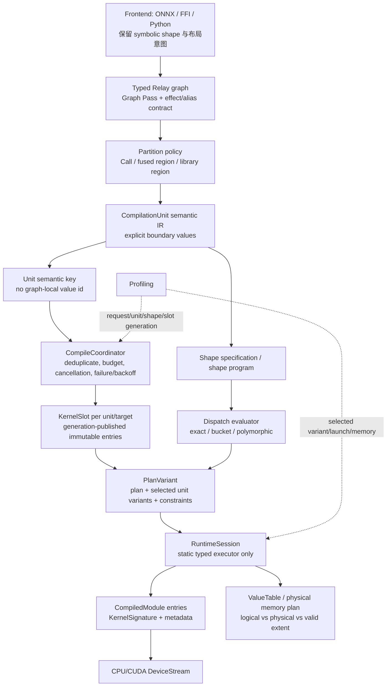
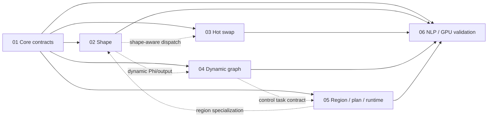

# 编译器基础架构基线审查：按单元编译、形状语义与可替换执行

> **归档说明：** 本文只记录 `3b95aca` 基线及当时的迁移设想，不是当前能力或待办权威。当前事实以源码、可复现测试、[`ARCHITECTURE_STATUS.md`](ARCHITECTURE_STATUS.md) 和 compiler-foundation handoff 为准。文中的 bucket/polymorphic、旧 coordinator/slot 等仅是历史方案。
>
> **审查日期：** 2026-07-22  
> **源码基线：** `dev` / `3b95aca188122ff52ebdb2f43d390d21273ff3e2`（`feat: compile relay graphs per operator`）  
> **审查范围：** `3b95aca` 工作树中的已跟踪 C++/Python 契约、测试和文档；[GitHub Issue #14](https://github.com/KDZZZZZZ/hdkx-aicompiler/issues/14) 与历史提交 `0b1d65b` 仅作自适应编译设计取证。
> **验证证据：** 同一 HEAD 已通过 19/19 Relay operator contract、19/19 Pass contract，以及 `graph_partition_test`、`operator_compilation_test`、`runtime_session_test`、`kernel_signature_test`、`infer_type_test`、`pass_pipeline_test`、`compiler_extension_contract_test`。  
> **本次文档变更：** 只新增并静态检查本文，未重新构建二进制；历史自适应实现只作设计取证。  
> **文档定位：** 目标架构审查与迁移准则，不是“当前已经实现”的能力声明。
> **Core Track01 仓内处置（当前）：** executable capability/invariant 与 normalized
> production executor 已接入；`Compiler::Compile` 和内部 primitive cache 是唯一的
> static-exact mutation authority，公共图只暴露 opaque real pins。dispatch/异步取消/
> 细分预算/generation/hot swap 仍归 Track03；不得称全路线完成。LLVM workflow 仍须
> 外部 builder 执行；当前边界见 [`handoffs/compiler-foundation/core.md`](handoffs/compiler-foundation/core.md)。

## 1. 执行摘要

当前分支已经完成一次重要且正确的架构转向：Relay 图在类型推导和图级 Pass 后，被确定性地变为 value graph；每个普通 compute `Call` 形成一个 `CompilationUnit`、一个 `PrimFunc`、一个 kernel entry；`ExecutablePlan` 用稳定 value id 和 symbol 串起多 entry，`RuntimeSession` 只消费 module + plan 并按顺序启动。这条主链可由下列当前文件交叉核验：

- `src/compiler/graph/value_graph.cc`、`src/compiler/graph/partition.cc`；
- `src/compiler/lowering/lowered_graph.cc`；
- `src/compiler/compiler.cc`；
- `src/runtime/executable_plan.cc`、`src/runtime/session.cc`；
- `include/kxc/compiler/compiler.h`、`include/kxc/runtime/session.h`。

这比旧的“整图一个 kernel + 自适应 session”更容易验证 ABI、追踪 profile、实施多 kernel 调度和局部缓存。也因此，**不能恢复旧 fuzzy cache**：历史实现在 `0b1d65b:src/runtime/kernel_cache.cc` 只以“cached dimension >= query dimension”推断可运行性，既没有物理 buffer/stride/layout/valid extent 契约，也没有 kernel 的 tail mask、workspace、输出 shape、alias 与 ABI 证明。这不是尚未补上的优化，而是会造成越界、错误输出或静默误编译的危险抽象。

下一阶段的核心不是把 `Compiler`、`ShapePredictor` 和后台线程重新塞进静态执行器。`RuntimeSession` 应继续是静态、强类型的 plan executor；shape 路由、去重编译、版本选择和安全热替换应位于其上方的编排层。目标是让一个语义稳定的 `CompilationUnit` 拥有多个经验证的 `KernelVariant`，让一个 graph template 拥有有限个不可变 `PlanVariant`；`CompileCoordinator` 负责编译生命周期，`KernelSlot` 以 generation/引用保活方式发布同一 Plan ABI 下的可运行版本。执行器只接收已经选定的不可变 plan variant。

必须同时纠正两个当前过渡性问题：

1. 当前 `src/compiler/graph/partition.cc` 的 `BuildStructuralHash` 将 graph-local `value_id` 写入 unit structural hash，而 `src/compiler/cache/primitive_cache.cc` 又将该 hash 用作 primitive cache key 的主体。**graph-local value id 不应进入 kernel semantic key**；它是计划连线身份，不是 kernel 语义。否则同一算子因在图中的拓扑位置不同而失去可复用性，或把“图位置”误当作代码语义。
2. `include/kxc/runtime/kernel_abi.h` 的 `kDynamicDimension = -1`，以及 `src/runtime/executable_plan.cc`、`src/runtime/session.cc` 对其的输入哨兵处理，只表示“该位置尚未精确约束”。**`-1` sentinel 不是 dynamic shape**：它没有符号绑定、shape function、约束求解、分桶策略或物理容量语义，不能作为动态形状实现完成的证据。

## 2. 源码基线、事实来源与术语

### 2.1 基线与文档冲突处理

本审查以本页所列的当前源码为优先事实源。以下文档仍有价值，但其描述与 `3b95aca` 的多单元实现不完全同步，不能单独用来判断当前能力：

- `docs/ARCHITECTURE_STATUS.md` 仍将主 lowering 描述为整个 Function 一个 `PrimFunc`；当前 `src/compiler/lowering/lowered_graph.cc` 已逐 unit lowering。
- `docs/COMPILER_EXTENSION_CONTRACT.md` 已写出“一普通 compute Call 一 unit”的目标契约，并与当前 partition 主线基本一致。
- `docs/REPO_IMPLEMENTATION_OVERVIEW.md` 和 `docs/DEVICE_MODEL.md` 中关于旧 Adaptive Runtime 已移除、RuntimeSession 不持有 Compiler 的边界仍然正确，但部分 API 例子仍是单 entry 时代。
- `docs/MODULE_GUIDE.md`、`docs/RUNTIME_API_GUIDE.md` 和 `docs/PROFILING_AGENT_SYSTEM_V1.md` 含有历史背景或未完全同步的描述；尤其不可将其中的 background compile 表述当作当前实现证据。

### 2.2 本文术语

| 术语 | 本文含义 | 不等同于 |
|---|---|---|
| value id | 图内 value 的确定性连线身份；当前由参数顺序和 post-order 遍历产生 | kernel 语义、缓存语义或存储身份 |
| `CompilationUnit` | 当前每个普通 compute `Call` 的局部编译边界 | 永久“一 Call”抽象 |
| semantic key | 决定编译产物数学/ABI/代码语义是否可复用的规范化内容哈希 | graph-local value id、对象地址、symbol 名称 |
| dispatch key | 在已存在 variant 中选择可运行版本的 shape/layout/target 条件 | primitive semantic key |
| `PlanVariant` | 一个图或区域的可执行版本：plan、每 entry 的 ABI/shape 约束、版本集合 | 单个 backend handle |
| logical shape | 张量数学索引域的形状 | allocation capacity 或 padded layout |
| physical shape | 实际 buffer 的 layout、stride、padding、对齐和容量描述 | logical/valid extent |
| valid extent | 在 physical buffer 中本次调用可读写且结果语义有效的范围 | `-1` 或“容量足够” |

## 3. 当前编译链、算子/Pass 接入与边界

### 3.1 已核验主链

```text
ONNX / FFI / 手写 Relay
  -> OperatorSpec + attrs + FInferType + FRelayToTE
  -> InferType + graph-scope Relay Pass
  -> ValueGraph（stable value id）
  -> Partition（当前策略：一个普通 compute Call 一个 CompilationUnit）
  -> 每 unit boundary-only lowering
  -> 每 unit PrimFunc Pass / KernelSignature / backend build
  -> multi-entry CompiledModule + ExecutablePlan
  -> RuntimeSession(module, plan) 顺序 launch
  -> NDArray / Storage / DeviceStream / AsyncOperation
```

证据链如下。

1. 算子契约由 `include/kxc/relay/op.h` 的 `OperatorSpec` 承载，机器可读清单为 `contracts/relay_op_contract.json`；其要求 schema、类型关系、lowering、FFI、backend 和测试。`src/compiler/lowering/lowered_graph.cc` 在 unit lowering 前复核 arity、attrs、`FInferType` 和 lowering binding。
2. Relay Pass 的元数据在 `include/kxc/pass/pass.h`、`src/pass/pass.cc`，当前 Relay/TIR 注册和调度在 `src/relay/transforms/pipeline.cc`、`src/tir/transforms/pipeline.cc`；机器契约为 `contracts/pass_contract.json`。图拓扑变换应在 unit 冻结前完成，见 `docs/COMPILER_EXTENSION_CONTRACT.md` 第 4、6 节。
3. `src/compiler/compiler.cc::OptimizeRelay` 在策略前后执行 `InferTypePass`。`src/compiler/graph/value_graph.cc` 只接收类型完整的参数、常量、Call、tuple/tuple field，并建立 plan 用的 value id。
4. `src/compiler/graph/partition.cc` 为 ordinary compute Call 产生 unit、symbol 与 `runtime::KernelCall`。`src/compiler/lowering/lowered_graph.cc::LowerCompilationUnit` 只从 unit 边界 tensor 映射读取输入，禁止递归 lowering producer unit。
5. `src/compiler/compiler.cc` 对每个 primitive 运行 TIR pipeline、ABI 构建与 backend 编译；`include/kxc/runtime/compiled_module.h` 和 `src/runtime/compiled_module.cc` 提供按 symbol 查询、启动的 multi-entry module。
6. `include/kxc/runtime/executable_plan.h` 与 `src/runtime/executable_plan.cc` 定义不依赖 Relay/TE/TIR 的 plan；`src/runtime/session.cc` 校验 module/plan/signature 一致性，绑定输入/常量、分配中间值及输出并按 calls 顺序 launch。

### 3.2 静态图、动态图与 NLP 的当前边界

- **静态图：** 当前最完整路径。输入/常量/中间/输出的静态 `TensorType` 可进入 per-unit lowering；`RuntimeSession` 使用 `ValueSpec` 和 `KernelSignature` 分配静态中间/输出。
- **动态图（控制流/动态执行图）：** 不是当前主链能力。`ValueGraphBuilder` 只支持参数、常量、Call、Tuple、TupleGetItem；`If`、`Let`、函数值等并未获得完整的 plan/shape/control-flow runtime 合约，见 `src/compiler/graph/value_graph.cc`。
- **dynamic shape：** 当前仅有 input ABI 中的 `-1` 哨兵接受实际维度，测试证据见 `test/runtime_session_test.cpp::TestDynamicInput`。输出 `ValueSpec` 禁止动态维度（`src/runtime/executable_plan.cc`），lowering 的 `TEShape` 将形状直接变成 `IntImm`（`src/compiler/lowering/lowered_graph.cc`）。故不存在端到端动态输出、符号约束、shape program 或 specialization 链。
- **NLP：** ONNX importer 的正式边界仍是静态 shape MVP；`docs/ONNX_IMPORTER.md` 明确把未知非 batch 维暂定为 `1`，只支持 7 类 ONNX node。这无法可靠表示 token length、ragged/padding mask、KV cache、beam 维或动态 batch；NLP 只能作为未来 shape 模型的重点用例，不能据此宣称当前已支持。

### 3.3 当前 ABI 与运行时边界

这是应保留的单向依赖：

```text
Compiler / Relay / TE / TIR / Codegen  --->  CompiledModule + ExecutablePlan
                                                   |
                                                   v
                                      RuntimeSession + NDArray + DeviceStream
```

`RuntimeSession` 的公共头 `include/kxc/runtime/session.h` 只依赖 module/plan；实现 `src/runtime/session.cc` 没有调用 `Compiler`、Relay registry 或 `ShapePredictor`。这条边界必须保留。将动态选择逻辑回塞执行器会导致每次 Run 同时承担图语义、编译失败、缓存竞争、版本发布、资源保活和 kernel launch，破坏当前可测的单一职责。

## 4. 值得保留的正确抽象

| 抽象 | 证据 | 应保留的原因 |
|---|---|---|
| 完整 `OperatorSpec` 与 canonical attrs 序列化 | `include/kxc/relay/op.h`、`src/relay/op_registry.cc`、`contracts/relay_op_contract.json` | 让前端、类型、lowering 和 Pass 查询通用能力，而非在 Runtime 按 op 名分支。 |
| `PassSpec` + 显式 scope/phase | `include/kxc/pass/pass.h`、`src/pass/pass.cc`、`contracts/pass_contract.json` | 提供了阻止 graph Pass 在 unit 冻结后跨边界改写的正确契约位置；当前 runner 还需真正执行 invariant/analysis/target 校验。 |
| value graph 与 runtime-neutral `ExecutablePlan` | `src/compiler/graph/value_graph.cc`、`include/kxc/runtime/executable_plan.h` | 图连线、kernel ABI 和运行时调度有明确分层；runtime 不需要理解 Relay。 |
| immutable `KernelSignature` 与 `[input][constant][output]` ABI | `include/kxc/runtime/kernel_abi.h`、`src/compiler/kernel_abi_builder.cc` | shape、dtype、device、alignment、constant key 在启动前可验证。 |
| multi-entry `CompiledModule` | `include/kxc/runtime/compiled_module.h`、`src/runtime/compiled_module.cc` | entry 以稳定 symbol 独立寻址，适合每 unit 编译、批量 backend module 与版本化。 |
| session 的局部调用状态和异步保活 | `src/runtime/session.cc`、`src/runtime/internal/value_table.h` | 避免并发 Run 共享参数状态；完成对象保活 storage 与 executable。 |
| plan 层的 storage lifetime 校验 | `src/runtime/executable_plan.cc`、`src/runtime/memory_plan.cc` | storage reuse 是物理分配决策，而非 value identity；非重叠性可验证。 |
| primitive cache 的 immutable entry 方向 | `src/compiler/cache/primitive_cache.cc` | 缓存对象包含 ready kernel/signature/metadata，而非裸函数或 `void*`。需要修 key，而不是倒退到 fuzzy cache。 |
| profile 的阶段与 unit 关联 | `src/compiler/compiler.cc`、`include/kxc/profiling/profiling.h` | 编译阶段、unit symbol、operator identity、cache hit、storage 计划已有可观测挂点。 |

## 5. 缺口矩阵

严重度按“若进入真实模型/在线服务后造成错误结果、资源失控或阻塞后续演进”的风险排序；“未实现”与“危险抽象”在下一节严格区分。

| 严重度 | 缺口 | 当前证据 | 影响 | 建议方向 |
|---|---|---|---|---|
| 阻断 | 端到端 dynamic shape 不存在 | `src/compiler/lowering/lowered_graph.cc` 将 shape 固化为 `IntImm`；`src/runtime/executable_plan.cc` 禁止动态 output | NLP 可变 seq、动态 batch 和动态输出不能正确编译/分配 | 先建立 shape program 和 exact/bucket/polymorphic variant 契约，后扩展 lowering/runtime。 |
| 严重 | kernel semantic key 混入 graph-local value id | `src/compiler/graph/partition.cc::BuildStructuralHash` 序列化 input/output id；`src/compiler/cache/primitive_cache.cc` 以该 hash 建 key | 跨图/跨位置等价单元缓存碎片；身份概念混淆，后续重分区/融合会不稳定 | 拆分 unit locator、semantic key、dispatch key；从 semantic key 删除 value id。 |
| 严重 | `-1` 被误读为 dynamic shape | `include/kxc/runtime/kernel_abi.h`；`src/runtime/session.cc::ValidateShape` | 没有约束、extent、输出函数时，任何“动态支持”都是不完整的；可能将不兼容物理 layout 当作兼容 | 将 `-1` 限定为 legacy input ABI sentinel，禁止向 plan/kernel capability 传播；迁移到显式 Dim/Constraint。 |
| 严重 | Relay IR 能表达的节点集合大于可执行子集，却缺少统一 capability verifier | `If`/`Let` 可由 IR/InferType 表达，但 `src/compiler/graph/value_graph.cc` 明确拒绝 | 错误在 partition/lowering 后期暴露；上层容易把“IR 可构造”误认为“可编译” | 在编译入口、Pass 后和 partition 前验证 executable dialect/capability，错误必须定位到节点和缺失能力。 |
| 严重 | 生产 per-unit lowering 与 legacy whole-graph `LowerToTIR` 并存 | `src/compiler/lowering/lowered_graph.cc` 与 `src/compiler/lowering/relay_to_tir.cc` | 两套 cardinality、常量和测试语义导致文档漂移，扩展可能只接通其中一条 | 将 whole-graph API 明确标为兼容/测试入口并逐步弃用；共享前端校验和 lowering primitives，以生产路径为唯一能力判定。 |
| 严重 | 无 variant 选择、去重编译、失败状态或安全热替换协议 | 当前 `RuntimeSessionNode` 只持有 module+plan，见 `src/runtime/internal/session_node.h` | Issue #14 所需的热替换无法安全落地；重复请求可发生编译风暴 | 新增上层 `CompileCoordinator`、`KernelSlot`、`PlanVariant`，不修改静态 session 职责。 |
| 已解决 | primitive cache hit 的 artifact ownership | `CompiledPrimitiveBatch` 直接保留 immutable pin，`AssembleCompiledGraph` 消费 ordered pins | cache eviction 不会使已命中的编译事务失效 | 保持 same-key singleflight 与引用感知淘汰。 |
| 高 | 当前“一 Call 一 `CompilationUnit`”被误认为永久抽象 | `src/compiler/internal/compilation_unit.h`、`src/compiler/graph/partition.cc` | fusion、library region、控制流区域、通信 region 无法演进；unit identity 与 partition policy 耦合 | 保持当前策略为 Phase-0 policy；演进为可验证的 region/unit partition，不改变 runtime plan ABI。 |
| 高 | unit locator、link symbol 与 artifact semantic identity 相互耦合 | final TIR 保留 `global_symbol`、`kxc.unit_id` 等 attrs，cache hit 又要求 cached/current symbol 相同 | 即使移除 value id，相同计算位于不同位置仍难复用；重分区会产生无关 cache miss | canonical hash 必须剥离非语义 attrs；artifact 使用 semantic symbol/重定位，plan call identity 与 backend entry symbol 分开。 |
| 高 | NLP frontend 以静态替换 unknown 维 | `docs/ONNX_IMPORTER.md` 的 shape 行为；`python/kxc_onnx/importer.py` | 将真实动态语义静默改为 batch/default 或 `1`，可能编译出错误模型 | unknown/symbolic dim 必须保留为显式约束或明确拒绝，不能填 `1` 伪装静态。 |
| 高 | Transformer 与 CUDA 还没有可作为架构验收的端到端能力 | 正式 Relay 仅 19 op，`matmul` 仅 rank-2；ONNX 仅 7 类；CUDA 证据集中于有限逐元素路径 | 不能用简单静态图成功推断 NLP、高吞吐 GPU 或动态执行基座已经成熟 | 将 batched matmul/attention-mask/KV-capacity 作为 shape/runtime 验收模型；具体 op/backend 仍按独立 support matrix 推进。 |
| 高 | frontend、shape 推导和 TE compute 的公式需同源 | `src/relay/type_infer.cc` 与 `include/kxc/te/topi/` 分层；`docs/ARCHITECTURE_STATUS.md` 记录 conv/pool 等语义限制 | shape 正确但实际 kernel buffer/index 不一致；动态化时问题放大 | 引入共享 shape rule/shape program，type relation 与 lowering 都调用同一规范公式。 |
| 高 | 当前 `ValueSpec` 只有 shape/dtype/device，缺 layout/physical capacity/valid extent | `include/kxc/runtime/executable_plan.h` | 无法证明 bucket 大 buffer 对小 logical input 的正确性；无法描述 padded NLP tensor | 扩展为 logical/physical/valid extent + layout/alignment/workspace contract。 |
| 高 | Operator contract 与 Pass pipeline 都存在多权威来源 | operator JSON + C++ registration/default inference；Pass JSON + binding table + resolver execution | checker 能发现部分漂移，但实现、default 与生产编译策略仍可能不一致；名字推断 category 会掩盖遗漏 | contract metadata 单源生成或严格显式化；由统一 `PipelineResolver` 生成 normalized configuration，生产编译不再维护第二套 pass 列表。 |
| 高 | `PassSpec` 的 invariant/analysis/target 字段多数仍是描述性元数据 | `src/relay/transforms/pipeline.cc` 主要校验 dialect/scope/phase/implementation，只有 `infer_type` 特判 produced invariant | Pass 看似有安全契约，实际 scheduler 不执行前后置条件；未来 unit/module Pass 容易误调度 | 引入 analysis/invariant state，在 pass 前后执行 required/produced/preserved/invalidated 与 target capability 校验。 |
| 中 | cache 仅进程内、256 条 LRU，缺观测到的 compile request 生命周期 | `src/compiler/cache/primitive_cache.cc` | 不能控制并发 miss、负缓存、取消、过期和跨 variant 发布；按条数也不能反映 LLVM/CUDA module 内存 | cache 继续只存 immutable artifact；coordinator 单独管理 in-flight/failure/backoff，按代码/模块字节和引用状态淘汰。 |
| 中 | OperatorSpec 默认值和 category 名字推断弱化 contract-first | `src/relay/op_registry.cc::InferCategoryFromName`、`FillLegacyDefaults` | 新类别/NLP op 可能得到错误 metadata，遗漏字段被默认值掩盖 | 新 schema 必须显式；JSON 作为源生成 metadata，或 C++ spec 导出 JSON，不能继续两边手写并依赖名字启发式。 |
| 中 | plan/session 仅单设备、顺序单 stream | `src/runtime/session.cc` 明确 v1 one device；`src/runtime/memory_plan.cc` 假设顺序调用 | 多 stream、跨 device、通信与异步依赖需要新计划语义 | 先把 dependency/event 放入 plan；不要把 worker id 混入 device id。 |
| 中 | Pass 元数据具备 unit/module scope 枚举，但执行 pipeline 主要是 graph/PrimFunc | `src/pass/pass.cc`、`src/relay/transforms/pipeline.cc` | 未来 unit/shape Pass 容易绕过 phase/invariant 检查 | 在 partition 后增加显式 unit pipeline，ABI freeze 后只允许 non-ABI module pass。 |
| 中 | 文档与 profiling 诊断包含已删除或尚未闭环的能力 | `docs/MODULE_GUIDE.md` 仍描述旧 Adaptive Runtime；`docs/ARCHITECTURE_STATUS.md` 仍描述整图主 lowering | 设计讨论、用户预期和自动诊断会把历史目标误当当前事实 | 建立 current/target/archived 标记和文档 CI；能力声明必须链接当前测试或 feature gate。 |
| 中 | profile 字段有 shape/缓存诊断愿景，但 variant 生命周期尚未闭环 | `docs/PROFILING_AGENT_SYSTEM_V1.md` 与 `src/compiler/compiler.cc` | 无法区分 compile storm、bucket miss、替换失败和真实 kernel 性能问题 | 记录 request id、unit semantic key、dispatch key、slot generation、queue/wait/compile/publish 时间。 |

## 6. 错误/危险抽象审查（与“尚未实现”分开）

### 6.1 必须禁止或修正的危险抽象

1. **恢复旧 fuzzy cache：禁止。**

   历史 `0b1d65b:src/runtime/kernel_cache.cc` 的 `GetFuzzy` 以每维 `cached >= query` 选择“最近”模块；历史头 `0b1d65b:include/runtime/kernel_cache.h` 返回 `unordered_map` 元素裸指针。这一设计既不验证 ABI/physical layout，也有 map mutation 后指针与发布生命周期问题。即使改成 `shared_ptr`，仅靠维度偏序仍不证明 kernel 可处理尾部、mask、workspace、输出 extent 或随机访问布局。应永久删除这条匹配语义，而不是“修复后恢复”。

2. **把 `-1` 当作完整 dynamic shape：禁止。**

   `-1` 只能表示当前 signature 校验跳过某个 input dimension。动态形状至少需要维度变量、等式/范围/整除约束、由输入到输出的 shape program、物理 buffer extent 和 variant 适用条件。当前 sentinel 不能表达其中任何一项。

3. **把 graph-local value id 放入 kernel semantic key：修正。**

   当前 `BuildStructuralHash` 既写 `id:type` 也写 attrs；id 在一个图内对 plan 很好，但相同 `add(float32[...])` 放在不同 graph 位置将有不同 cache key。semantic key 应从规范化单元 IR、显式边界 tensor contract、attrs、target/opt/ABI/backend 版本得到；value id 只放 `PlanVariant`/diagnostic locator。symbol 同理是链接身份，不能单独充当语义 key。

4. **让 `RuntimeSession` 重新持有 `Compiler` 或 `ShapePredictor`：禁止。**

   历史 `0b1d65b:include/runtime/runtime_session.h` 同时持有 Relay function、CompileConfig、`KernelCache`、`ShapePredictor`、`BackgroundCompiler`、`KernelRunner`。这违反现有 `docs/COMPILER_EXTENSION_CONTRACT.md` 的单向依赖，也使每次 Run 的可观测性和失败边界不可判定。现在 `src/runtime/session.cc` 的 module+plan executor 是正确抽象，不能退回。

5. **以“当前一 Call”定义永久 `CompilationUnit`：修正为策略。**

   `src/compiler/graph/partition.cc` 的强门禁适合作为当前迁移阶段：可验证 N 个普通 Call 对应 N 个 unit。它不是最终抽象；未来合法 unit 可以是单 Call、已验证融合 region、外部库调用或控制流 region。永久不变量应是“unit 有稳定语义边界、显式输入输出、可验证 ABI 和可追踪 identity”，而非 Call 数量。

6. **将 allocation capacity 当作 logical tensor shape：禁止。**

   bucket variant 可能为 `[B, 128]` 分配物理 buffer，而本次 logical token 长度为 `97`。若 kernel 不接受 valid extent 并做 tail predicate，读写 `[97,128)` 是语义错误。容量复用只属于 storage plan，不能改写 value 的 logical identity。

7. **把 `PassSpec` 当成已经生效的 Pass Manager：修正。**

   当前 metadata 方向正确，但生产 runner 尚未普遍执行 required/produced invariants、analysis preserve/invalidate 和 target capability。对外应称其为“Pass contract + pipeline binding”，直到 invariant state 真正落地。

8. **依赖 op 名字推断 schema/category 或用默认值补完整契约：修正。**

   `InferCategoryFromName`、`FillLegacyDefaults` 适合兼容迁移，不适合作为长期扩展机制。operator JSON、C++ metadata、FFI 和 docs 应由一个 schema source 派生；新字段遗漏应 fail closed，而不是被名字启发式或默认值掩盖。

9. **让 legacy whole-graph lowering 与生产 per-unit lowering长期拥有同等能力地位：禁止。**

   两条路径可以短期共存，但能力矩阵、数值测试和扩展契约必须以 `Compiler::Compile`/`LowerGraph` 为准。旧入口应明确标记为 compatibility/testing，并最终收敛到共享的 validated lowering building blocks。

10. **把 cache hit 压缩成 bool 后丢失 artifact 所有权：已修正。**

    `CompiledPrimitiveBatch` 保留 immutable pin，并由 `AssembleCompiledGraph` 直接消费；cache eviction 只能移除索引，不能使已命中的编译事务失效。完整 backend batch 返回后不再重放中间编译状态。

11. **把“Relay IR 能构造”当成“Compiler 能执行”：禁止。**

    `If`、`Let` 等节点在 IR/InferType 层存在，不代表 ValueGraph、plan 和 runtime 支持。编译入口必须有显式 executable-capability verifier；不支持节点应在进入 partition 前失败，而不是在更晚阶段暴露实现细节。

### 6.2 尚未实现，但不是错误抽象的能力

下列是明确缺口，应按路线实现，而不是通过回滚架构“补齐”：shape program、符号/范围约束、exact/bucket/polymorphic variants、in-flight 编译去重、负缓存/退避、safe hot swap、磁盘 artifact cache、多 stream dependency、NLP dynamic frontend、region fusion、distributed module registry。它们目前不存在或不完整，并不意味着现有 module/plan/session 分层错误。

## 7. 目标架构



在线服务可增加一个只属于控制面的 `AdaptiveController`/`AdaptiveSession`：它持有 graph template、shape dispatcher、PlanVariant registry 和 `CompileCoordinator`，在请求边界选择或构造冻结版本；它不直接组装 kernel 参数或管理 NDArray 执行。当前 `RuntimeSession` 保持数据面静态执行器，可被该控制面复用，也可继续独立用于 AOT/static 调用。

### 7.1 分层职责

| 层 | 负责 | 明确不负责 |
|---|---|---|
| Frontend | 保留 symbolic/unknown dim、layout、mask、模型约束；拒绝无法表达的语义 | 把 unknown dim 填成 `1` 后冒充静态正确 |
| Relay graph/Pass | 图语义、effect/alias、类型与 shape rule；图拓扑改写 | 在 frozen unit 后跨 unit 偷改边界 |
| Partition policy | 选择单 Call/region/library 等 unit 边界 | 定义 kernel 缓存或 runtime allocation |
| CompilationUnit | 规范化局部 IR、显式 boundary、semantic identity | 承担 graph-local routing id |
| Shape system | 输入绑定、输出 shape program、valid extent、variant applicability | 编译 backend 或执行 kernel |
| AdaptiveController | request shape 绑定、profile/plan 路由、预热和服务级策略 | kernel 参数装配、设备执行或破坏 static RuntimeSession 边界 |
| CompileCoordinator | 预算、排队、去重、编译、失败/取消、发布候选 artifact | 执行 NDArray、在 session 内做 graph 解释 |
| KernelSlot | 原子选择已验证 immutable kernel variant，generation 与引用保活 | 判断模型图语义或 fuzzy 维度兼容 |
| PlanVariant | 图级 value routing + 每 unit 已选版本 + physical memory plan | 修改 Relay 或持有 compiler 私有 IR |
| RuntimeSession | 严格验证和执行已选择的 plan variant | 编译、预测、cache policy、按 op 名分支 |

### 7.2 编译流程必须拆成模板准备与 Shape 实例化

当前 `Compiler::Compile` 对每个 concrete Function 重新执行 Relay Pass、ValueGraph、partition、unit lowering 和 backend build。若只改变 batch/sequence shape，这会把图级固定成本重复施加到每个 shape。目标流程应拆为：

```text
PrepareGraphTemplate
  = validate + normalize + graph Pass + capability check + partition skeleton

InstantiateShapeProfile(template, bindings/policy)
  = solve constraints + infer concrete logical/physical shapes
  + select exact/bucket/polymorphic applicability
  + produce unit specialization requests + memory-plan draft

CompileMissingUnits(requests)
  = artifact-cache lookup + same-key singleflight + backend compile

AssemblePlanVariant(template, profile, artifacts)
  = freeze value routing + signatures + physical memory plan + generations
```

`GraphTemplateKey`、`UnitSemanticKey`、`KernelArtifactKey`、`ShapeProfileKey` 和 `PlanVariantKey` 必须分开。这样一个新序列长度只实例化 shape profile，并只编译真正 miss 的 unit；不会默认重跑整个图编译链。模板可以保持 shape-polymorphic，但进入当前静态 backend 前必须绑定为可验证的 concrete physical profile。

### 7.3 graph call identity 与 backend entry identity 分离

当前 `KernelCall.symbol`、PrimFunc `global_symbol`、CompiledModule entry symbol 被要求完全一致，这对单次静态编译有利，却阻止跨图位置共享相同 artifact。迁移 semantic cache 时需要二选一：

- artifact symbol 由 `KernelArtifactKey` 生成，plan call 另持 graph-local call id；或
- backend 支持安全重定位/alias wrapper，使同一 artifact 可绑定到不同 plan call。

无论采用哪种方案，canonical TIR hash 都必须剥离 `global_symbol`、`kxc.unit_id`、profile span 等非语义 attrs，同时保留影响计算、ABI、layout 和 schedule 的全部内容。

## 8. Shape 模型：logical、physical、valid extent 与 variant 分类

### 8.1 三层形状与 layout 契约

每个运行时 value 需要从当前 `ValueSpec` 的静态 `(shape, dtype, device)` 扩展为下表；字段可分期落地，但语义必须先冻结。

| 层 | 必要内容 | 示例：NLP token tensor |
|---|---|---|
| logical shape | 数学维度、dtype、axis meaning；可含符号/已绑定实际值 | `[batch=4, seq=97, hidden=768]` |
| physical shape/layout | allocation capacity、stride、contiguous/padded layout、alignment、memory scope | capacity `[4,128,768]`，stride `[98304,768,1]`，64-byte alignment |
| valid extent | 本次 kernel 可读/写的有效逻辑区域；必要的 mask/tail predicate | `seq < 97`；输出只在 `[0,4)×[0,97)×[0,768)` 有效 |

约束：logical 形状参与数学语义和 output shape program；physical shape 参与 allocation/schedule/ABI；valid extent 参与每个可 bucket/padded 执行的 kernel correctness。三者不得互相替代。

### 8.2 维度表达

建议引入显式概念，而非复用 `int64_t -1`：

```text
DimExpr = Const(n) | Symbol(name) | Add/Mul/FloorDiv/...（受限）
Constraint = Eq | Range | DivisibleBy | BroadcastCompatible | SameRank | Layout
ShapeProgram = input bindings -> output logical shapes + valid extents
```

- `Const(0)` 仍是合法零长度维度；不能与 unknown 混淆。
- unknown/symbolic 前端维度要么变为 `Symbol` 并带约束，要么在 frontend 明确报不支持；不能静默变 `1`。
- 旧 `kDynamicDimension` 在迁移期仅允许出现在 legacy input signature adapter，不能写入 semantic key、`PlanVariant` 或 output allocation spec。

### 8.3 三类 variant

| 类型 | 适用条件 | ABI/物理要求 | 典型用途 | 禁止事项 |
|---|---|---|---|---|
| exact | 全部 logical shape/layout 绑定精确相等 | physical=logical（或完全声明的固定 layout） | 首次正确闭环、调试、精确缓存 | 把“更大 buffer”当成 exact 命中 |
| bucket | logical dims 落在声明 bucket；例如 `1<=seq<=128` | physical bucket capacity + valid extent + tail-safe kernel 必须同时存在 | NLP 序列长度、动态 batch | 以 `cached >= query` 替代适用性证明 |
| polymorphic | 在符号约束域内都正确；如 `B>0,S>0,S%8==0` | kernel 接收 runtime shape/extent 或 shape program 产物；codegen 证明/测试其约束域 | 通用 elementwise、部分 reduction | 未验证约束就把所有 `-1` 归为 polymorphic |

dispatch key 至少包括 unit semantic key、target capability、dtype/layout、已绑定 logical dims 或 bucket id、shape-ABI version、schedule/backend version。exact/bucket/polymorphic 是**适用性与调度层**分类；它们不能改变 KernelSignature 已验证的参数角色和 dtype/device 基本契约。

## 9. 按 unit 的缓存、`CompileCoordinator`、`KernelSlot` 与 `PlanVariant`

### 9.1 三种 identity/key 必须分离

```text
Graph value locator:     graph revision + value_id + output_index
Unit semantic key:       normalized unit IR + canonical attrs + boundary tensor semantics
Primitive artifact key:  unit semantic key + target + opt + ABI + backend/schedule version
Dispatch key:            artifact family + shape/layout bindings + variant policy/version
```

当前 value id 仍可保留在 `ExecutablePlan`、profile 和诊断中；它不进入 semantic/artifact key。当前 `src/compiler/cache/primitive_cache.cc` 已包含 target、opt、ABI 与 backend version 的大部分元素，迁移时应将其 `structural_hash` 改为不含 value id 的 normalized unit semantic hash，并显式纳入 shape ABI/schedule version。

### 9.2 推荐数据关系

```text
CompilationUnit semantic key
  -> UnitArtifactFamily (per target)
      -> KernelSlot
          -> { VariantRecord[generation, applicability, signature,
                              launch metadata, immutable executable,
                              compile provenance, health] }

Graph plan template + value routing
  -> PlanVariant[graph revision, chosen slot generations,
                 concrete shape bindings, physical memory plan]
```

- **`CompileCoordinator`** 是进程/服务级协调器：以 primitive artifact + dispatch key 对 in-flight request 去重；维护队列、编译预算、取消、负结果 TTL/退避、资源配额与发布审计。它返回 future/result，不把裸 map 元素指针交给调用者。
- **`KernelSlot`** 是按 unit semantic key + target 的稳定发布点。slot 中的 variant record 不可变；替换通过 generation 单调递增和原子 `shared_ptr`/ObjectRef 发布。执行中的 `AsyncOperation` 保活已选择 executable，因此新版本发布不会卸载旧 module。
- **`PlanVariant`** 在提交到 session 前已经冻结：包含确定的 calls/value routing、每 call 的 selected symbol/generation、concrete logical binding、physical allocation plan 和 valid extent metadata。每次 session Run 不“查 cache 猜一个模块”，只执行该不可变 variant。

### 9.3 cache 与编译请求状态必须分层

artifact cache 只存成功且不可变的 artifact；编译请求状态由 coordinator 管理，不能用 `cache miss` 同时表示“从未请求、正在编译、已失败、已取消”。推荐状态机：

```text
Absent -> Queued -> Compiling -> Validating -> Ready
             |          |             |
             +------> Cancelled       +------> Failed(retry_after)
                                                |
                                                +------> Queued
```

- 同完整 canonical key 的请求共享一个 future；hash 只用于索引，等价判断必须比较 canonical key。
- ready artifact 被编译事务、PlanVariant 或 in-flight launch 引用时必须 pin；淘汰只删除 cache 可发现性。
- 队列按预计收益/编译成本排序并设置全局、per-model、per-device/backend 并发和内存预算；低价值预热先被丢弃。
- failure 使用结构化分类与负缓存 TTL；transient error 可退避重试，unsupported shape 不得形成重试风暴。
- 淘汰按 code/module bytes、命中、重编译成本和引用状态，不再只按固定条数。

### 9.4 热替换（Issue #14）安全协议

Issue #14 的目标应定义为“候选 variant 在不影响 in-flight execution 的前提下发布”，不是“运行中的函数指针被原地改写”。建议步骤：

1. frontend/shape binder 建立 request 的 logical shape binding；dispatch 先找已验证 exact/bucket/polymorphic `PlanVariant`；
2. 命中后，pin 每个 `KernelSlot` 的具体 generation，构造或复用 immutable plan variant，并交给 `RuntimeSession`；
3. 未命中时由 `CompileCoordinator` 合并同 key 的请求。调用者可等待 exact 编译、选择显式声明可用的保守 variant，或获得明确“无可执行 variant”错误；绝不 fuzzy fallback；
4. 编译完成后，先验证 symbol/signature/shape applicability/数值与 ABI，再向 slot 发布新 generation；
5. 新请求可选择新 generation；已开始或已返回 completion 的请求继续保活旧 generation，直到最后引用释放；
6. 编译失败写入可观测的 failure state（错误、key、尝试次数、退避截止），不得静默反复提交或替换已知正确版本。

`RuntimeSession` 不参与第 1、3、4、5 的策略判定，只接收第 2 步的冻结 variant。这保留 `src/runtime/session.cc` 的强类型执行性质。

## 10. Pass、partition、runtime、frontend 与 profiling 的改进

### 10.1 Pass

1. 以 `contracts/pass_contract.json` 或等价 schema 为唯一 pipeline metadata 来源；binding table 只绑定 `implementation_key -> function`，不再复制 opt/default/idempotence 等字段。
2. `PipelineResolver(normalized CompilerConfiguration)` 统一解析 opt level、target capability、用户 enable/disable 和 named pipeline；其 `NormalizedPipeline` 是生产顺序的唯一权威。
3. runner 维护显式 invariant/analysis state，在每个 Pass 前后执行 required/produced/preserved/invalidated、scope、phase 和 target capability 校验，而不是只验证名称与 implementation binding。
4. graph Pass 继续只在 partition 前运行；修改 shape/dtype/attrs 的 Pass 必须使 checked type/shape analysis 失效并重建，符合 `docs/COMPILER_EXTENSION_CONTRACT.md`。
5. partition 后新增显式 **unit-scope Relay normalization** 与 **PrimFunc shape/schedule Pass**；不得通过“普通 graph Pass”跨 unit 读取 producer。ABI-changing Pass 必须在 signature freeze 前完成。
6. shape specialization 不是任意字符串 Pass：它消费 `ShapeProgram` 的 binding，产出带 applicability/guard 的 variant，并将 resolved pipeline fingerprint 写入 artifact key 和 profile。

### 10.2 Operator contract 与 Partition

1. 收敛 `contracts/relay_op_contract.json`、C++ `OperatorSpec`、FFI 和 support matrix：选择一个 schema source 生成其余 metadata；新 operator 禁止依赖 `InferCategoryFromName`/legacy defaults 补全关键字段。
2. type relation 与 lowering 应消费同一个声明式 shape rule/shape program，而不是各自复制 shape 公式；target/dtype/layout 不支持必须在 capability verifier 中 fail closed。
3. 把当前 “one ordinary Call = one unit” 从 `PartitionValueGraph` 的永久结构条件降格为默认 `PartitionPolicy::PerCall`；保留其 N-call/N-unit characterization test。
4. 为后续 region policy 定义同样的硬门禁：每 unit 输入/输出是显式 live boundary；不可跨 effect/alias/communication/control-flow 边界；unit semantic key 在无关 graph re-numbering 下不变。
5. unit symbol 应由稳定 unit locator 生成，但缓存不得依赖 symbol；fusion 后可以产生新 unit semantic key，而旧单 Call artifact 可继续存在。
6. `argument_value_ids` 保留重复操作数的逻辑顺序（现有 `src/compiler/graph/value_graph.cc` 已如此），而 unique boundary values 只服务 ABI/storage；不能为去重而改写算子语义。

### 10.3 Runtime

1. 保持 `RuntimeSession(api::CompiledModule, ExecutablePlan)` 的核心模式；未来可增加只含 runtime 数据的 `FrozenPlanVariant` 参数，但不得 include compiler/Relay。
2. `ValueSpec` 演进为包含 logical/physical/valid extent/layout；在迁移期，静态 exact variant 可令三者相同，以最小变更保持现有 `ValueTable`。
3. memory reuse 要在 physical contract 等价且 lifetime 不重叠时发生；`src/runtime/memory_plan.cc` 的顺序单 stream 假设必须成为显式 plan 前提。多 stream 时以 event/dependency 扩展 liveness，不可沿用“call 序号不重叠”判断。
4. session 构造时验证 selected slot generation 的 signature 与 plan value contract；launch 时再验证实际 NDArray 的 logical/physical 条件和 valid extent。

### 10.4 Frontend 与 NLP

1. `python/kxc_onnx/importer.py` 和 `docs/ONNX_IMPORTER.md` 应从“未知维替 `default_batch`/`1`”迁移为：保留 symbol、记录约束、要求用户 bind，或清晰拒绝。不能让 silent concretization 进入语义缓存。
2. 建立 tokenizer/model 前端无关的 shape binding API：batch、sequence length、attention mask、past KV length、beam 等都只是命名/约束，不把 NLP op 名写入 runtime。
3. 首批 NLP 验收应覆盖可变 `S` 的 attention mask 与 KV cache valid extent；重点是 bucket tail correctness、输出 logical shape 和 cache alias/lifetime，而不是仅让 importer 通过。

### 10.5 Profiling

现有 `src/compiler/compiler.cc` 已记录 unit、operator、IR hash、cache hit 和存储计划指标；应扩展为以下稳定字段：

- `graph_revision`、`unit_semantic_key`、`artifact_key`、`dispatch_key`；
- `logical_shape`、`physical_shape`、`valid_extent`、variant kind/bucket；
- coordinator queue/wait/compile/validate/publish 时长与 in-flight merge count；
- slot generation、fallback（只能是已验证 variant）原因、compile failure/backoff；
- plan variant id、memory peak/retired storage、stream dependency。

`docs/PROFILING_AGENT_SYSTEM_V1.md` 中的 `shape_fragmentation`、`cache_miss_pattern`、`background_compile_stall` 可在上述真实事件闭环后保留；在此之前不应把诊断类别当成功能已实现的证明。

## 11. 能力轨道与集成顺序

详细实现计划已经按能力拆分到 [编译器基础路线图](plans/compiler-foundation/README.md)。本节只保留跨轨依赖和集成波次，不再复制各轨任务清单。

### 11.1 独立能力轨道

| 轨道 | 独立计划 | 可并行起点 | 进入生产主链的硬门禁 |
|---|---|---|---|
| 01 共同基础 | [契约、identity 与 artifact cache](plans/compiler-foundation/01-core-contracts-identity-cache.md) | 无前置；其他轨可立即按其 fake contract 开发 | capability、normalized pipeline、canonical key、artifact pin/singleflight 冻结 |
| 02 Shape | [Shape 系统与特化](plans/compiler-foundation/02-shape-system-and-specialization.md) | `DimExpr`/solver、frontend fidelity、GraphTemplate 可并行 | exact profile 先闭环；bucket/polymorphic 分别有 applicability 与差分测试 |
| 03 热替换 | [自适应编译与安全热替换](plans/compiler-foundation/03-adaptive-compilation-hot-swap.md) | 可直接基于当前 static exact Plan ABI 和 fake artifact 开发，不等待完整 Shape | 同 Plan ABI、immutable generation、pin/rollback/backpressure 全部验证 |
| 04 动态图 | [动态图与控制流](plans/compiler-foundation/04-dynamic-graph-control-flow.md) | Let/ANF、capability、structured IR/CFG 可与 executor 并行 | 静态 exact If/loop 先闭环；动态 Shape Phi/输出再依赖 02/05 |
| 05 Region/执行 | [Region、ExecutionPlan 与 Runtime](plans/compiler-foundation/05-region-execution-plan-runtime.md) | region verifier、fake task-DAG executor、memory planner 可分别开发 | per-call 回退、effect/alias、DAG/liveness 和静态 executor 等价性 |
| 06 NLP/GPU 验收 | [NLP/GPU 验收轨道](plans/compiler-foundation/06-nlp-gpu-validation.md) | reference、fixture、manifest、profile schema 可提前 feature-gated 开发 | 只为对应已完成轨道出具端到端证据，不反向定义核心架构 |

### 11.2 依赖与并行关系



- 实线表示集成生产路径前的硬依赖；虚线表示用版本化 DTO 和 mock/fake 可提前并行的接口。
- 03 的 static exact hot swap 不依赖 02；只有 shape-aware variant routing 才消费 02。
- 04 的静态 exact `If`/loop IR 与 verifier 不依赖完整 dynamic shape；动态 Shape Phi、shape-changing loop 和动态输出才依赖 02/05。
- 05 可先把当前 per-call plan 映射为单 stream task DAG，不等待 fusion、控制流或多 stream。
- 06 是持续验收轨道，不是基础实现的串行终点；未实现能力必须保持 feature gate/pending。

### 11.3 集成波次

| 波次 | 可并行工作 | 汇合产物 | 进入条件 |
|---|---|---|---|
| W0：接口冻结 | 01 的 verifier、schema/pipeline、identity、artifact lifecycle；02–06 同时写契约测试 | opaque public artifact view 与 capability matrix | 不扩大当前能力，现有静态回归保持通过 |
| W1：静态 exact | 02 exact GraphTemplate/profile；03 synchronous singleflight/slot；05 保持 future task-DAG 规划 | exact compiler-side plan variant + immutable artifact generation | canonical key、pin、static Plan ABI 通过 contract suite |
| W2：有限自适应 | 02 bucket；03 background/backpressure/canary；05 conservative region/memory DAG | 有限 Shape Profile + 同 ABI 热替换 + per-call 回退 | bucket 数值/tail 证明，in-flight 生命周期和回退安全 |
| W3：执行语义扩展 | 04 static If/loop；05 control task、多 stream基础；02 allowlist polymorphic | structured control-flow plan 与受限 runtime extent | effect/alias/Phi/liveness/guard 验证齐全 |
| W4：动态输出与生产化 | 02 ShapeEval/dynamic output；05 allocate/event；06 prefill/decode/GPU/持久化证据 | 可观测、可回滚、可部署的能力报告 | 动态分配、目标指纹、数值、并发与性能门禁齐全 |

W1、W2 中的 exact path 始终保留为正确性 oracle 和回退路径。任何波次都不能通过让 `RuntimeSession` 依赖 Compiler、恢复 fuzzy cache、静默 concretize 或把 graph-local identity 放入 artifact key 来绕过门禁。

### 11.4 并行协作规则

1. 每条轨道只在自己的计划文档维护详细步骤、测试和 Done 状态；README 维护依赖和集成状态，本文维护架构结论。
2. 跨轨只共享版本化、runtime-neutral DTO/contract；M1/W0 前使用 deterministic mock/fake，不 include 对方私有 header。
3. 每个接口变更必须说明 hard/soft dependency、兼容 adapter、key/ABI/version 变化和回退路径。
4. “轨道完成”与“集成完成”分开：单轨可先通过 fake contract Done，只有跨轨 contract suite 和端到端证据通过后才能开放 feature gate。
5. 01 是共同生产门禁，但不是开发串行锁；02–06 从第一天即可按冻结草案并行准备 IR、状态机、executor、fixture 和测试。

## 12. 非目标

本路线明确不做以下事情：

- 不恢复历史 `ShapePredictor + KernelCache + BackgroundCompiler + KernelRunner` 绑在 `RuntimeSession` 内的一体化 Adaptive Runtime。
- 不恢复 fuzzy cache、按“维度更大”运行的 fallback，或 `std::vector<void*>`/裸函数指针公共 ABI。
- 不把 `-1` 的存在包装成完整 dynamic shape 支持。
- 不在 dynamic shape 架构工作中顺带扩大全部 ONNX opset、修复所有具体算子数值/attrs 问题，或承诺通用 CUDA 调度；这些应各自有独立契约和测试矩阵。
- 不以 fusion 减少 kernel 数作为当前按 unit 编译的成功标准；先保证 unit/plan/ABI/shape 正确，再引入 region policy。
- 不允许 Runtime 按 operator name、registry 顺序或前端模型格式决定执行/缓存策略。
- 不将 graph-local value id、storage id、object address 或 backend symbol 误作跨图 kernel semantic identity。

## 13. 迁移原则

1. **先语义，后性能。** exact variant、shape binding、ABI 与 valid extent 可验证后，才引入 bucket/polymorphic/热替换。
2. **fail closed。** 没有已证明适用的 variant 时等待、编译或报错；绝不 fuzzy 执行。
3. **单向依赖不倒流。** Runtime 只消费 plan/module/NDArray；编译协调层可调用 Compiler，RuntimeSession 不可反向依赖它。
4. **identity 分层。** graph value locator、unit semantic key、artifact key、dispatch key、symbol、storage id 各司其职，任何转换都可审计。
5. **发布不可变版本。** 不原地修改正在执行的 kernel/module；generation + 引用保活保证替换对 in-flight 调用安全。
6. **保持兼容的窄适配器。** 现有 static `ValueSpec`/`KernelSignature` 是 exact variant 的特例；迁移时可以适配，不能让 `-1` 渗透成新 shape 模型。
7. **每阶段可回退、可量化。** per-call partition 保留为回退 policy；每项性能主张都需 profile 中的编译次数、命中、队列、launch、峰值存储与端到端数值证据。
8. **契约与测试先行。** 每次增加 op、Pass、shape rule、variant 或 region policy，都同步更新机器契约、正反例、ABI/数值/生命周期测试和本文状态。

## 14. 审查结论

当前仓库已经拥有比旧自适应运行时更可靠的基础：算子/Pass 契约、单元边界、multi-entry module、runtime-neutral plan、强类型 session 和异步资源保活。下一步不应“找回旧缓存/热替换”，而应在这个基础上构建显式 shape 语义和版本化编译编排。

最优先的架构修正是：让文档与 capability fail closed，从 kernel semantic key 中剥离 graph-local identity，固定 cache artifact 生命周期，统一 operator/pass/config 权威来源，并明确 `-1` 只是 legacy sentinel、per-Call 只是当前 partition policy。随后把 Compiler 拆成 graph template 准备、shape profile 实例化、缺失 unit 编译和 PlanVariant 组装；以 exact 为正确性基线，用有限 bucket 降低 shape 基数，再引入同 Plan ABI 的安全热替换。Region、task DAG、polymorphic kernel、动态输出和 NLP/GPU 验收必须建立在这些契约之上。这样既控制 Issue #14 的 shape 编译压力，也不会牺牲 ABI、内存生命周期和数值正确性。
