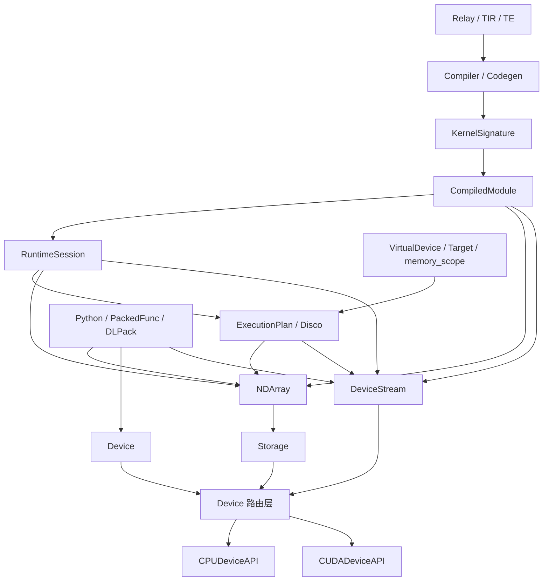
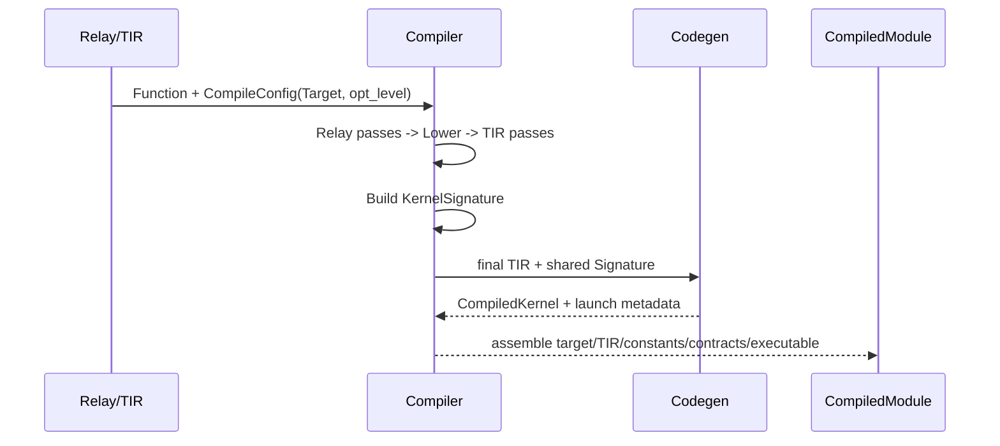
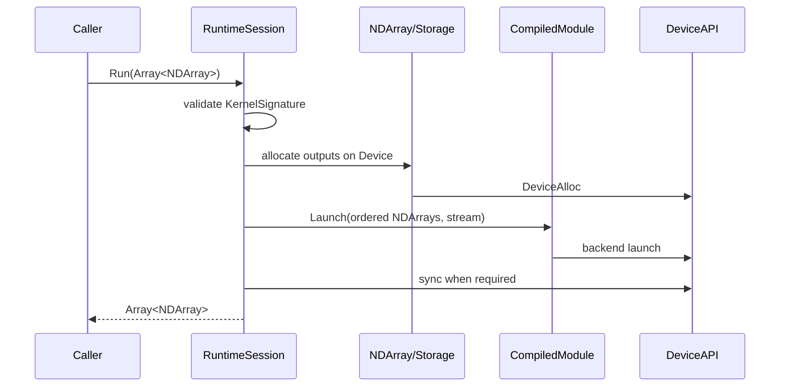

# Device 预期模型与模块交互

> **历史文档／非当前事实源（HISTORICAL, NON-AUTHORITATIVE）。**
> 本文仅保留历史设计/状态背景，不得用于证明当前 capability 或测试通过。
> 当前事实只以 [`MODULE_GUIDE.md`](MODULE_GUIDE.md)、[`core handoff`](handoffs/compiler-foundation/core.md)、
> 当前源码和可重复测试为准。
>
> 原 Device Runtime 实施计划已移除；本文中的目标接口和落地状态均按历史背景阅读。

## 1. 目标

Device 子系统负责统一表达设备身份、设备内存、数据复制、执行流和张量存储，使编译器及运行时满足以下约束：

1. 高层模块只传递 `Device`、`NDArray`、`DeviceStream` 等强类型对象。
2. 裸设备指针只在经过校验的主机访问、DLPack 互操作、DeviceAPI 后端和内核 ABI 边界中出现。
3. `NDArray` 不直接调用 `new[]`、`delete[]`、`memcpy`、`cudaMalloc` 或 `cudaMemcpy`。
4. 物理设备编号、Disco worker 编号和 VirtualDevice 放置是三个独立概念。
5. CPU-only 构建不依赖 CUDA；CUDA 不可用时返回明确错误，不静默回退到 CPU。
6. 公共同步接口返回时操作已经完成；异步接口必须显式传入绑定设备的 `DeviceStream`。
7. 不保留旧 Device 工厂、旧 `NDArray(shape, dtype)` 构造函数或双轨兼容接口。

## 2. 分层模型



各层职责：

| 层 | 核心对象 | 责任 |
|---|---|---|
| 设备身份 | `DeviceNode`, `Device` | 表示物理设备类型和编号 |
| 后端能力 | `DeviceAPI`, `DeviceAPIManager` | 分配、释放、复制、流、属性查询 |
| 物理存储 | `StorageNode`, `Storage` | 持有一段设备内存及其释放责任 |
| 张量视图 | `NDArrayNode`, `NDArray` | dtype、shape、strides、offset 和 Storage 视图 |
| 异步执行 | `DeviceStreamNode`, `DeviceStream` | 持有设备绑定的执行流 |
| 内核契约 | `KernelSignature`, `KernelArgSpec` | 参数顺序、角色、dtype、shape 和 device |
| 编译模块 | `CompiledModule` | 校验完整有序参数并启动已经编译的内核 |
| 运行时 | `RuntimeSession` | 接收 inputs、解析常量、分配静态输出并管理同步/异步结果 |
| 放置执行 | `VirtualDevice`, `ExecutionPlan`, Disco | 从逻辑放置解析物理设备和 worker |

## 3. Device 身份模型

### 3.1 类型定义

```cpp
namespace kxc {

enum class DeviceTypeCode : int {
    kCPU = 0,
    kCUDA = 1,
    kOpenCL = 2,
    kMetal = 3,
};

class DeviceNode final : public Object {
public:
    DeviceTypeCode device_type;
    int device_id;

    KXC_OBJECT_DECLARE
};

class Device : public ObjectRef {
public:
    Device(DeviceTypeCode type, int id);
    explicit Device(const ObjectRef& ref);

    static Device CPU(int id = 0);
    static Device CUDA(int id = 0);

    DeviceTypeCode device_type() const;
    int device_id() const;
    std::string ToString() const;

    bool operator==(const Device& other) const;
    bool operator!=(const Device& other) const;

    const DeviceNode* operator->() const;
};

}  // namespace kxc
```

### 3.2 不变量

- Device 是不可变对象。
- 相等性由 `(device_type, device_id)` 决定，不由节点地址决定。
- CPU 第一阶段只允许 `cpu:0`。
- CUDA id 必须非负，并在访问后端时检查设备是否存在。
- 规范字符串为 `cpu:0`、`cuda:0`。
- `kCUDA` 明确表示 CUDA 后端，不使用含糊的 `kGPU`。
- 从错误类型的 `ObjectRef` 构造 Device 必须抛出类型错误。

### 3.3 与 DLPack 设备类型的映射

目标实现使用固定版本的官方 DLPack 1.0+ 头文件，不继续维护本地 `DLContext/DLTensor` 重声明。内部设备枚举和 DLPack 枚举数值不同，必须使用显式函数：

```cpp
DLDeviceType ToDLDeviceType(DeviceTypeCode type);
DeviceTypeCode FromDLDeviceType(DLDeviceType type);
DLDevice ToDLDevice(const Device& device);
Device FromDLDevice(const DLDevice& device);
```

禁止使用 `static_cast` 在两组枚举之间转换。

### 3.4 DeviceManager

`DeviceManager` 只负责对象驻留和查询，不负责内存分配：

```cpp
class DeviceManager {
public:
    static DeviceManager* Global();

    Device Get(DeviceTypeCode type, int id);
    Array<Device> ListAvailableDevices() const;
    Array<DeviceInfo> GetAllDeviceInfo() const;
};
```

Manager 必须线程安全。缓存 key 是结构化的 `(type, id)`，不能使用 worker id 或字符串拼接作为语义来源。

## 4. DeviceAPI 后端模型

### 4.1 后端接口

`DeviceAPI` 是内部后端抽象，高层模块不得直接选择具体实现：

```cpp
class DeviceAPI {
public:
    virtual ~DeviceAPI() = default;

    virtual void SetDevice(const Device& device) = 0;

    virtual void* AllocDataSpace(
        const Device& device,
        size_t nbytes,
        size_t alignment) = 0;

    virtual void FreeDataSpace(
        const Device& device,
        void* ptr) = 0;

    virtual void CopyDataSync(
        const Device& from_device,
        const void* from,
        size_t from_offset,
        const Device& to_device,
        void* to,
        size_t to_offset,
        size_t nbytes) = 0;

    virtual void CopyDataAsync(
        const Device& from_device,
        const void* from,
        size_t from_offset,
        const Device& to_device,
        void* to,
        size_t to_offset,
        size_t nbytes,
        void* backend_stream) = 0;

    virtual void* CreateStream(const Device& device) = 0;
    virtual void FreeStream(const Device& device, void* stream) = 0;
    virtual void StreamSync(const Device& device, void* stream) = 0;

    virtual void* CreateEvent(const Device& device) = 0;
    virtual void RecordEvent(
        const Device& device, void* event, void* stream) = 0;
    virtual bool QueryEvent(const Device& device, void* event) = 0;
    virtual void WaitEvent(const Device& device, void* event) = 0;
    virtual void FreeEvent(const Device& device, void* event) = 0;

    virtual DeviceAttributes GetDeviceAttributes(
        const Device& device) = 0;
};
```

裸 `backend_stream` 只存在于 DeviceAPI 与具体后端之间，不能进入公共 C++、PackedFunc 或 Python API。

### 4.2 公共路由接口

```cpp
class AsyncOperation;
class Storage;

void* DeviceAlloc(
    const Device& device,
    size_t nbytes,
    size_t alignment = 0);

void DeviceFree(
    const Device& device,
    void* ptr);

void DeviceCopySync(
    const Device& from_device,
    const void* from,
    size_t from_offset,
    const Device& to_device,
    void* to,
    size_t to_offset,
    size_t nbytes);

void StorageCopySync(
    const Storage& from,
    size_t from_offset,
    const Storage& to,
    size_t to_offset,
    size_t nbytes);

AsyncOperation StorageCopyAsync(
    const Storage& from,
    size_t from_offset,
    const Storage& to,
    size_t to_offset,
    size_t nbytes,
    const DeviceStream& stream);
```

`DeviceCopySync/DeviceCopyAsync` 是 DeviceAPI 路由层的内部裸指针原语；所有权安全的上层复制使用 `StorageCopySync/StorageCopyAsync`。Storage 接口负责容量边界校验，异步接口把来源和目标 Storage 放入 AsyncOperation。

路由规则：

| 来源 | 目标 | 后端 |
|---|---|---|
| CPU | CPU | CPUDeviceAPI |
| CPU | CUDA | CUDADeviceAPI |
| CUDA | CPU | CUDADeviceAPI |
| CUDA:0 | CUDA:0 | CUDADeviceAPI |
| CUDA:0 | CUDA:1 | 第一阶段拒绝；P2P 阶段实现后再开放 |
| 其他后端组合 | 未实现时明确拒绝 |

### 4.3 内存契约

- `nbytes == 0` 返回 `nullptr`，释放和复制均为空操作。
- `alignment == 0` 表示后端默认对齐。
- 非零 alignment 必须是 2 的幂，并作为最小对齐保证。
- 分配失败、设备不可用、非法方向和后端错误均抛出带上下文的异常。
- `DeviceFree(device, nullptr)` 为空操作。
- 显式 `DeviceFree` 可以报告错误；对象析构必须捕获并记录释放错误，不能抛出。
- 同步复制返回时数据已经可被目标设备或主机读取。
- 原始指针路由层只能校验设备、空值、offset 和整数转换；容量边界由持有 Storage 的上层校验。

## 5. DeviceStream 模型

```cpp
class DeviceStreamNode final : public Object {
public:
    Device device;
    void* backend_handle;
    bool owns_handle;

    KXC_OBJECT_DECLARE
};

class DeviceStream : public ObjectRef {
public:
    static DeviceStream Create(const Device& device);
    static DeviceStream Default(const Device& device);

    Device device() const;
    bool is_default() const;
    void Sync() const;

    const DeviceStreamNode* operator->() const;
};
```

不变量：

- 每个 stream 永久绑定一个 Device。
- 默认 stream 是明确的非持有句柄，析构时不释放后端默认流。
- 自建 stream 最后一个引用销毁时释放后端资源。
- 析构不抛异常；显式 `Sync` 和显式释放可以报告错误。
- 异步复制或内核启动必须校验 stream.device 与执行设备一致。
- 不允许线程局部“当前流”悄然改变同步 API 语义。

### 5.1 AsyncOperation

所有异步复制和异步内核启动都返回可等待对象。该对象在操作完成前持有 stream、event 和参与操作的 Storage，防止源或目标内存提前释放。

```cpp
#include "base/storage.h"

class AsyncOperationNode final : public Object {
public:
    DeviceStream stream;
    Array<Storage> retained_storage;
    ObjectRef retained_executable;
    void* backend_event;
    bool completed;

    KXC_OBJECT_DECLARE
};

class AsyncOperation : public ObjectRef {
public:
    void Wait() const;
    bool IsReady() const;
    Device device() const;
};
```

- H2D 的 stream 绑定目标 CUDA Device。
- D2H 的 stream 绑定来源 CUDA Device。
- D2D 的 stream 与来源、目标的共同 CUDA Device 一致；跨 CUDA Device 在 P2P 实现前拒绝。
- CPU 到 CPU 的异步请求可以返回已完成的 AsyncOperation。
- 尚未完成的 CUDA 内核通过 AsyncOperation 的 `retained_executable` 持有 module、function 和 backend launch state；LLVM 在返回已完成句柄前已同步执行完毕，无需保活 executable。
- `Wait()` / `IsReady()` 成功后回收 event；当前 retained Storage 和异步 executable 继续由完成句柄持有，直到该 ObjectRef 释放。析构未完成操作时必须等待或把所有权移交给后端完成队列，不能直接丢弃引用。

## 6. Storage 物理存储模型

`Storage` 表示一段物理设备分配，`NDArray` 表示该存储上的逻辑张量视图。二者分离后可以安全支持 view、DLPack 外部所有权和后续内存复用。

```cpp
enum class StorageOwnership {
    kOwned,
    kExternal,
    kWorkspace,
};

using ExternalStorageDeleter = void (*)(void* data, void* context);

class StorageNode final : public Object {
public:
    Device device;
    void* data{nullptr};
    size_t capacity_bytes{0};
    size_t alignment{0};
    StorageOwnership ownership{StorageOwnership::kOwned};
    ExternalStorageDeleter external_deleter{nullptr};
    void* deleter_context{nullptr};

    KXC_OBJECT_DECLARE
};

class Storage : public ObjectRef {
public:
    static Storage Alloc(
        const Device& device,
        size_t nbytes,
        size_t alignment = 0);

    static Storage FromExternal(
        const Device& device,
        void* data,
        size_t capacity_bytes,
        ExternalStorageDeleter deleter,
        void* context);

    Device device() const;
    size_t capacity_bytes() const;
    void* data() const;

};
```

所有权规则：

- `kOwned` 通过 `DeviceAlloc` 创建，最终通过同一 Device 的 `DeviceFree` 释放。
- `kExternal` 不调用 DeviceFree，只调用一次外部 deleter。
- `kWorkspace` 由 workspace pool 管理，不能导出为长期 DLPack 所有权。
- 最终析构恰好释放一次资源，析构异常转为诊断事件。
- Storage 不记录 shape 或 dtype。

## 7. NDArray 张量模型

### 7.1 对象结构

```cpp
namespace kxc::runtime {

class NDArrayNode final : public Object {
public:
    Storage storage;
    DLDataType dtype;
    std::vector<int64_t> shape_storage;
    std::vector<int64_t> strides_storage;
    size_t byte_offset{0};
    DLTensor dl_tensor;

    KXC_OBJECT_DECLARE
};

class NDArray : public ObjectRef {
public:
    static NDArray Empty(
        Array<int64_t> shape,
        DLDataType dtype,
        Device device);

    static NDArray Zeros(
        Array<int64_t> shape,
        DLDataType dtype,
        Device device);

    Device device() const;
    Array<int64_t> shape() const;
    DLDataType dtype() const;
    size_t NBytes() const;
    bool IsContiguous() const;

    void CopyFromBytes(const void* source, size_t nbytes) const;
    void CopyToBytes(void* destination, size_t nbytes) const;
    void CopyFrom(const NDArray& source) const;
    NDArray CopyTo(const Device& destination) const;

    AsyncOperation CopyFromAsync(
        const NDArray& source,
        const DeviceStream& stream) const;

    NDArray CreateView(
        Array<int64_t> shape,
        Array<int64_t> strides,
        size_t byte_offset) const;

};

}  // namespace kxc::runtime
```

### 7.2 不变量

- 第一阶段只创建连续 dense NDArray：`strides == nullptr`、`byte_offset == 0`。
- view 第一阶段仅允许连续布局。后续开放 strides 时只接受非负、以元素为单位的 strides；使用检查溢出的 `max_element_offset = sum((shape[i] - 1) * strides[i])` 计算最大可达字节，并验证 `byte_offset + (max_element_offset + 1) * element_bytes <= storage.capacity_bytes`。任一维为零时可达字节数为零。
- shape 维度不得为负；元素数和字节数计算必须检查溢出。
- dtype 必须是支持的 code，`bits` 是 8 的倍数，`lanes >= 1`。
- `NBytes()` 返回逻辑字节数；零元素张量返回 0，data 为 nullptr。
- `Empty` 不初始化数据，`Zeros` 明确清零。
- 复制 NDArray 句柄共享同一节点；`CopyTo` 分配独立 Storage。
- Storage 完全由 RAII 管理，不提供显式 `Release()`；最后一个引用销毁时恰好释放一次。
- `DLTensor.data` 指向 Storage 基地址，`byte_offset` 保存在 DLTensor 字段中。
- Python buffer 仅允许 CPU、连续、主机可访问的 NDArray。
- `CopyFromBytes`、`CopyToBytes` 和直接同布局复制只支持连续 NDArray；非连续 view 在实现 strided copy kernel 前明确拒绝。

## 8. KernelSignature 与内核 ABI

公共执行边界只接受 `NDArray` 和显式 `DeviceStream`。CPU 与 CUDA 可以在各自的私有 `.cc` 实现中使用不同调用帧，但裸指针、函数地址和后端句柄不得进入 `api/`、公共 `runtime/`、PackedFunc 或 Python 接口。

### 8.1 已实现的对象模型

参数、签名和启动元数据均为 `Object/ObjectRef` 对象。对象构造时完成校验，对外返回的 `Array` 会复制容器节点，调用方不能通过共享别名重排已经验证的 ABI。

```cpp
enum class KernelArgRole : int {
    kInput = 0,
    kConstant = 1,
    kOutput = 2,
};

class KernelArgSpecNode final : public Object {
public:
    String name;
    KernelArgRole role;
    DLDataType dtype;
    Device device;
    uint64_t alignment;
    bool mutable_data;
    String constant_key;

private:
    Array<int64_t> shape_;
};

class KernelSignatureNode final : public Object {
public:
    String symbol;

private:
    Array<KernelArgSpec> arguments_;
};

class KernelSignature : public ObjectRef {
public:
    void Validate() const;
    Array<KernelArgSpec> arguments() const;
    bool has_dynamic_input_shape() const;
};

class KernelLaunchMetadataNode final : public Object {
public:
    Device device;
    CodeGenBackend backend;
    Dim3 grid;
    Dim3 block;
    uint64_t dynamic_shared_memory_bytes;
};
```

当前不变量：

- 参数严格按 `input -> constant -> output` 分段，顺序来自最终优化后的 `PrimFunc.params`，不能由调用方重新推测。
- 参数名在同一签名内唯一；常量 key 非空且唯一，非定值参数的 `constant_key` 必须为空。
- 常量 payload 由 Relay lowering 保留，Compiler 在 Lower 阶段将其放置到 Target Device；`BuildKernelSignature` 使用结构化常量 key 和最终 TIR 构建契约，不重新扫描 Relay。
- `shape` 是唯一的 rank 来源。`-1` 仅表示动态输入维度；当前没有 shape function，因此动态输出在签名构造阶段直接拒绝。
- dtype 比较覆盖 DLPack 的 `code`、`bits` 和 `lanes`，alignment 必须是 2 的幂。
- LLVM metadata 只允许 CPU Device 和 `1x1x1` grid/block；CUDA metadata 只允许 CUDA Device，并由 `BindCudaThreads` 固化 grid、block 和逻辑 work size。

### 8.2 CompiledModule 公共启动边界

`CompiledModule` 同时持有 Target、最终 TIR、Signature、启动元数据、常量表和后端 `CompiledKernel`。模块构造要求 executable 与模块共享同一个 Signature 和 metadata 节点，避免装配阶段出现两份 ABI 事实。

```cpp
class CompiledModule : public ObjectRef {
public:
    AsyncOperation Launch(
        const Array<runtime::NDArray>& ordered_arguments,
        const DeviceStream& stream) const;

    KernelSignature signature() const;
    KernelLaunchMetadata launch_metadata() const;
    Map<String, runtime::NDArray> constants() const;
    Target target() const;
};
```

`Launch` 在调用 launcher 前依次验证：

1. executable 和 stream 已定义且 ready；
2. stream Device 与启动 metadata 一致；
3. 参数数量与 Signature 完全相等；
4. 每个 NDArray、Storage、dtype、device、rank、shape 和连续性合法；
5. `byte_offset + NBytes()` 位于 Storage 容量内，有效数据地址满足 alignment；
6. 常量参数必须是模块常量表中对应 key 绑定的同一个 NDArray 对象，调用方不能替换 payload；
7. 全部检查成功后才调用 `CompiledKernel::Launch`，失败路径不产生后端副作用。

当前 backend 内部规则：

- LLVM launcher 在私有实现中使用 `int32_t(void** data, uint64_t count)` 调用帧。它从已经验证的 NDArray 提取有效地址，调用 ORC JIT 机器码，并返回已完成的 `AsyncOperation`。该 `void**` 不是公共 ABI。
- 每个 LLVM 编译模块拥有独立 ORC `LLJIT`；launcher 强持有 JIT 和函数地址，模块销毁前机器码始终有效。
- CUDA launcher 先构造有效 device pointer 的主机存储单元 `pointer_values[i]`，再令 `kernel_params[i] = &pointer_values[i]` 后调用 `cuLaunchKernel`；不能把 device pointer 数组直接冒充 Driver 参数数组。
- CUDA NDArray 的有效地址是 `Storage.data + byte_offset`。launch 后在同一 stream 记录 event，pending `AsyncOperation` 同时保活参数 Storage、CompiledKernel、CUmodule、stream 和 event，直到完成或显式等待。
- `CSourceEmitter` 只生成诊断 C 源码，不是可执行 backend，也不参与 Compiler dispatch。

## 9. 与编译器模块的交互

### 9.1 Relay、TIR 和 TE

- Relay/TIR/TE 只表达逻辑 shape、dtype、VirtualDevice 和 memory_scope。
- IR 节点不得持有 DeviceAPI 或后端 stream。
- Relay 常量持有 NDArray，但常量折叠只能通过 NDArray 主机复制接口读取数据。
- CPU-only Pass 不得直接解引用 CUDA NDArray 数据。

### 9.2 Compiler 和 Codegen

`CompileConfig` 只包含 Target、`opt_level` 和 profiling 选项：

```cpp
CompileConfig config = CompileConfig::Create(target, opt_level);
CompiledModule module = Compiler::Compile(function, config);
```

不存在独立 backend 字段，也不存在 AOT、JIT 或 Adaptive mode。Target 是 backend 选择的唯一事实来源：`llvm + CPU` 进入 LLVM ORC JIT，`cuda + CUDA` 进入线程绑定、CUDA C++ 发射、NVRTC PTX 编译和 Driver module 加载；kind、DeviceType、device id 或能力快照不一致时在编译入口失败。

Compiler 使用不可回退的 `CompileResult` 状态机按以下顺序推进：

1. `validate`：校验 CompileConfig、Target 和入口 Relay Function；
2. `optimize_relay`：强制类型推导并执行 `opt_level` 对应的确定性 Relay pass；
3. `lower`：原子产出 PrimFunc 和稳定常量表；
4. `optimize_tir`：执行确定性 TIR pass，并只保留最终 TIR 事实；
5. `build_signature`：从最终 TIR、常量表和 Target 构建 KernelSignature；
6. `build_backend`：按 Target 构建 metadata 和 CompiledKernel；
7. `assemble`：把所有同源对象组装为 CompiledModule。

每次状态转移只允许前进一个阶段；常量表从 lowering 开始持续保活，后续阶段不能重新扫描 Relay。PassContext 会合并 CompileConfig Target 与 Relay placement，存在冲突时失败，不静默覆盖。

当前 Compiler 输出包括：

- 强持有最终 TIR、常量 payload 和 executable 的 `CompiledModule`；
- 后端无关 `KernelSignature`；
- Target 与物理 Device 快照；
- `KernelLaunchMetadata`；
- LLVM ORC JIT launcher，或持有 `CUmodule/CUfunction` 的 CUDA Driver launcher。

Codegen 本身不分配调用方输入输出 NDArray。LLVM 编译临时对象由 RAII 管理；常量 NDArray 由 CompiledModule 持有。静态输出 shape 记录在 Signature 中，由 RuntimeSession 在调用阶段按 dtype、Device 和 alignment 自动分配；直接调用 `CompiledModule::Launch` 时仍由调用方提供完整输出参数。

### 9.3 编译执行流程



## 10. 与 RuntimeSession 的交互

> **实现状态：静态核心已实现。** `RuntimeSession` 位于 `include/runtime/runtime_session.h` 和 `src/runtime/runtime_session.cc`，只消费已经 ready 的 `CompiledModule`。旧 Adaptive runtime、后台编译器、shape predictor、模糊 kernel cache 和裸参数 runner 均未恢复。

### 10.1 已实现能力

RuntimeSession 已完成：

1. 在产生输出分配前，按 KernelSignature 校验输入数量、dtype、shape、Device、连续布局、Storage range 和 alignment；
2. 通过 `constant_key` 取得 CompiledModule 持有的同一常量对象；
3. 按 output spec 的 shape、dtype、Device 和 alignment 自动分配静态输出；
4. 严格遍历 Signature 组装 input、constant、output，不根据 Map 顺序或参数名推测 ABI；
5. `Run` 使用模块 Device 的默认 stream，等待完成后返回 outputs；
6. `RunAsync` 使用调用方提供的同 Device stream，同时返回 outputs 和 completion；
7. completion 保活本次调用的全部参数 Storage 和 stream；尚未完成的异步后端还会保活 executable。

### 10.2 公共接口

RuntimeSession 是 CompiledModule 的上层消费者，不是 Compiler mode。接口只接受强类型张量：

```cpp
struct RunAsyncResult final {
    Array<NDArray> outputs;
    AsyncOperation completion;
};

class RuntimeSession : public ObjectRef {
public:
    explicit RuntimeSession(api::CompiledModule module);
    explicit RuntimeSession(const ObjectRef& ref);

    Array<NDArray> Run(const Array<NDArray>& inputs) const;
    RunAsyncResult RunAsync(
        const Array<NDArray>& inputs,
        const DeviceStream& stream) const;
};
```

`RuntimeSessionNode` 只持有一个 `CompiledModule`，单次调用的 inputs、outputs、ordered arguments 和 completion 均为局部状态。`RunAsyncResult` 当前是 C++ 聚合，不注册到 PackedFunc/Python；跨语言接口需要独立的 ObjectRef result 类型，不能直接暴露该结构体 ABI。

### 10.3 异步前置条件和资源驻留

- `RunAsync` 不接收 dependency 列表，NDArray 也不记录 last-writer event。输入必须已经 ready，或其 producer 必须与本次 launch 使用同一 stream；跨 stream 消费前由调用方等待 producer completion。
- `AsyncOperation::Wait/IsReady` 回收 event，但完成句柄仍持有 `retained_storage`，异步后端还持有 executable，直到 completion ObjectRef 自身释放。LLVM 在返回 completion 前已经同步执行完毕，因此无需把 executable 存入完成句柄。长期保存已完成 completion 仍会占用其实际持有的资源。
- `Storage::FromExternal` 的异步安全取决于外部 owner。若没有能覆盖执行期的 deleter/所有权对象，completion 只能保活 Storage 元数据，不能延长外部 buffer 的真实生命周期。
- CUDA 测试已覆盖同 stream H2D 后直接 launch，不在 copy 与 kernel 之间显式等待；也覆盖 module、session、inputs 和外部 stream 引用释放后仅凭 completion 完成执行。

### 10.4 尚未实现的边界

- 动态输出 shape function 和动态 shape specialization；
- exact shape cache、后台重编译、失败传播和 module 热替换；
- ExecutionPlan 到 CompiledModule 的 registry、查找和参数装配；
- 可序列化 AOT artifact、磁盘 cache 或跨进程 module 加载。

这些能力不得重新引入 `std::vector<void*>`、shape fuzzy 命中或持有 unordered_map 元素裸指针的 cache。



当前 CPU LLVM 与 CUDA add/constant/relu 数值测试均通过 RuntimeSession 只传 inputs；这不表示动态 shape specialization 或 ExecutionPlan 执行已经完成。

## 11. 与 ExecutionPlan 和 Disco 的交互

### 11.1 三类身份必须分离

| 概念 | 示例 | 含义 |
|---|---|---|
| 物理 Device | `cuda:0` | 当前进程可访问的硬件设备 |
| Disco worker | `worker 3` | 分布式或线程执行参与者 |
| VirtualDevice | target + memory_scope + placement | 编译期逻辑放置 |

禁止用 `device_id` 推导 worker id，也禁止用 worker id 构造物理 Device。

### 11.2 放置解析

ExecutionPlan 必须为每个 value 保存或可解析：

- shape；
- dtype；
- VirtualDevice；
- worker 集合；
- 物理 Device；
- storage id 和生命周期信息；
- 同步依赖。

ExecutionPlan 的 `constant_value_ids` 必须映射到 session/worker 常量表中的 NDArray；加载计划时校验每个常量 id 都有 payload、dtype、shape 和 Device，执行期间常量 Storage 必须持续存活。

`ExecutionPlanExecutor::ExecuteKernel` 必须真正完成模块查找、参数绑定和内核启动，不能通过复制第一个输入模拟执行。

### 11.3 复制和集合通信

- 普通 `device.copy` 使用 NDArray/Storage 和 Device 路由层。
- CPU CCL 只接受 CPU NDArray。
- NCCL 完成前，CUDA collective 明确报错。
- NCCL 完成后，communicator 按 worker、rank 和物理 CUDA Device 建立。
- barrier 必须同步实际 DeviceStream 或 collective，而不是仅同步 worker 队列。

## 12. 与 Python、PackedFunc 和 DLPack 的交互

### 12.1 Python API

```python
cpu = kxc_runtime.Device.cpu()
cuda0 = kxc_runtime.Device.cuda(0)

x = kxc_runtime.NDArray.empty([2, 3], "float32", cuda0)
y = kxc_runtime.NDArray.zeros([2, 3], "float32", cpu)
z = x.copy_to(cpu)

array = memoryview(z)   # 仅连续 cpu:0 NDArray 导出 buffer
```

约束：

- Python 不接收或返回整数形式的设备指针。
- `memoryview(cuda_array)` 明确失败。
- `numpy()` 对 CUDA NDArray 执行显式同步复制。
- Device、NDArray、DeviceStream 都由 ObjectRef 生命周期管理。

### 12.2 PackedFunc

PackedFunc 使用 ObjectRef 传递 Device、NDArray 和 DeviceStream。原始指针只允许出现在私有后端注册函数中，不作为公共 Python API。

### 12.3 DLPack

- 只支持 DLPack 1.0+ 的 `DLManagedTensorVersioned`，不提供 deprecated `DLManagedTensor` 兼容路径。
- `__dlpack__(stream, max_version, copy, dl_device)` 收到 `max_version < 1.0` 时明确拒绝。
- versioned capsule 名称使用 `dltensor_versioned`；消费后改名为 `used_dltensor_versioned`。
- 导出 capsule 时，manager context 持有 Storage/NDArray 引用；capsule deleter 恰好释放一次引用。
- 导入外部 capsule 时创建 `StorageOwnership::kExternal` Storage；外部 deleter 恰好调用一次。
- CUDA consumer 必须把后续消费所用的 stream 传给 producer；producer 在必要时通过 event/wait 建立依赖，不能只交换指针而忽略生产流上的未完成工作。
- CPU capsule 不需要 CUDA stream；CUDA stream 参数必须与 capsule Device 一致。
- `copy=False` 时不允许隐式复制；跨设备转换必须由显式 copy/dl_device 请求触发，并遵循当前支持矩阵。
- DLPack Device、dtype、shape、strides、byte_offset、flags 和 version 必须完整校验。
- workspace Storage 不允许导出为长期 capsule。

规范依据：[DLPack 官方 Python 规范](https://dmlc.github.io/dlpack/latest/python_spec.html)中的 stream handling、versioned managed tensor 和 capsule ownership 要求。

## 13. 生命周期与状态

### 13.1 NDArray 状态

| 状态 | `defined()` | Storage | data | 允许操作 |
|---|---:|---|---|---|
| 未定义句柄 | false | 无 | 无 | 赋值、析构 |
| 零元素张量 | true | 容量 0 | nullptr | shape/dtype 查询、零字节复制 |
| 已分配张量 | true | 有 | 非空 | 完整 NDArray API |

### 13.2 错误语义

- 构造、显式分配、显式释放、复制、同步和内核启动可以抛出异常。
- Object 析构函数不得抛出异常。
- 析构期后端错误写入 profiling/diagnostic，并包含 device、操作和错误码。
- 无效输入在调用后端前失败。
- CUDA 不可用时不得回退到 CPU。

## 14. 可观测性

以下操作必须记录 profiling event：

- device discovery；
- allocation/free；
- H2H、H2D、D2H、D2D copy；
- stream create/free/sync；
- kernel launch；
- collective；
- memory pool hit/miss；
- destructor release failure。

公共字段至少包括：

```text
device_type
device_id
operation
nbytes
alignment
copy_direction
stream_id
synchronous
duration_us
status
```

不得记录原始数据内容。指针地址默认不进入持久日志。

## 15. 模块边界总表

| 模块 | 可以依赖 | 禁止行为 |
|---|---|---|
| Relay/TIR/TE | Device、VirtualDevice、NDArray 常量 | 直接调用 DeviceAPI、直接解引用 CUDA 数据 |
| Compiler/Codegen | Device capability、KernelSignature | 持有调用方 NDArray 生命周期 |
| DeviceAPI 后端 | Device、裸指针、内部 stream | 理解 IR、worker 或 ExecutionPlan |
| Storage | Device 路由层 | 保存 shape/dtype |
| NDArray | Storage、dtype、shape、DeviceStream | 直接调用 CUDA/系统分配函数 |
| RuntimeSession | NDArray、KernelSignature、CompiledModule | 编译 Relay、暴露裸指针 ABI，或重新引入旧 Adaptive/fuzzy cache |
| ExecutionPlan/Disco | VirtualDevice、Device、NDArray、collective | 混用 worker id 和 device id |
| Python/PackedFunc | ObjectRef 接口 | 用整数传递设备指针 |
| DLPack | NDArray/Storage 所有权桥 | 重复释放或隐式设备复制 |

## 16. 最小完成标准

核心 Device 模型完成时必须满足：

1. Device 是不可变 Node/Ref 对象，worker 和 device 身份完全分离。
2. CPU/CUDA 分配、释放和同步复制在 Windows 与 Linux 上通过契约测试。
3. NDArray 通过 Storage 和 DeviceAPI 持有 CPU/CUDA 内存。
4. CPU、H2D、D2H、同设备 D2D 往返数据正确。
5. Python、Relay 常量和 CPU CCL 不会解引用 CUDA 指针。
6. CompiledModule 以完整有序 NDArray 为公共参数；RuntimeSession 只接收 inputs，并根据 KernelSignature 绑定常量和分配静态 outputs。
7. ExecutionPlan 在声明的物理设备上分配 value 并执行真实 kernel。
8. CPU-only 构建不引用 CUDA 符号。
9. ASan、ThreadSanitizer 和 Compute Sanitizer 未报告所有权、越界或泄漏错误。
10. 公共接口中不存在旧 Device 工厂、旧 NDArray 构造函数或兼容适配层。
