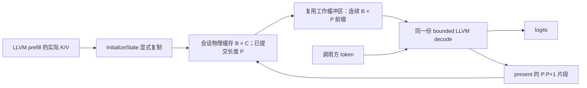

# M2/M3 技术报告：变长 decode 接入会话 KV 状态

日期：2026-09-09。范围：CPU/LLVM、固定物理容量与每次变化的有效长度，真实八层 MiniMind。

## 达到的效果

完整变长 decode 现已接入 RuntimeSession 持有的 KV 缓存。调用方每步只传 `input_ids[B,1]`；会话提供 16 个 K/V 的有效前缀，执行普通 LLVM kernel，再将新 K/V 追加到固定容量的状态缓冲区。位置窗口、attention 长度和输出分配都使用实际 P，不再由调用方另外提供位置或容量 mask。

四组 `(B,P)=(1,0),(1,1),(2,4),(3,8)` 共执行 **3,096 次模型 kernel 调用**。logits 和 16 个状态前缀与同一 LLVM 产物的 fresh-output 执行结果逐位一致；后者已与动态 ONNX ReferenceEvaluator 比较，最大绝对误差为 1.56164e-5。

另一次真实 **LLVM prefill → InitializeState → 四步 LLVM greedy decode** 执行了 742 次 prefill 和 3,096 次 decode 调用。16 个缓存地址保持不变，有效长度从 4 增长到 8；prefill seed 和各步 logits/KV 对 ONNX 参考的最大绝对误差为 **8.9407e-6**。greedy token 为 5059、4840、4840、1763。初始化完成后释放 prefill 输出，后续运行依靠会话自己的存储。

## 使用的方法

### 在现有计划中声明状态绑定

新增 `ExecutablePlan::BindBoundedStateOutputs` 和独立模式 `kBoundedStatefulExternalV1`。方法消费已编译的 bounded fresh-output plan、输入/present 输出配对、extent 轴、固定 append 数量和物理 shape；不编译 kernel，不访问 primitive cache。

原 past 输入的 value id 成为物理状态 id，继续用于 `InitializeState`、`StateValue` 和 `StateExtent`。方法为原逻辑输入建立新的 prefix value id，重接普通调用的输入，并保留图输入顺序和全部 B/P guard。present 输出成为内部保活的追加来源，不再作为调用方输出返回。`StateOutputBinding::input_value_id` 明确记录该 prefix，由 RuntimeSession 提供；其他图输入按原顺序由调用方传入。

计划校验要求一一配对、CPU float32、正的静态容量、合法范围与布局、独立存储，以及 present 的 producer 直接消费对应 prefix。普通 kernel 不能直接消费物理容量 state。会话构造还核对模块自有的输出维度表达式必须等于 `InputAxis(prefix,P) + append_count`。因此不能把 P+1 随意标成追加两个 token；错误绑定会在会话存储分配之前被拒绝。

### 处理多 batch 的物理步长

物理缓存为 `[B,C,4,96]`，kernel 的逻辑输入为 `[B,P,4,96]`。B 大于 1 时，两者的 batch 步长不同，直接改 shape 会读到无效容量区。

会话因此一次分配物理缓存和一个等容量的 prefix 工作缓冲区。每次运行先完成容量、dtype/rank 和原图全部共享维度 guard 的检查，再复用 `CopyStateRange`，逐 batch 把有效区域整理成连续的 `[B,P,4,96]` 视图。P=0 时不复制任何 payload。普通 kernel 沿用已有 input-axis extent ABI，读到的长度来自会话已提交的状态元数据。



运行结束后先检查所有 present 的完整 shape，再从各自的 P 位置复制固定的新片段到容量缓存。所有复制成功后才一起提交新长度。prefix 和容量存储都不随每次 P 的变化重新分配；普通中间张量与 present 仍按已有 dynamic fresh-output 机制分配。

### 保留已有完成与失败规则

状态和 prefix 缓冲区都属于同一个 RuntimeSession。复用既有状态锁、length book、completion 保活和失败标记；没有新的 KV registry、模型专用执行器或 ShapeProgram。

CPU/LLVM 版本在 `RunAsync` 返回前完成 kernel 和状态复制。输入/容量错误发生在启动前，不改变状态；执行已经开始后的失败继续按既有规则使会话不能继续，不承诺回滚。`InitializeState` 仍显式复制已完成的 prefill 输出，不在两个会话间共享裸指针。

新模式的计划 ABI 为 **v11**，包含物理容量、布局、状态/prefix/输出配对及 append 数量；运行 cursor 不进入 identity。内存合同为 `bounded-external-stateful-capacity-and-compact-prefix-v1`。旧静态容量模式保留 ABI v10，kernel 的 ModuleInvocationContract 仍为 v4，bounded 编译身份不变。

## 验证与效果

生产验证位于 [minimind_bounded_decode_llvm_test.cpp](../../test/minimind_bounded_decode_llvm_test.cpp)，使用实际 Compiler 和 RuntimeSession。

| 验证 | 结果 |
|---|---|
| 无下载状态图 | B=1/2/3，正负 1e20 哨兵，各自连续追加到 C=6；30 runs、60 次 LLVM 调用，前缀、追加和输出精确，地址稳定 |
| 小图反例 | 36 次输入/容量拒绝，10 次绑定/模块合同拒绝；覆盖 rank/dtype、batch/长度、错误容量/布局、重复配对、伪造 prefix id、错误 producer 和 append 数量 |
| 原始完整 decode | 四组 B/P，3,096 次调用；logits 和 16 个缓存与 fresh-output LLVM 逐位一致，无效容量区保持 1e20 |
| 跨层长度错误 | 先初始化 15 个 K/V 输入、保留最后一个 extent=0，运行在分配/启动前拒绝；补齐后同一会话正常执行 |
| 实际 prefill 交接 | 742 次 prefill + 四步共 3,096 次 decode，16 个地址稳定，extent 4→8；包含 seed 的最大误差 8.9407e-6 |
| 缓存与身份 | 上述 Run 不访问 primitive cache；cursor 变化不改变计划 ABI，物理容量改变会改变 ABI |
| 默认 CPU/LLVM | 48/48 CTest 通过，41.36 秒 |
| bounded CPU/LLVM 全量 | 62/62 CTest 通过，250.76 秒；显式启用七组 bounded 模型 fixture 与原静态容量模型 fixture |
| 旧静态容量模型 | 实际 LLVM prefill 与四步 owned decode 再次通过，extent 16→20，最大 logits 误差 5.42402e-6 |
| Python | 280/280 通过，1.21 秒 |
| 合同与架构 | Relay 37/37、pass 20/20、include 279、headers 89+10 编译、docs 54 篇通过；1,847 个强全局符号无重名，diff check 通过 |

完整图首次组合验证通过，耗时 133.08 秒，主要包含模型准备、编译、数值和拒绝检查。这不是性能 benchmark，也不代表单 token 延迟。

profile 复用了 M1 的运行关联字段。四组 owned decode 记录 3,096 对 submit/exec 和 208 次运行内 copy；实际 prefill 记录 742 对，四步 owned greedy 记录 3,096 对和 128 次 copy。小图记录 60 对、110 次 copy 和 180 次普通调用分配事件。事件按 stage、B/P、state extent、export receipt、计划 ABI、run_id 和 kernel 关联；初始化阶段的复制与运行事件分开记录。

## 复现与来源

模型、原始 ONNX、JSON、参数和独立参考均复用 [完整 decode 报告](M3_FULL_DECODE_REPORT.md)与 [完整 prefill 报告](M3_FULL_PREFILL_REPORT.md)的固定产物。没有修改模型，也没有重新导出或在 Python 中实现状态执行。模型是固定种子的八层 MiniMind 构造，不用于声称语言质量。

```bash
KXC_MINIMIND_BOUNDED_DECODE_DIR="$PWD/out/fx_minimind_bounded_decode" \
KXC_MINIMIND_BOUNDED_PREFILL_DIR="$PWD/out/fx_minimind_bounded_prefill" \
  ctest --test-dir out/build/bounded-llvm --output-on-failure \
  --no-tests=error -R '^minimind_bounded_decode_llvm_test$'
```

未设置相应 fixture 环境变量时只运行无下载部分，不能据此声称完整模型或 prefill 交接通过。首次组合日志及完整收据已保存到 `/tmp/kxc-m2-bounded-state-actual.log` 和 `/tmp/kxc-m2-bounded-state-actual-lasttest.log`；事件包位于 `out/build/bounded-llvm/out/minimind_bounded_decode_profile/events.jsonl`。

## 三轮 Ponytail QA 与剩余范围

1. **复用检查**：沿用 ExecutablePlan、RuntimeSession、ModuleShapeExpr、图 guard、CopyStateRange 和原有 completion；编译后的普通 kernel 不需要修改。
2. **权威与身份检查**：只有会话 length book 决定有效长度；prefix 是工作副本，不能由调用方替换。绑定和物理布局进入 ABI，cursor 不进入编译身份；fresh-output 模式继续拒绝持久 state。
3. **执行与边界检查**：空 past、多 batch、全部层、真实 LLVM prefill、连续 greedy、哨兵、容量和错误绑定均有实际消费者与测试。动态输出表达式在会话分配前核对，运行输入在复制/启动前核对。

本切片采用两份显式编译的 bounded 计划：prefill 输出经初始化复制进入持有状态的 decode 会话。每个状态计划的 batch 与物理容量固定，编译产物本身可供不同 B/P 使用；不能在持有缓存的会话中随意改变 batch 或请求顺序。

CPU 前缀整理的复制量随有效缓存长度增长，且每个 state 需要额外的等容量工作缓冲区。设备端更新、直接按物理步长读取、请求合批/退出与槽位管理、分页缓存、状态迁移以及控制流运行时接入仍待实施。

最终回归日志为 `/tmp/kxc-m2-bounded-state-bounded-ctest.log`、`/tmp/kxc-m2-bounded-state-default-ctest.log`、`/tmp/kxc-m2-bounded-state-python.log`；完整 bounded 收据保存为 `/tmp/kxc-m2-bounded-state-bounded-final-lasttest.log`。完整 decode/state 事件包包含 59 次成功 Run 与 59 次 preflight 拒绝，合计 13,258 对 submit/exec，分别归属窗口、外部 K/V、会话状态及 prefill 交接阶段。
