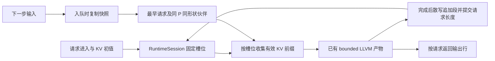

# M2/M3 技术报告：请求批处理与 KV 槽位

CPU/LLVM 请求批处理首版已接到现有 `ExecutablePlan` 和 `RuntimeSession`。调用方可以接纳请求、提交下一步输入、合并兼容请求、取消排队步骤并释放槽位。每个请求的有效 KV 长度分别保存，持久张量仍由 RuntimeSession 的同一张 state 表拥有。

完整八层 MiniMind 实测中，**4 个请求、7 个请求步合为 5 次图执行**，LLVM kernel 提交从 **5418 次降到 3870 次，减少 28.6%**。各请求 logits 和全部 16 份有效 KV 与独立 LLVM 执行逐位相等；初始 fixture 与 ONNX 参考的最大绝对误差为 `1.12504e-05`。这是提交次数和数值证据，尚不是吞吐基准结论。核心定向、真实模型、三套完整回归与架构检查均通过。

## 为什么这样实现

现有 bounded MiniMind decoder 在一批中使用一个统一的 past length `P`。将不同 P 的缓存直接拼到同一批，会改变位置编码、注意力范围与输出布局。因此，本次按 **相同已提交长度、相同非 batch 输入形状** 分组；不同长度可以同时驻留，也可以在步与步之间进入或退出，但不会被隐式补齐到同一个 P。

参考 [Triton batching 文档](https://docs.nvidia.com/deeplearning/triton-inference-server/user-guide/docs/user_guide/batcher.html) 对无状态请求合并与有状态序列归属的区分，采用显式模型批处理声明和稳定的状态归属。没有引入 Triton 依赖、服务进程或另一套模型状态管理器。

`BindRequestBatching(max_batch_size)` 是模型生产者对已有 bounded state 计划的显式声明：输入、输出均以第 0 轴表示相互独立的请求。**形状一致不能证明数学上的行独立性**；生产者必须确认模型不跨请求归约、不利用总 batch 大小改变每行计算。本次完整 MiniMind 和受控图通过独立执行对照验证这一声明，没有声称能自动识别任意图的请求独立性。

## 合同与数据路径



扩展位于现有 [计划合同](../../include/kxc/runtime/executable_plan.h)、[计划验证](../../src/runtime/executable_plan.cc)、[会话 API](../../include/kxc/runtime/session.h) 与 [执行实现](../../src/runtime/session.cc)：

- `RequestBatchingContract` 只作用于 `kBoundedStatefulExternalV1`。物理 state 第 0 轴确定有限槽位数，`max_batch_size` 可小于槽位数；槽位数仍须在编译时 batch 上界内。
- 每个输入须有共享的有界 batch 轴，允许 `1..槽位数` 的所有整数；batch 与非 batch 轴不能通过 equality guard 混为一维。state extent 轴必须不是第 0 轴，各 state 的槽位数和每步追加数量相同。
- 原 `BindBoundedStateOutputs` 和模块构造检查继续证明源输出为 `P+append_count`，不重新实现 shape evaluator 或推测 kernel ABI。新批处理声明不会编译、查 cache 或选择 profile。
- 接纳请求时，先检查全部 KV 初值，再重置空槽位、复制有效前缀，最后发布新的请求编号。编号在一个 session 内单调递增，释放后不复用；旧编号不能访问新请求。
- 每个活动请求最多排队一个步骤。入队先走已有 dtype、rank、shape 和 guard 校验，再复制输入；调用方随后修改或释放原输入不会改变排队工作。
- `RunNextBatch` 以队头为锚点，按队列顺序选择兼容请求，最多取 `max_batch_size` 个。未选请求保留原顺序。空队列返回空结果，不执行 kernel。
- 同一份已有执行循环接收紧凑 `[B,P,...]` 前缀；全部输出完成并通过布局检查后，将新片段散写到各物理槽位，最后提交请求长度。支持非 batch 的 extent 轴和固定多 token 追加，未新增模型专用 KV 表。
- 批处理公开操作串行化；其他线程或观测回调再次进入时明确拒绝。递归 mutex 使同线程重入检查本身有定义，单独的执行中标记阻止嵌套操作。CPU 首版在方法返回前完成状态提交。
- 执行发生后的失败沿用会话 poison 合同，后续操作要求重建会话；提交前拒绝保留队列与状态。`ReleaseRequest` 取消该请求的排队步骤并释放槽位。退出与完成消费使用预先分配的空容器交换，避免分配失败留下半清理状态；被消费的输入快照在锁外释放。
- `CopyRequestState` 返回有效前缀的独立副本，避免诊断句柄随槽位复用访问另一请求。返回的输出行保活本次 fresh output，与请求离开及槽位复用无关。

Plan ABI 新增 `executable-plan-abi-v12-request-batching-v1`，记录最大批量、FIFO/等长分组规则以及既有物理槽位和 state/prefix 绑定。内存合同为 `bounded-request-slots-gather-prefix-scatter-append-v1`。身份仍由 [已有 builder](../../src/compiler/identity/experimental_identity.cc) 生成；请求编号、队列和当前 P 属于执行状态，不进入产物身份。旧无批处理计划保留原 ABI 字节。

## 如何使用

先显式编译支持 batch/past 轴的 bounded 图，再使用已有 KV input/output 绑定构造 state 计划。例如，已声明 B 为 `1..3` 的 decoder 可保留三个请求槽位，每次执行最多两个请求：

```cpp
auto plan = compiled.plan()
    .BindBoundedStateOutputs(bindings, physical_shapes) // 每份 KV 为 [3, capacity, ...]
    .BindRequestBatching(2);
kxc::runtime::RuntimeSession session(compiled.module(), plan);

// past_a/past_b 按 plan.state_value_ids() 顺序提供 B=1 的 KV。
auto a = session.AdmitRequest(past_a, 4);
auto b = session.AdmitRequest(past_b, 4);
session.EnqueueRequest(a, {token_a});
session.EnqueueRequest(b, {token_b});
for (const auto& result : session.RunNextBatch()) {
    // result.request_id 对应调用方请求；result.outputs 不包含私有 KV append 源。
}
session.ReleaseRequest(a);
```

旧 `Run/RunAsync/StateValue/StateExtent/InitializeState` 在批处理计划上明确要求使用请求 API，避免把全 session 长度或物理槽位顺序误当作某一个请求的状态。

## 实际效果

[完整模型测试](../../test/minimind_bounded_decode_llvm_test.cpp) 复用真实 `decode.json/decode.params`、原始 token/past fixture 和 ONNX 参考，不创建简化 decoder。模型保留八层、16 份 KV、774 个普通编译单元；一次完整图执行提交 774 个 LLVM kernel。所用导出 receipt 为 `158ea389d1a332ee51df9901459c387034fd6b1eed4436fcbcd4740f9fba5fb9`。

| 批次 | 选中的请求 | 本批 P | 执行后的长度 | LLVM 提交 |
|---|---|---:|---|---:|
| 1 | A、C；B 暂留队列 | 4 | A=5、C=5、B=0 | 774 |
| 2 | B | 0 | B=1 | 774 |
| 3 | A 退出后进入的 D | 0 | D=1 | 774 |
| 4 | B、D；C 暂留队列 | 1 | B=2、D=2、C=5 | 774 |
| 5 | C | 5 | C=6 | 774 |

A 退出时还有一个已排队步骤，测试证明其被取消。D 复用空槽位后从零长度开始，结果与独立执行一致；A 的旧输出仍可读取，旧编号被拒绝。每一步同时核对请求身份、logits、16 份 KV 的全部有效元素、长度和 cache 全部统计，不只比较生成 token。

M1 Bundle 将 `request_ids`、`request_batch_size`、`request_past_extent` 写入本次执行关联。实际 5 份成功 run receipt 各记录 `submit_count=774`，7 份独立参考 receipt 同样各为 774；最终 Bundle 的成功 `kernel_exec` 完成事件分别为 3870 和 5418。入队复制和合批输入复制也经过已有观测接口，发生在 graph run span 之外；因此不能只用 graph span 时长声称完整请求延迟改善。

## 验证与复现

[request_batching_llvm_test.cpp](../../test/request_batching_llvm_test.cpp) 使用真实 concat/relu/辅助输出编译图和标量参考，覆盖最大批量、等长分组、不同非 batch 形状、队列余项、输入/初值快照、退出取消、旧编号拒绝、KV 副本隔离、容量拒绝、独立 session、身份变化、非第 1 轴及固定两 token 追加、清空 cache 与释放编译图后的执行。另用真实第一个 LLVM kernel 加第二个 launcher 故障注入检查失败状态；用观测回调和显式线程握手验证重入与并发拒绝。

最终核对日期：2026-09-09。核心定向五项检查通过，完整 MiniMind 专项通过（129.08 秒）；退出路径异常安全简化后，三套构建重编译并再次完成全部回归。

| 最终检查 | 结果 |
|---|---|
| 默认 CPU/LLVM 全量 | 50/50，43.91 秒 |
| adaptive 全量及显式真实 MiniMind fixture | 50/50，115.87 秒；两代各 650 次 LLVM 执行，17 输出逐位相等 |
| bounded 全量及八组显式 fixture | 65/65，258.80 秒；完整八层 prefill/decode、状态交接、greedy 与新增请求场景实际执行 |
| Python | 280/280，1.70 秒 |
| Relay / Pass 合同与生成文件 freshness | 37/37、20/20，生成物均一致 |
| 公共头文件与 include 方向 | 90 个安装头、10 个实验头独立编译；284 个文件扫描通过 |
| 能力矩阵 | NLP checker 通过；缺模型证据、用 tensor batch 替代请求语义和未证明的 CUDA 提升均被拒绝 |
| 文档、差分与强符号 | 58 篇文档链接检查、diff 检查通过；三套 archive 均无重复强 C++ 定义 |

完整 adaptive 复跑还确认了静态热替换输出与 ONNX 参考最大绝对误差 `8.82149e-06`，原有 route/计划 ABI 字节保持其已记录合同。它是旧静态路径回归，未测试 state/batching 热替换。Python 和头文件检查之后只有 session 清理实现及报告文字收口；公共接口与 Python 源码未再改变。

完整 bounded 回归额外设置既有 `KXC_MINIMIND_PROJECTION_DIR`、`KXC_MINIMIND_HEADS_DIR`、`KXC_MINIMIND_ROPE_DIR`、`KXC_MINIMIND_GQA_DIR`、`KXC_MINIMIND_ATTENTION_DIR` 和 `KXC_MINIMIND_DECODE_LOOP_DIR` fixture 变量。三套最终 CTest 回执分别保存在 `/tmp/kxc-request-batching-final-default-lasttest.log`、`/tmp/kxc-request-batching-final-adaptive-lasttest.log` 和 `/tmp/kxc-request-batching-final-bounded-lasttest.log`；这些是本地临时回执，复现以代码、fixture 和以下命令为准。

```bash
cmake --build out/build/bounded-llvm -j2
ctest --test-dir out/build/bounded-llvm --output-on-failure --no-tests=error \
  -R 'request_batching_llvm_test|executable_plan_test|runtime_session_test|compiler_identity_test'
KXC_MINIMIND_BOUNDED_DECODE_DIR="$PWD/out/fx_minimind_bounded_decode" \
KXC_MINIMIND_BOUNDED_PREFILL_DIR="$PWD/out/fx_minimind_bounded_prefill" \
OPENBLAS_NUM_THREADS=1 \
ctest --test-dir out/build/bounded-llvm --output-on-failure --no-tests=error \
  -R '^minimind_bounded_decode_llvm_test$'
```

上述 fixture 复用 [完整 decode 报告](M3_FULL_DECODE_REPORT.md)与 [状态报告](M2_BOUNDED_STATE_REPORT.md) 的导出方法及 receipt。未配置环境变量时，下载无关用例仍执行，完整模型会明确跳过；跳过不算模型通过。Bundle 位于相应构建目录下的 `out/request_batching_profile/` 和 `out/minimind_bounded_decode_profile/`。

三轮 Ponytail QA：A 复用现有 plan/state/module/shape owner，以声明扩展服务合同；B 核对 immutable identity、FIFO/队列界限、提交顺序、重入和槽位寿命，补上 batch 与非 batch 轴不得相等的检查；C 用真实 LLVM、故障注入和完整模型证明消费路径，补齐退出异常安全，再以三套完整回归与架构检查收口。

## 当前边界

首版是 CPU/LLVM、固定 rank、有界槽位、固定每步追加数量和同步批次执行。调用方在步骤之间接纳或移除请求，并显式调用 `RunNextBatch`；没有后台定时器、排队时间承诺、优先级服务或隐式编译。EOS、取消条件和何时提交下一步由调用方提供。

不同 P 的请求分成不同批次，未实现同一 kernel 内的 ragged/padded attention。prefill 与 decode 仍使用已证明的两份显式计划及初始化交接；这次没有宣称单个计划同时完成变长 prefill 和 decode。CUDA 状态复制、真正设备端异步批次、分页 KV、跨 session 共享/迁移与分布式一致性仍未由本模块证明。M10 控制流及 M6 热替换也没有因此自动获得批处理能力。

2026-09-10 后续：GPU 请求批处理已接入同设备准入与显式 stream，设备验收仍待执行，见 [后续报告](GPU_REQUEST_BATCHING_REPORT.md)。本文保留本阶段的原始验证范围。
