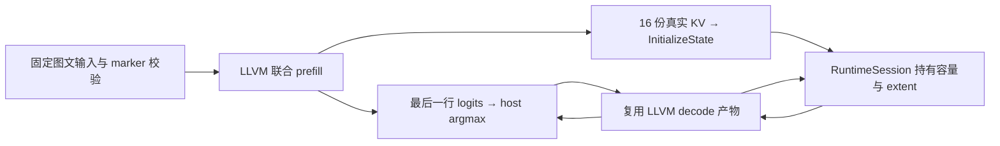

# M9 L2：MiniMind-V 图文联合推理技术报告

2026-09-09。固定单图 MiniMind-V 已完成图像编码、64 个视觉 token 注入、完整八层语言模型 prefill，以及会话持有 KV 的四步 decode。三组输入的全部 logits 和 16 份 KV 均通过 CPU/LLVM 数值验证，最大绝对误差 `1.06096e-5`。本模块复用现有导入、编译、状态与观测路径，没有新增 IR。

这里验收的是完整架构、随机 float32 权重和明确的固定输入合同。固定双图另有[独立报告](M9_MINIMIND_V_MULTI_IMAGE_REPORT.md)；任意多图、变长图文 prefill、预训练质量和 GPU 尚未验收，不能把这些 CPU 结果扩写为整个 L2 已完成。

## 1. 模型与输入合同

源码为上游 [MiniMind-V commit 740d467](https://github.com/jingyaogong/minimind-v/tree/740d467ece78a0b7d2d976fcb424472095d4a688)，直接构造 `MiniMindVLM`。视觉配置沿用[前一模块](M9_MINIMIND_V_VISION_REPORT.md)的 [SigLIP2 配置 revision 9465d1d](https://huggingface.co/jingyaogong/siglip2-base-p32-256-ve/blob/9465d1dc89db6bc6227c5b6b0e0ca9b940325d62/config.json)。

| 部分 | 本次实际配置 |
|---|---|
| 视觉编码器 | 12 层，hidden 768，12 heads，FFN 3072，256×256 图像，patch 32 |
| 视觉投影 | 上游 LayerNorm → Linear → GELU → Linear，输出 `[1,64,768]` |
| 语言模型 | 8 层，hidden 768，Q heads 8，KV heads 4，head dim 96，FFN 2432，词表 6400 |
| 构造参数量 | 159,647,232；未缩层、缩宽或更换模型。上游未消费的视觉 pooling head 不进入输出依赖图 |
| prefill 输入 | `input_ids: int64[1,68]`，`pixel_values: float32[1,3,256,256]` |
| 图像槽位 | 前缀 2 token + 64 个连续 marker `12` + 后缀 2 token；marker 仅允许出现在 `[2,66)` |
| prefill 输出 | `logits[1,68,6400]` 与交错排列的八层 K/V，各 `[1,68,4,96]` |
| decode | 固定单 token、容量 80，显式 position 和有效区 mask；四步 extent `68 → 72` |

权重使用 seed 0 完整初始化；输入图像已经预处理。本次没有下载训练权重、执行图片处理器或证明识图/语言质量。版本为 torch 2.14.0+cpu、transformers 5.16.1、ONNX 1.22.0、NumPy 2.5.3、LLVM 20.1.2；opset 17，legacy exporter，`dynamo=False`，eager attention。

## 2. 使用的方法

### 保留上游图文注入语义，明确导出特化

上游 `count_vision_proj` 用 Python `.tolist()` 扫描 image marker，再以 `torch.cat` 拼接文本前缀、视觉 token 和文本后缀。TorchScript 会固定这次扫描得到的布局。导出器因此记录 `minimind_v.fixed_single_image.v1` 合同，要求调用方在执行前核对 token 数、词表范围和全部 marker 位置。

独立的未修改上游模型在投影层和首个语言层设置只读 hook，逐位核对中间 embedding 的三个区间：前缀仍是原文本 embedding，中央 64 行等于真实视觉投影，后缀仍是原文本 embedding。三组输入均通过该检查；改变图像和改变文本分别使完整 logits 出现最大 `2.897763` 和 `3.231763` 的变化，确认两种输入都实际参与计算。

Python 导出、fixture 入口和 C++ 示例调用者都校验固定 marker 布局。缺 marker、多余 marker、越界词元会被拒绝。这个内容约束属于显式模型调用者；通用 RuntimeSession 的张量 ABI 校验并不自动识别 marker 值，不能绕过前置校验后宣称任意同形状 token 都受支持。

### 把真实 ONNX Concat 接入已有二元算子

此次实际导出包含 `Concat(prefix, vision, suffix)`，以及 batch=1 的 `torch.stack` 导出的单输入 Concat。原静态入口仅接受两个输入，因此两个结构都无法导入。

采用 [ONNX Concat-13](https://onnx.ai/onnx/operators/onnx__Concat.html#concat-13) 的至少一个输入、显式 axis、相同非拼接维度和输入顺序不变量，并核对 [ONNX Runtime CPU Concat](https://github.com/microsoft/onnxruntime/blob/main/onnxruntime/core/providers/cpu/tensor/concat.cc) 先验证、再按输入次序复制以及处理空张量的做法。KXC 继续使用已有 TE/LLVM 复制实现。

现在静态 ONNX Concat 接受 1..N 个输入。三个及更多输入按原顺序确定性展开为左结合二元链；单输入使用同 dtype、同 rank、非拼接轴相同、拼接轴为 0 的零字节常量作第二操作数，复用已有二元 `concatenate` 的复制语义。结果保持独立输出，未新增 Identity 算子或修改 Relay 的二元 arity 合同。

静态与 shape-source 共用多输入归一化 owner。生成名字避开全部原始输入、输出、中间值、metadata 和节点名，防止缺失值被意外补成合法输入。每个二元阶段继续检查 axis 类型、rank、dtype、非拼接轴、int64 长度溢出与声明输出。未知 domain 在常量折叠前拒绝，不能把自定义同名算子解释成标准 ONNX。未被常量折叠消去的单输入 shape-source 仍拒绝，避免用固定零长度常量替代未知非拼接轴。

### 用同一语言模型和状态 owner 接续 decode

导出只在临时源码副本应用已有 `minimind_noninplace_mask.patch` 和 `minimind_capacity_kv.patch`，原始 checkout 保持不变。前者消除导出不支持的原地 mask；后者把 position 从缓存容量中分离出来，用有效长度控制 RoPE，并用 mask 屏蔽无效容量区。patch、原始和适配源码均记录 SHA256。

非零历史时，上游 VLM 跳过视觉计算。capacity adapter 调用同一个 VLM 对象继承的 `MiniMindForCausalLM.forward`，使用同一份语言层、norm 和输出权重，以接入已有 position 参数。每一步都与未修改上游 VLM 的精确长度缓存输出比较；三组 prefill 的适配误差为 0，capacity decode 对上游的最大误差 `1.907349e-6`。



C++ 复用既有 `minimind_decode_loop_llvm_test`，通过 `--vlm 0|1|2` 选择输入。prefill 的实际 LLVM 输出初始化 decode session，参考文件不参与状态生产。此后 RuntimeSession 负责持久存储、有效区和追加；host 只提供 token、position、mask，并从实际输出选下一 token。

### 独立参考与完整回执

先由未修改上游模型生成 prefill 和四步 decode 的全部输出，再用独立 ONNX ReferenceEvaluator 验证。参考 Conv 的 `VALID` 等价改写复用[视觉模块已定位的修正](M9_MINIMIND_V_VISION_REPORT.md)，仅修改另存的参考图，未改变原始 ONNX 或 KXC 图。

fixture 在加载模型前检查完整配置、构造参数量、15 份参考文件清单及逐文件哈希，原始两份 ONNX 也需匹配导出回执。错误 profile、缺少最后一步参考和伪造参考哈希均在图加载前拒绝。

prefill 显式复用固定 Shape 证明，再走原有常量折叠、生产 importer 和序列化；decode 直接走同一常量折叠及导入。默认 importer 和 runtime 没有新增隐式 shape 求值或编译。

| 图 | 原始 ONNX 节点 | 折叠节点 / 物化字节 | 导入 Relay 节点 / kernel |
|---|---:|---:|---:|
| 联合 prefill | 1,875 | 730 / 1,547,832 | 1,146 |
| 容量 decode | 1,167 | 484 / 1,634,108 | 683 |

prefill 折叠后为 1,145 个 ONNX 节点；三输入 Concat 展开增加一次二元调用，最终为 1,146 个 Relay 节点。三组 fixture 通过硬链接复用相同的图规格与参数。

## 3. 达到的效果

三组使用同一导出图和权重，每组在独立测试进程中各编译一次 prefill 和 decode。每组的四个主步骤复用同一 decode session、同一产物和相同的 16 个缓存地址，extent 从 68 增长到 72；编译缓存统计在步骤之间保持不变。

| 输入变化 | LLVM prefill 全部输出最大误差 | 四步 logits 最大误差 | 四步完整 16 份缓存最大误差 |
|---|---:|---:|---:|
| 确定性随机图像与文本 | 1.04308e-5 | 4.70877e-6 | 1.04308e-5 |
| 同文本，图像归零 | 1.00136e-5 | 4.64916e-6 | 1.00136e-5 |
| 同图像，改变文本前缀和后缀 | 1.06096e-5 | 4.58956e-6 | 1.06096e-5 |

上表比较 LLVM 与独立 ONNX 参考，每个元素必须为有限值，最大绝对误差不得超过 `1e-4`。ONNX 与原始上游模型的全部 logits/KV 最大差为 `8.34465e-6`，使用 `atol=2e-4, rtol=2e-4`。不是只比较 argmax 或抽样缓存：prefill 检查完整 `[1,68,6400]` logits 及所有 KV；每一步检查完整 logits 和 16 个容量张量，包括无效区。

每组还重放最后一步两次，把无效缓存填充改为 0 与 -1234.5，所得 logits 逐位一致。有效追加后，其余容量区保持原哨兵值。greedy token 由被测模型实际 logits 选择，逐步与独立参考序列一致。

三套构建逐一审计：每组 prefill bundle 有 1,146 对 submit/execute，decode bundle 有 4,098 对（四步加两次重放），合计 5,244 对；三组共 15,732 对。runtime 事件都具有 export receipt、stage、generation、plan ABI、state extent/version。prefill/decode bundle 分别为 3,453 / 12,506 条事件；已逐一核对成功状态、run 数、提交与完成配对、主机计时标签及 extent。

## 4. 回归与复现

三轮 Ponytail QA：A 核对复用点，Concat 继续使用已有二元 Relay、参数序列化与 TE/LLVM，独立参考复用同一 Conv 修正；B 核对唯一权威和身份，多输入规范化由同一个 importer helper 负责，已有图、常量和 unit 身份包含规范化后的节点、axis、dtype/shape 与零字节参数，不新增 ABI 或第二套状态 owner；C 核对实际消费者和拒绝边界，三组完整模型均由生产入口执行，临时导出适配与原始模型独立对照，三套回归及 bundle 审计均执行。Concat 的静态/shape-source 顺序、负轴、多输入中带空片段、单输入、名字冲突、尾部非法输入和自定义 domain 均有测试。

| 检查 | 结果 |
|---|---|
| 默认 CPU/LLVM CTest | 55/55，231.63 秒 |
| adaptive LLVM CTest | 55/55，301.25 秒 |
| bounded LLVM CTest | 70/70，422.94 秒 |
| Python 全库 | 332/332，1.07 秒 |
| 契约和架构 | Relay 40/40、Pass 20/20，两个生成文件 freshness，NLP 矩阵，include-layer 284 文件，90 个安装头与 10 个实验头独立编译均通过 |
| 文档和静态库 | 63 份 Markdown 链接/索引及 `git diff --check` 通过；默认/adaptive/bounded/CUDA archive 的 1603/1715/1883/1614 个强定义均无重复 |

三套配置都实际执行三组 VLM、上一模块的完整视觉 fixture，以及原有 L1 prefill → 容量状态 → 四步 decode。adaptive 额外设置真实 MiniMind 热替换 fixture；bounded 设置原有八组模型/阶段 fixture。CTest 中原有 feature gate 和可选测试的 SKIP 不作为新能力证据；例如未设置 `KXC_MINIMIND_IMPORT_DIR` 的独立 L1a 测试仍会跳过，其完整 prefill 在本轮 L1 decode-loop 入口实际复验。启用 adaptive/bounded 的构建通过不表示本次 VLM 已执行热替换或变长推理。

两次独立导出（第二次 `PYTHONHASHSEED=17`）的 15 份参考数据及两份原图逐文件哈希一致：

- prefill：`f222f900dedc7412171dfabe778b9f77fd686513ceeb43abb75acc77b3f28448`
- decode：`861cbdc877a1fe098b336ab9953bd2d2db5c78636388690c9a4682f6cebdf93f`

使用已固定的上游 checkout 和配置复现：

```bash
OPENBLAS_NUM_THREADS=1 out/venv/bin/python python/tools/export_minimind_v_joint_onnx.py \
  --src out/minimind-v-source --vision-config out/minimind-v-config/config.json \
  --config-revision 9465d1dc89db6bc6227c5b6b0e0ca9b940325d62 --out out/minimind_v_joint
OPENBLAS_NUM_THREADS=1 out/venv/bin/python python/tools/make_minimind_v_joint_fixture.py \
  --export out/minimind_v_joint --out out/fx_minimind_v_joint
cmake --build out/build/dev-ninja-cpu -j2
KXC_MINIMIND_VLM_DIR=/home/oops/repo/hdkx-aicompiler/out/fx_minimind_v_joint \
  OPENBLAS_NUM_THREADS=1 ctest --test-dir out/build/dev-ninja-cpu \
  --output-on-failure --no-tests=error -j1 -R '^minimind_vlm_case[012]_llvm_test$'
```

源码参数和大文件留在 `out/`；本模块不增加隐式下载、权重安装或 runtime 编译。导出支持 3..12 步以匹配容量，本次实际验收四步，不把其它步数或 EOS 宣称为已验收。CTest 使用同一个模型资源锁，防止三个完整模型测试并发占用内存。

三个配置的 bundle 审计摘要另存 `out/minimind_v_joint_{default,adaptive,bounded}_bundle_audit.json`，包含事件文件 SHA256。

复验日志：`/tmp/kxc-l2-joint-{default,adaptive,bounded}-{build,ctest,lasttest}.log`，`/tmp/kxc-l2-joint-python-final.log`，`/tmp/kxc-l2-joint-preflight.log`；默认全量增量构建另存 `/tmp/kxc-l2-joint-default-full-build.log`。执行参数与原始/参考/导入文件哈希在 `out/minimind_v_joint/export_metadata.json`、`out/fx_minimind_v_joint/receipt.json` 中。初次 case 0 的 Debug 专项运行 46.64 秒、峰值 RSS 4,492,560 KiB，仅作为本机资源记录，不是性能基准或加速比。

## 5. 剩余边界

此模块完成固定单图、固定 marker 布局、float32 的完整图文 CPU 链；固定双图的独立 CPU/LLVM 证据见[双图报告](M9_MINIMIND_V_MULTI_IMAGE_REPORT.md)。任意多图与不同文本长度仍需要新的显式输入 profile 和独立数值验证（后续 0～3 张图、S≤224 的运行时位置方案见 [有界报告](M9_MINIMIND_V_BOUNDED_REPORT.md)）；不能用本次 Python 扫描的固定结果接收任意图像位置。已有 KV owner 可以继续复用，EOS/服务请求生命周期与设备端状态需按各自合同接入。

用户指定的 Windows GPU 后续已接通并通过基础 CUDA 专项 5/5，见 [Windows 实测报告](GPU_WINDOWS_VALIDATION_REPORT.md)。本联合模块没有新增 GPU 数值证据，其 CUDA 格子保持未验证；也不将固定图文 CPU 结果推广为 MiniMind-O、分布式 Transformer 或完整项目目标已经完成。
