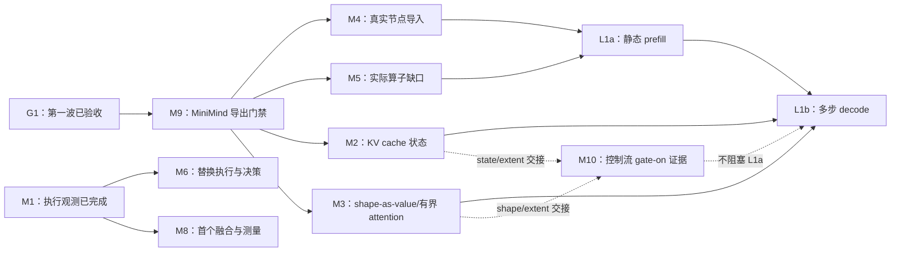

# 模块实施计划

现在的 KXC 已能把真实 MiniMind 静态 prefill 和容量型 decode 从 ONNX 导入、编译为 LLVM，再交给 RuntimeSession 执行。prefill 的实际 K/V 输出经显式初始化合同进入 decode 会话，后者持有缓存并连续生成 greedy token。完整八层变长 prefill 已通过，见 [技术报告](M3_FULL_PREFILL_REPORT.md)；有界 P+C 拼接及连续追加见 [KV 追加报告](M3_KV_APPEND_REPORT.md)；单一 LLVM 计划的多 token 当前长度和 prefill→decode 外部 K/V 交接见 [多 token 报告](M3_MULTITOKEN_REPORT.md)。完整八层变长 decode 和四步外部 K/V greedy 循环也已通过，见 [decode 报告](M3_FULL_DECODE_REPORT.md)；与会话 KV state/extent 的联合也已通过，见 [状态报告](M2_BOUNDED_STATE_REPORT.md)；请求级 CPU/LLVM 批处理已接入队列、进入/退出和 KV 槽位，见 [批处理报告](M2_REQUEST_BATCHING_REPORT.md)。纯文本 MiniMind 是当前 L1 验收目标，MiniMind-O 是北极星。

这组文档现在分成 M0–M10 十一个模块。M0/M1/M4/M5 的第一波切片已经完成；M9 负责先锁定 MiniMind 导出合同，随后 M2/M3/M4/M5 的后续切片并行推进 L1a 静态 prefill 和 L1b 多步 decode。M10 单独承接已经存在但默认关闭的结构化控制流：先补 gate-on LLVM 证据，再决定它是否适合真实生成循环。M6–M8 以真实模型运行证据为输入，M7 的进程内 CPU/LLVM 静态整图分发和完整 MiniMind prefill 已在限定范围内完成。每篇文档开头都先说明现状和要做的模块，再给出步骤、代码落点和验收条件。

> 状态：第一波已完成，第二波结果见 [G2 记录](G2_RECORD.md)。M2 的真实容量/变长模型状态绑定、M1 模型关联、host greedy 和 M6 静态热替换执行切片已完成；M6 后续保留会话 KV 的静态 CPU 热替换也已通过完整模型、三套 CPU 回归及集成审计，见 [状态报告](M6_STATEFUL_REPORT.md)。相同有界 profile/状态 ABI 的 CPU 热替换随后通过完整八层模型及四配置回归，见 [有界报告](M6_BOUNDED_REPORT.md)。请求批处理热替换也已完成，四个请求的五个批次保留队列与 KV，代际 1→2→2→1→1；最终四配置回归 55/55、56/56、70/70、75/75 及集成审计通过，见 [请求报告](M6_REQUEST_BATCHING_REPORT.md)。M7 进程内 CPU/LLVM 静态整图分发和完整 MiniMind prefill 已在限定范围内完成，见 [整图报告](M7_MODEL_REPORT.md)；M8 静态 Program 与首个融合切片已完成并通过三套门禁；请求批处理首版已有真实模型证据；显式全 mask 注意力已通过 CPU 数值验证；矩阵 12 行已刷新，未验证格继续关闭。核对日期：2026-09-10。原始分阶段目标仍以 [WAVE_2](WAVE_2.md) 和各模块计划为准。
> 目标以[项目目标](../PROJECT_GOAL.md)为准，已实现行为以[架构总览](../ARCHITECTURE.md)、代码、机器契约和实际测试为准。本文不新增能力声明。

## 先读哪一篇

要开始新的分派，先读[第二波 MiniMind-L1 计划](WAVE_2.md)；[第一波计划](WAVE_1.md)只作为已完成工作的历史分派记录。要实施某个模块，再读下面对应的文档。

| 模块 | 要解决的问题 | 第一波安排 | 主要前置条件 |
|---|---|---|---|
| [M0 基线与证据口径](M0_BASELINE.md) | 已完成的 G0 基点和能力边界需要持续作为共同事实 | 已完成；只维护基线证据 | 无 |
| [M1 执行侧观测](M1_RUNTIME_PROFILING.md) | 执行 bundle 与模型/代际信息关联 | 真实 prefill/decode 与 M6 健康消费已接通；静态 GPU prefill 设备活动已关联，GPU 性能决策继续推进 | [关联报告](M1_MODEL_ASSOCIATION_REPORT.md)；[CUDA 关联报告](M1_CUDA_CORRELATION_REPORT.md)；[真实模型报告](M2_MINIMIND_STATE_REPORT.md)；[M6 报告](M6_RUNTIME_REPORT.md) |
| [M2 KV cache 与动态状态](M2_KV_STATE.md) | decode 需要同一会话内有容量和有效长度的缓存 | S1/S2 基础、静态容量与 bounded 模型状态绑定已接通；[静态报告](M2_MINIMIND_STATE_REPORT.md)、[bounded 状态报告](M2_BOUNDED_STATE_REPORT.md)；请求级 CPU/LLVM 批处理见 [报告](M2_REQUEST_BATCHING_REPORT.md)；静态 CUDA 状态与四步 decode 见 [GPU 报告](GPU_KV_STATE_REPORT.md) | M9 E2；M3 extent 合同 |
| [M3 形状值与有界计算](M3_SHAPE_VALUES.md) | MiniMind 的变长和形状控制值还不能可靠执行 | 受限 shape 链、通用 attention、共享 DAG、tuple 输出、实际 RMSNorm/QKV、ONNX 拆头/QK 归一化、RoPE/GQA/因果 mask/输出投影的实际第一层 attention 已通过；[因果 attention 报告](M3_CAUSAL_ATTENTION_REPORT.md)、[RoPE 报告](M3_ROPE_REPORT.md)、[GQA 报告](M3_GQA_REPORT.md)、[拆头报告](M3_ONNX_HEADS_REPORT.md)、[加权投影报告](M3_WEIGHTED_PROJECTION_REPORT.md)、[注意力报告](M3_BOUNDED_ATTENTION_REPORT.md)、[图结构报告](M3_GRAPH_STRUCTURE_REPORT.md)、[int64 索引报告](M3_INT64_INDEX_REPORT.md)；完整八层变长 prefill 见 [报告](M3_FULL_PREFILL_REPORT.md)；完整变长 decode 见 [报告](M3_FULL_DECODE_REPORT.md)；与持久状态联合见 [报告](M2_BOUNDED_STATE_REPORT.md) | M9 E0；M4 导入 |
| [M4 ONNX 导入与多输出](M4_ONNX_IMPORT.md) | 真实 MiniMind 节点仍有导入缺口和多输出顺序问题 | 静态 prefill/decode、多图输出和静态常量 2+ 路 Split 已接通；显式 shape-source 拆头链见 [报告](M3_ONNX_HEADS_REPORT.md)，完整变长 prefill 见 [报告](M3_FULL_PREFILL_REPORT.md)；完整变长 decode 见 [报告](M3_FULL_DECODE_REPORT.md)；state/extent 联合见 [报告](M2_BOUNDED_STATE_REPORT.md)；Split 纵向证据见 [报告](M4_SPLIT_REPORT.md) 和 [多路扩展报告](M4_SPLIT_VARIADIC_REPORT.md) | M9 E0；M5 算子语义 |
| [M5 新逐元素算子](M5_ELEMENTWISE_OPS.md) | 基础算子已有闭环，继续补模型所需的严格数值与属性边界 | Equal 与显式 masked_softmax 已完成，后者见 [报告](M5_MASKED_SOFTMAX_REPORT.md)；其余按实际 inventory 审计 | M9 E1；LLVM 数值 |
| [M6 热替换执行与决策](M6_HOT_SWAP.md) | 需要把执行 profile 变成真实的候选切换证据 | 静态无状态、容量状态及相同有界 profile 的 MiniMind CPU 换代、lease 保活、one-shot health 与回滚已通过；见 [状态报告](M6_STATEFUL_REPORT.md)和[有界报告](M6_BOUNDED_REPORT.md)。请求队列与 KV 跨代际的完整模型证据见 [请求热替换报告](M6_REQUEST_BATCHING_REPORT.md)；静态 CUDA 热替换已通过 [CUDA 报告](M6_CUDA_REPORT.md)，bounded KV/请求 CUDA 换代仍需独立 consumer | [技术报告](M6_RUNTIME_REPORT.md)；M1；M2 |
| [M7 分布式证据与执行桥接](M7_DISTRIBUTED.md) | 进程内多 worker 的已编译 CPU 执行 | S1–S4 已验证双 worker LLVM、分组 CCL、完整预检与生命周期；整图绑定、多输出及完整 MiniMind 静态 prefill 两套放置已完成，边界见报告 | [首版报告](M7_DISTRIBUTED_REPORT.md)；[整图报告](M7_MODEL_REPORT.md) |
| [M8 TE Program 与首个融合](M8_TE_PROGRAM.md) | MiniMind attention/FFN 还没有 profile 驱动的融合候选 | 静态 Program、优化等级 3 的 add→sqrt 融合与 LLVM/profile 验收已接通，见 [报告](M8_TE_PROGRAM_REPORT.md) | M1；M9 L1a |
| [M9 MiniMind 模型与导出验收](M9_MINIMIND_TARGET.md) | 模型目标、导出参数、past/present 轴和生成入口需要一个唯一门禁 | L1 已有真实模型/state/greedy 证据；L2 完整静态视觉链见 [报告](M9_MINIMIND_V_VISION_REPORT.md)，固定单图和固定双图 prefill/decode 见 [联合报告](M9_MINIMIND_V_JOINT_REPORT.md)、[双图报告](M9_MINIMIND_V_MULTI_IMAGE_REPORT.md) | G1；Python/ONNX 依赖 |
| [M10 结构化控制流](M10_STRUCTURED_CONTROL.md) | 已有 `If`/有界 `While` 编译和运行代码默认未启用 | C0/C1 审计与 gate-on LLVM、C2 host loop 决策已完成；真实 greedy 证据见 [G2 报告](G2_GREEDY_REPORT.md)，C3 仍待 M2/M3 交接 | C1 独立于 L1a；真实 decode state 依赖 M2/M3 |

## 当前事实与原快照的差异

以下结论来自第一波后的代码和实际 MiniMind 导出；后续变更必须回写到权威文档，避免计划和快照再次分叉。

- [模型清单](../OP_TODO.md)来自 MiniMindForCausalLM 的实际导出，区分原始图和常量折叠后的实算图；它不是支持矩阵。静态 prefill 与容量 decode 的导入缺口现已闭合，证据和剩余动态限制见 [G2](G2_RECORD.md)。
- 运行时索引 Gather、int64 Add 和导入前常量折叠都有显式语义边界；真实模型通过不能推广为任意 ONNX 图已支持。
- [能力矩阵](../../test/nlp_validation/transformer_capability_matrix.json)的 12 行已逐格刷新当前证据，包含实际 prefill、decode、状态、请求批处理、全 mask 和 copy/event 的 CPU 路径。`implemented`、`validated` 必须连同 gate/reason 阅读；runtime-only 的复制不虚构 Relay/lowering，CUDA 记录按每个局部 gate 限定形状与执行模式；GPU bounded 状态和请求批处理的设备验收已通过，CUDA 热替换仍按静态无状态与 bounded KV/请求分别限定。最后两行的核对与复制观测修复见 [报告](M1_COPY_EVENT_REPORT.md)。后续 [CUDA 复制报告](M1_CUDA_COPY_REPORT.md)已补齐 copy_event 的 DMA 配对、受控 pending 与跨线程完成证据。
- `RuntimeSession` 已通过版本化输出绑定持有和追加 MiniMind 容量型 K/V，并公开有效长度。bounded 的 fresh-output 模式仍拒绝 state；独立 bounded stateful 模式通过 prefix/append 绑定复用同一状态 owner，真实 prefill 交接与四步 decode 已通过。
- `experimental_identity` 在形状路由、自适应准备等开关启用的路径中被调用，不能直接删除。分布式执行器已绑定外部 CompiledModule；静态 CPU 小图和完整 MiniMind prefill 的显式跨 worker 执行均已有报告，分布式 decode/持久 KV 仍未验收。
- `runtime` 的普通代码目前不能直接 include `profiling`；观测接入需要维持依赖方向。M1 已把这个约束纳入实现方案。

## 十一个模块之间如何衔接

图中的箭头表示某项验收需要前项的结果。M9 E0 通过后 M2/M3/M4/M5 可以并行；M7 先完成独立的计划/通信证据，不阻塞 L1。

## 几个术语的普通含义

| 用词 | 这里具体指什么 |
|---|---|
| 契约 | 一段代码接受什么输入、保证什么输出、什么情况必须报错 |
| ABI | 编译好的内核和运行时之间传参数的约定 |
| identity | 判断两个编译产物能否安全共用缓存的身份信息 |
| profiling / span | 对一次操作记录开始、结束、结果以及它属于哪次运行 |
| shape profile | 某个编译产物允许接收的形状；与性能 profiling 是两件事 |
| capacity / valid extent | 已分配多少空间 / 其中多少内容当前有效 |
| fail-closed | 不能证明可以执行时，在执行前报错，不悄悄换另一种实现 |
| 纵向切片 | 只做一个小功能，但从入口到实际执行和测试全部接通 |

## 所有模块共用的交付要求

每个 PR 说明具体例子的改前/改后行为，注明输入形状、dtype、目标和 feature gate；只记录实际运行的命令和结果。默认关闭的能力必须在启用相应开关的构建中验证，关闭 LLVM 的构建不能替代 LLVM 数值证据。

新增语义必须同时完成声明、校验、实际调用者、必要的 identity/version 更新、数值正例和执行前负例。只新增字段、schema 或 API，没有调用者，不属于可合并功能。已有能力的纯接线不应无理由重做 ABI。

能力矩阵由集成负责人统一更新，并同步调整 [NLP 检查器](../../python/tools/check_nlp_gpu_validation.py)的证据规则。一个通用 runtime 测试不能把 12 个 profile 格子全部改成通过；参考计算也不能替代编译器执行。

## 本轮计划的边界

新 agent IR、IR parser、Python 编译入口、训练、自动调优继续按项目目标延后或排除。视觉验证链和仍有消费者的 identity 代码保留。

CUDA 的 bounded 单阶段输出、形状值和 rank-2 MatMul 已有 [基础数值证据](GPU_BOUNDED_CORE_REPORT.md)；有界 Softmax/MaskedSoftmax、RMS 和三头注意力已取得 [多阶段数值证据](GPU_BOUNDED_REDUCTION_REPORT.md)；动态间接访存、完整 bounded 模型、协作归约与设备端请求批处理继续推进。静态 MatMul/Dense 与线程内归约已有 [GPU 报告](GPU_OWNED_REDUCTION_REPORT.md)。请求级 CPU/LLVM 等长批处理已有独立 [报告](M2_REQUEST_BATCHING_REPORT.md)，显式全 mask 注意力的 CPU 数值行为已有独立 [报告](M5_MASKED_SOFTMAX_REPORT.md)。十一篇模块计划不能被当作这些能力已经完成的声明；特别是“一份产物接受多种 batch shape”不等于已经实现请求排队、合批、退出和 KV 槽位管理。M10 的控制流路径也不能因为源码、参考执行器或 gate-off 拒绝测试存在，就被写成 MiniMind 生成循环已经通过。

GPU 驱动的安装核验、启动文件刷新及 Windows/Tailscale 接入过程见 [环境修复报告](GPU_DRIVER_REPAIR_REPORT.md)。Windows RTX 4070 Ti SUPER 已完成原生 CUDA 专项 5/5，真实 kernel、复制和 CUPTI 活动见 [实测报告](GPU_WINDOWS_VALIDATION_REPORT.md)；这组局部证据不解锁完整 NLP CUDA 矩阵。

随后 CUDA 专项 6/6 已贯通多维输出映射和线程内归约，含 float32/64 MatMul/Dense、批次广播、三维 Where/Slice/Concatenate、标量 sum/max，见 [技术报告](GPU_OWNED_REDUCTION_REPORT.md)。矩阵更新三格局部实测证据；后续 Softmax/MaskedSoftmax、LayerNorm 和 ReduceMean 的静态多阶段执行见 [技术报告](GPU_MULTISTAGE_REDUCTION_REPORT.md)，同步复制/清零完成语义见 [修复报告](GPU_SYNC_MEMORY_REPORT.md)。Gather/Pow 已有后续 [报告](GPU_GATHER_POW_REPORT.md)，固定 B1/S16 完整八层模型数值和最新 8/8 专项见 [CUDA prefill 报告](GPU_MINIMIND_PREFILL_REPORT.md)。完整 prefill 的 CUPTI 设备活动关联与多 profile 时钟对齐已有 [M1 报告](M1_CUDA_CORRELATION_REPORT.md)；静态 CUDA decode/state 的后续实现、全部 KV 数值与复制顺序见 [GPU 状态报告](GPU_KV_STATE_REPORT.md)，bounded prefill/decode/state/request 设备验收也已完成。

同一 CUDA 产物处理多形状的地址证明、实际 scalar 参数与上界缓存身份见 [有界基础报告](GPU_BOUNDED_CORE_REPORT.md)。单阶段输出、shape_of 和 rank-2 MatMul 已通过真实 GPU 数值、设备活动及最终回归；变长多阶段归约和三头注意力已取得 [后续证据](GPU_BOUNDED_REDUCTION_REPORT.md)；完整变长 GPU 模型仍需后续索引、形状重排与状态工作。

完整八层 bounded MiniMind 的索引和形状重排已接入 CUDA 证明：全部 742 个原语通过源码与 PTX 编译；Windows RTX 4070 Ti SUPER 上的双流完整 prefill、9 个零提交拒绝、7420 个 kernel 和 CUPTI 关联也已通过，见 [接入技术报告](GPU_BOUNDED_PREFILL_REPORT.md)。

后续完整 bounded decode 的 24 个动态拼接缺口已闭合，774/774 个原语通过源码与 PTX 编译；同版本 prefill 742 个原语再次通过。Windows 上完整 decode/state 的 16-run、12384-kernel CUPTI 门禁已通过，见 [decode 编译接入报告](GPU_BOUNDED_DECODE_REPORT.md)。

bounded KV 的 CUDA 状态准入与完整模型 consumer 已接到同一 RuntimeSession，先打包前缀、全部 kernel 完成后追加并提交长度；Windows 上状态数值、336 次 state copy 和容量拒绝均已通过，见 [状态接入报告](GPU_BOUNDED_STATE_REPORT.md)。请求批处理随后接入同设备 CUDA 与显式 stream，完整模型 5 batches/9288 kernels、管理复制和 17 个损坏反例也已通过，见 [批处理接入报告](GPU_REQUEST_BATCHING_REPORT.md)。
