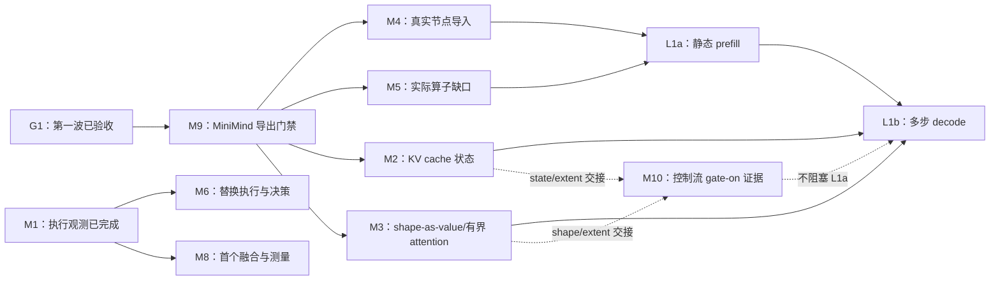

# 模块实施计划

现在的 KXC 已经能够把静态计算从 ONNX 导入、编译为 LLVM 内核，再交给 RuntimeSession 执行；第一波还已经接通了真实执行侧 bundle、Equal→Where 组合和一批静态 ONNX 算子。下一步的目标模型已经收敛为 MiniMind：纯文本 MiniMind 是当前 L1 验收目标，MiniMind-O 是北极星。仓库有实际生成的 MiniMind prefill/decode 图和元数据，但同一会话的 KV 更新、变长形状和完整生成循环仍未形成端到端证据。

这组文档现在分成 M0–M10 十一个模块。M0/M1/M4/M5 的第一波切片已经完成；M9 负责先锁定 MiniMind 导出合同，随后 M2/M3/M4/M5 的后续切片并行推进 L1a 静态 prefill 和 L1b 多步 decode。M10 单独承接已经存在但默认关闭的结构化控制流：先补 gate-on LLVM 证据，再决定它是否适合真实生成循环。M6–M8 以真实模型运行证据为输入，M7 仍先补分布式证据。每篇文档开头都先说明现状和要做的模块，再给出步骤、代码落点和验收条件。

> 状态：第一波（G0 基线 + A/B/C 三线 + G1 组合验收）**已实施完成**（2026-09-07），证据见 [G0 基线记录](G0_BASELINE.md)与 [G1 验收记录](G1_RECORD.md)。当前可分派计划是 [第二波 MiniMind-L1](WAVE_2.md)。M2/M3/M6/M7/M8 仍为待实施，M9 是下一波入口；M0/M1/M4/M5 保留后续收尾切片。核对日期：2026-09-07。G0 记录提交为 `e426f7e`，G1 集成点为 `dev` @ `796fb9f`。
> 目标以[项目目标](../PROJECT_GOAL.md)为准，已实现行为以[架构总览](../ARCHITECTURE.md)、代码、机器契约和实际测试为准。本文不新增能力声明。

## 先读哪一篇

要开始新的分派，先读[第二波 MiniMind-L1 计划](WAVE_2.md)；[第一波计划](WAVE_1.md)只作为已完成工作的历史分派记录。要实施某个模块，再读下面对应的文档。

| 模块 | 要解决的问题 | 第一波安排 | 主要前置条件 |
|---|---|---|---|
| [M0 基线与证据口径](M0_BASELINE.md) | 已完成的 G0 基点和能力边界需要持续作为共同事实 | 已完成；只维护基线证据 | 无 |
| [M1 执行侧观测](M1_RUNTIME_PROFILING.md) | 已有运行 bundle，仍需把 MiniMind 的模型/代际信息接入诊断 | 第一波已完成；下一波做真实模型 profile | G1；M9 receipt |
| [M2 KV cache 与动态状态](M2_KV_STATE.md) | decode 需要同一会话内有容量和有效长度的缓存 | 第二波 S1/S2：追加、读取、prefill→decode | M9 E2；M3 extent 合同 |
| [M3 形状值与有界计算](M3_SHAPE_VALUES.md) | MiniMind 的变长和形状控制值还不能可靠执行 | 第二波 S1/S2：受限 shape 链和有界 attention | M9 E0；M4 导入 |
| [M4 ONNX 导入与多输出](M4_ONNX_IMPORT.md) | 真实 MiniMind 节点仍有导入缺口和多输出顺序问题 | 第一波静态子集已完成；按 M9 inventory 补齐 | M9 E0；M5 算子语义 |
| [M5 新逐元素算子](M5_ELEMENTWISE_OPS.md) | Equal 已闭环，MiniMind 仍需 Pow 等算子和严格属性边界 | Equal 已完成；Pow/Erf/实际缺口后续切片 | M9 E1；LLVM 数值 |
| [M6 热替换执行与决策](M6_HOT_SWAP.md) | 需要把执行 profile 变成真实的候选切换证据 | 后续实施，先无状态再带 KV | M1；M2 |
| [M7 分布式证据与执行桥接](M7_DISTRIBUTED.md) | 计划/通信代码仍不能证明 compiled module 多 worker 执行 | 后续先补证并准确降级 | 单机 MiniMind 基线 |
| [M8 TE Program 与首个融合](M8_TE_PROGRAM.md) | MiniMind attention/FFN 还没有 profile 驱动的融合候选 | 后续实施，先保留最小静态切片 | M1；M9 L1a |
| [M9 MiniMind 模型与导出验收](M9_MINIMIND_TARGET.md) | 模型目标、导出参数、past/present 轴和生成入口需要一个唯一门禁 | 第二波入口：E0→E1→E2 | G1；Python/ONNX 依赖 |
| [M10 结构化控制流](M10_STRUCTURED_CONTROL.md) | 已有 `If`/有界 `While` 编译和运行代码默认未启用，生产证据与 MiniMind 生成循环的适用性尚未定论 | 第二波 E 线：C0 审计→C1 gate-on LLVM→C2 生成循环决策；C3 再与 M2/M3 交接 | C1 独立于 L1a；真实 decode 依赖 M2/M3 |

## 当前事实与原快照的差异

以下结论来自第一波后的代码和实际 MiniMind 导出；后续变更必须回写到权威文档，避免计划和快照再次分叉。

- [模型清单](../OP_TODO.md)来自 MiniMindForCausalLM 的实际导出，分别记录 dynamic/static 原始图和常量折叠后的实算图；它不是支持矩阵。静态非原地 mask 的 L1a 口径仍有 11 种实算缺口，dynamic_axes 还会引入 Shape/Range/ConstantOfShape 等形状链。名称交集、常量折叠和真实运行证据必须分开记录。
- 已有交集中的 `Concat` 只接受两个输入，快照却出现三个或四个输入；`Gather` 导入要求常量索引。这些已有名称的语义限制也要进入后续验收。
- [能力矩阵](../../test/nlp_validation/transformer_capability_matrix.json)的 LLVM 列为 8 个 `implemented`、4 个 `unsupported`。`implemented` 不能写成“本次已经跑过”；部分 numeric 的 `validated` 仅是参考实现证据。
- 通用 state、alias 和重复执行机制已经存在，缺少的是 MiniMind Transformer 的 KV 更新语义和动态有效长度。bounded 分支的 fresh-output 模式仍拒绝 state，合入该分支不会自动得到 KV cache。
- `experimental_identity` 在形状路由、自适应准备等开关启用的路径中被调用，不能直接删除。分布式内核执行则确实仍有未实现的启动分支。
- `runtime` 的普通代码目前不能直接 include `profiling`；观测接入需要维持依赖方向。M1 已把这个约束纳入实现方案。

## 十一个模块之间如何衔接

图中的箭头表示某项验收需要前项的结果。M9 E0 通过后 M2/M3/M4/M5 可以并行；M7 先完成独立的计划/通信证据，不阻塞 L1。

## 几个术语的普通含义

| 用词 | 这里具体指什么 |
|---|---|
| 契约 | 一段代码接受什么输入、保证什么输出、什么情况必须报错 |
| ABI | 编译好的内核和运行时之间传参数的约定 |
| identity | 判断两个编译产物能否安全共用缓存的身份信息 |
| profiling / span | 对一次操作记录开始、结束、结果以及它属于哪次运行 |
| shape profile | 某个编译产物允许接收的形状；与性能 profiling 是两件事 |
| capacity / valid extent | 已分配多少空间 / 其中多少内容当前有效 |
| fail-closed | 不能证明可以执行时，在执行前报错，不悄悄换另一种实现 |
| 纵向切片 | 只做一个小功能，但从入口到实际执行和测试全部接通 |

## 所有模块共用的交付要求

每个 PR 说明具体例子的改前/改后行为，注明输入形状、dtype、目标和 feature gate；只记录实际运行的命令和结果。默认关闭的能力必须在启用相应开关的构建中验证，关闭 LLVM 的构建不能替代 LLVM 数值证据。

新增语义必须同时完成声明、校验、实际调用者、必要的 identity/version 更新、数值正例和执行前负例。只新增字段、schema 或 API，没有调用者，不属于可合并功能。已有能力的纯接线不应无理由重做 ABI。

能力矩阵由集成负责人统一更新，并同步调整 [NLP 检查器](../../python/tools/check_nlp_gpu_validation.py)的证据规则。一个通用 runtime 测试不能把 12 个 profile 格子全部改成通过；参考计算也不能替代编译器执行。

## 本轮计划的边界

新 agent IR、IR parser、Python 编译入口、训练、自动调优继续按项目目标延后或排除。视觉验证链和仍有消费者的 identity 代码保留。

CUDA 的归约/间接访存、完整自回归模型覆盖、全 mask 数值行为以及请求级动态批处理仍是后续工作。十一篇模块计划不能被当作这些能力已经完成的声明；特别是“一份产物接受多种 batch shape”不等于已经实现请求排队、合批、退出和 KV 槽位管理。M10 的控制流路径也不能因为源码、参考执行器或 gate-off 拒绝测试存在，就被写成 MiniMind 生成循环已经通过。
