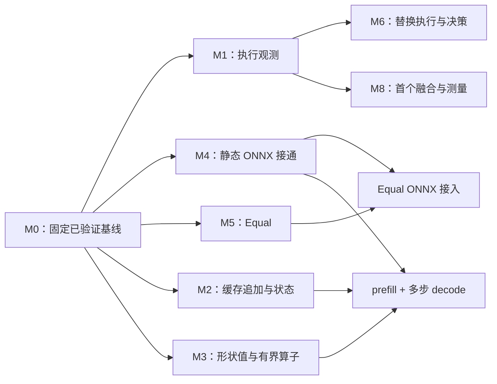

# 模块实施计划

现在的 KXC 已经能够把一小段静态 Transformer 计算从 ONNX 导入、编译为 LLVM 内核，再交给运行时执行。编译、缓存、内存和契约的主干已经存在。距离“能观察自己的执行，并安全调整的 Transformer 推理系统”，还缺执行数据、真正可用的 KV cache、形状计算、前端覆盖和替换行为的验证。

这组文档把接下来的工作分成 M0–M8 九个模块。第一波先固定可验证的共同基线，再并行完成执行观测、已有算子的 ONNX 接通和 `Equal` 算子。其余模块也给出具体方案，但不因为有了计划就同时启动实现。

> 状态：实施计划，尚未实施。核对日期：2026-09-07。代码基点：`dev` @ `f379ebf`。
> 目标以[项目目标](../PROJECT_GOAL.md)为准，已实现行为以[架构总览](../ARCHITECTURE.md)、代码、机器契约和实际测试为准。本文不新增能力声明。

## 先读哪一篇

要开始分派任务，先读[第一波并行计划](WAVE_1.md)。要实施某个模块，再读下面对应的文档。每篇都以当前情况和拟实现行为开头，随后给出步骤、代码落点和验收条件。

| 模块 | 要解决的问题 | 第一波安排 | 主要前置条件 |
|---|---|---|---|
| [M0 基线与证据口径](M0_BASELINE.md) | 分支中的能力还没有成为大家共同验证过的基线，文档统计也存在偏差 | 先完成基线检查点 G0，随后承担集成 | 无 |
| [M1 执行侧观测](M1_RUNTIME_PROFILING.md) | 知道编译花多久，但不知道真实执行、分配和拷贝花多久 | A 线实施 CPU/LLVM 首切片 | G0 |
| [M2 KV cache 与动态状态](M2_KV_STATE.md) | 下一次 decode 不能沿用一个有明确容量和有效长度的缓存 | 第一波不改运行时；下一波先做追加/读取切片 | G0；完整注意力链还需 M3 |
| [M3 形状值与有界计算](M3_SHAPE_VALUES.md) | 模型计算出来的形状，不能可靠交给后续算子使用 | 第一波记录需求，下一波实施 | G0；ONNX 接入与 M4 协同 |
| [M4 ONNX 导入与多输出](M4_ONNX_IMPORT.md) | 已有计算能力不能从真实模型到达，一个节点也不能返回多个结果 | B 线先接静态已有算子和 Constant | G0；多输出后续单独切片 |
| [M5 新逐元素算子](M5_ELEMENTWISE_OPS.md) | Equal、Pow、Erf 缺少从声明到执行的完整链路 | C 线只做 Equal；Pow/Erf 后续推进 | G0；Equal 导入与 B 线顺序交接 |
| [M6 热替换执行与决策](M6_HOT_SWAP.md) | 准备候选不等于正在执行的程序已经安全换代 | 后续实施 | M1；带状态替换另需 M2 |
| [M7 分布式证据与执行桥接](M7_DISTRIBUTED.md) | 现有计划和通信代码还不能证明多 worker 执行编译内核 | 后续先补证并准确降级 | 单机数值基线；桥接复用既有运行时 ABI |
| [M8 TE Program 与首个融合](M8_TE_PROGRAM.md) | 每个 Relay Call 都形成内核边界，跨算子优化尚无完整候选表示 | 功能链打通后实施 | M1；稳定的 compiler/identity 边界 |

## 当前事实与原快照的差异

以下结论来自本次代码核对，M0 负责回写到相应权威文档，避免计划和快照长期各说一套。

- [模型清单](../OP_TODO.md)是一个 Encoder 的 25 种 ONNX 算子快照，并非完整自回归模型验收集。[Python importer](../../python/kxc_onnx/importer.py)有 15 种映射，但与该快照只有 8 种名称交集；缺少 17 种名称。名称交集也不等于属性、输入数量和动态形状均已支持。
- 已有交集中的 `Concat` 只接受两个输入，快照却出现三个或四个输入；`Gather` 导入要求常量索引。这些已有名称的语义限制也要进入后续验收。
- [能力矩阵](../../test/nlp_validation/transformer_capability_matrix.json)的 LLVM 列为 8 个 `implemented`、4 个 `unsupported`。`implemented` 不能写成“本次已经跑过”；部分 numeric 的 `validated` 仅是参考实现证据。
- 通用 state、alias 和重复执行机制已经存在，缺少的是 Transformer 的更新语义和动态有效长度。bounded 分支的 fresh-output 模式仍拒绝 state，合入该分支不会自动得到 KV cache。
- `experimental_identity` 在形状路由、自适应准备等开关启用的路径中被调用，不能直接删除。分布式内核执行则确实仍有未实现的启动分支。
- `runtime` 的普通代码目前不能直接 include `profiling`；观测接入需要维持依赖方向。M1 已把这个约束纳入实现方案。

## 九个模块之间如何衔接

图中的箭头表示某项验收需要前项的结果，不表示所有后项都在第一波启动。M7 先完成独立的计划/通信证据，再决定进入实际内核桥接；它不阻塞第一波。

## 几个术语的普通含义

| 用词 | 这里具体指什么 |
|---|---|
| 契约 | 一段代码接受什么输入、保证什么输出、什么情况必须报错 |
| ABI | 编译好的内核和运行时之间传参数的约定 |
| identity | 判断两个编译产物能否安全共用缓存的身份信息 |
| profiling / span | 对一次操作记录开始、结束、结果以及它属于哪次运行 |
| shape profile | 某个编译产物允许接收的形状；与性能 profiling 是两件事 |
| capacity / valid extent | 已分配多少空间 / 其中多少内容当前有效 |
| fail-closed | 不能证明可以执行时，在执行前报错，不悄悄换另一种实现 |
| 纵向切片 | 只做一个小功能，但从入口到实际执行和测试全部接通 |

## 所有模块共用的交付要求

每个 PR 说明具体例子的改前/改后行为，注明输入形状、dtype、目标和 feature gate；只记录实际运行的命令和结果。默认关闭的能力必须在启用相应开关的构建中验证，关闭 LLVM 的构建不能替代 LLVM 数值证据。

新增语义必须同时完成声明、校验、实际调用者、必要的 identity/version 更新、数值正例和执行前负例。只新增字段、schema 或 API，没有调用者，不属于可合并功能。已有能力的纯接线不应无理由重做 ABI。

能力矩阵由集成负责人统一更新，并同步调整 [NLP 检查器](../../python/tools/check_nlp_gpu_validation.py)的证据规则。一个通用 runtime 测试不能把 12 个 profile 格子全部改成通过；参考计算也不能替代编译器执行。

## 本轮计划的边界

新 agent IR、IR parser、Python 编译入口、训练、自动调优继续按项目目标延后或排除。视觉验证链和仍有消费者的 identity 代码保留。

CUDA 的归约/间接访存、完整自回归模型覆盖、全 mask 数值行为以及请求级动态批处理仍是后续工作。九篇模块计划不能被当作这些能力已经完成的声明；特别是“一份产物接受多种 batch shape”不等于已经实现请求排队、合批、退出和 KV 槽位管理。
