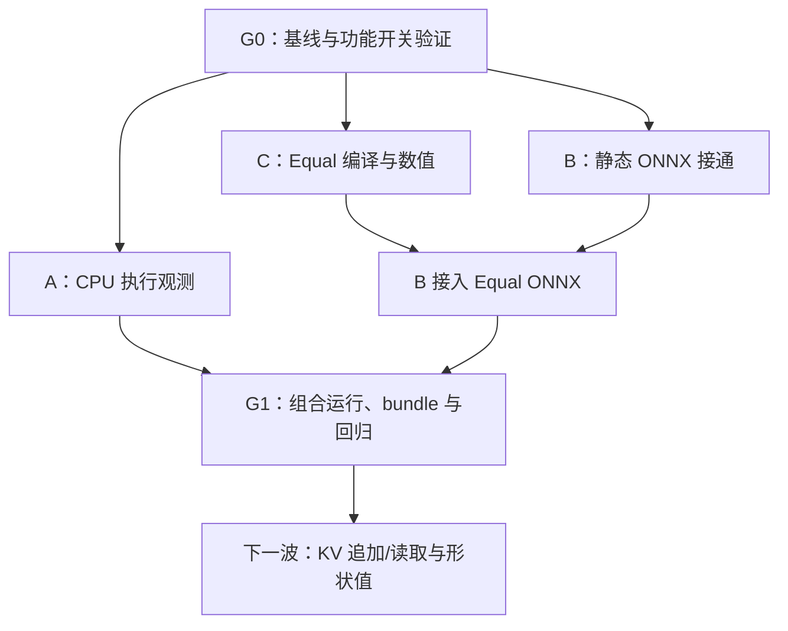

# 第一波并行计划（历史记录）

第一波开始时，KXC 只有一条窄的静态 LLVM 执行链，有界动态提交尚未合入，模型清单还是匿名 Encoder 快照。那一波的目标是先固定可验证基线，再并行接通执行观测、静态 ONNX 子集和 Equal。现在这些工作已经完成并由 G1 验收；本文保留原始分派、所有权和检查项，供追溯，不再作为新的待办列表。

当前目标模型已改为 MiniMind：MiniMind-O 是北极星，纯文本 MiniMind 是 L1 验收目标。下一组任务见 [第二波 MiniMind-L1](WAVE_2.md)，其入口是 [M9 模型与导出验收](M9_MINIMIND_TARGET.md)。

> 状态：**已执行完成（2026-09-07）**。G0 基点和测试见 [G0](G0_BASELINE.md)，组合验收见 [G1](G1_RECORD.md)。以下内容是第一波原始计划的完成记录，不要重新分派 A/B/C。控制流代码审计不属于已完成的 A/B/C 交付，已转入第二波 [M10](M10_STRUCTURED_CONTROL.md) 做 gate-on 生产证明；因此不能把第一波“开关关闭时的拒绝路径”误读为控制流已启用。

## 0. 并行开始前：G0 共同基线

由集成负责人完成 [M0](M0_BASELINE.md)：核对五个既有提交，运行默认 CPU/LLVM 回归和 bounded gates 下的专项测试，修正文档事实，产出唯一的基线 commit。这里的“产出”是经过评审流程可供其他任务引用的 commit，不是自动授权合并到共享分支。

当时 G0 未完成时，A/B/C 只能读代码、准备测试输入和审查方案；G0 通过后才按共同基点开工。该门禁已经完成，后续新任务直接引用 G1 和当前主线。

G0 输出必须写清：commit、LLVM 发现结果、feature flags、实际测试清单、失败或跳过项，以及仍然只支持 CPU elementwise/fresh-output 的范围。保留默认关闭的开关。

## 1. 三条并行实施线

| 线 | 第一波任务 | 交付物 | 本波截止线 |
|---|---|---|---|
| A：执行观测 | [M1](M1_RUNTIME_PROFILING.md) 的 CPU/LLVM 首切片 | 一个真实 RuntimeSession bundle；分配、内核、拷贝可关联；异步只记录准确的提交/观测完成含义 | 不扩展 GPU 计时，不改 KV、shape 路由或调度策略 |
| B：模型入口 | [M4](M4_ONNX_IMPORT.md) 的静态阶段 | Constant + Cast/Div/Mul/Sub/Sqrt/ReduceMean/Reshape 的受限静态导入、C++ 重建和数值 fixture | 不做 Split，不接动态 shape tensor，不宣布旧快照或 MiniMind 全图支持 |
| C：新计算能力 | [M5](M5_ELEMENTWISE_OPS.md) 的 Equal 阶段 | 生成式契约、InferType、TE、生产 lowering、LLVM 数值和 bool 输出 | 不顺带实现 Pow/Erf，不独立改 ONNX importer |

集成负责人不另开第四条核心重构线，负责共享文件、代码评审、C → B 交接，以及最后的组合验证。

## 2. 代码所有权与冲突处理

实现时每条线使用独立 branch/worktree、独立 build 目录。禁止多个任务直接写同一个 checkout，也不要共享会被重配置的 CMake build 目录。

| 文件区域 | 主负责人 | 其他线的做法 |
|---|---|---|
| `src/runtime/session.cc`、运行时观测接点、`src/profiling/`、profile 测试 | A | B/C 不改 runtime 的执行和分配合同 |
| `python/kxc_onnx/`、`src/frontend/onnx_importer.cc`、ONNX 测试 | B | C 先交付 Equal 的编译能力；由 B 追加 Equal 映射 |
| Equal 对应 Relay/TE/InferType/FFI、新 op 测试 | C | B 只复用现有 canonical op，不另写数学实现 |
| `contracts/relay_op_contract.json`、generated 注册文件、公共 op 头、共用数值测试、CMake 测试注册 | 集成负责人协调 | 各线在自己的分支给出必要差异，按提交顺序合并，最后重新生成；不能手工拼接 generated 文件 |
| 能力矩阵、NLP 检查器、架构和支持文档 | 集成负责人 | 各线提供可重跑证据及拟更新格子；集中核对后更新 |

共享文件不是禁止修改，而是每次合并只有一个明确负责人。发生冲突时保留两条线的语义和测试，重新生成派生文件，禁止直接选择 ours/theirs 跳过核对。

## 3. 各线的提交切片

### A 线

1. 在真实 CPU 运行中接通最小 runtime observation hook 和 ProfileContext 适配器；同一个提交包含调用者和 bundle 正例。
2. 补齐分配/复用/拷贝记账、错误状态和异步观测完成测试。记录的是主机执行、提交还是设备活动，字段含义要明确。
3. 用一个现有 LLVM `Where` 或其他有矩阵归属的 fixture 产生实际运行证据。通用 Add fixture 只能证明观测基础设施，不能代表所有 Transformer 能力。

### B 线

1. 在现有参数序列化路径中吸收 Constant 节点；先完成 `Constant → Mul/Sub/Div/Sqrt` 小图。
2. 接通 Cast、ReduceMean、Reshape 的静态属性和常量控制输入。按 fixture 的明确 opset 验证，不默认支持所有版本。
3. 加入覆盖上述节点的组合 fixture；保留原有静态 Transformer 和视觉回归。
4. 接收 C 线的 Equal 后，增加 `Equal → Where` ONNX fixture，联合更新 `onnx_ops` 元数据。

### C 线

1. 通过现有 generated subset 增加 canonical `equal`，先完成 CPU 静态 dtype/广播/bool 输出合同。
2. 复用 TIR 的比较表达式，完成真实 `Compiler::Compile → RuntimeSession` 数值测试；不增加独立 kernel 命名或调用框架。
3. 交给 B 线一份精确的输入子集、结果类型、失败规则和测试入口。导入尚未合入时 `onnx_ops` 不提前声明支持。

## 4. 集成顺序



推荐提交集成次序是 C 的 Relay/LLVM 能力、B 的 importer 及 Equal 接线、A 的观测。A 可以独立提前验证，但最后必须对集成后的图再测一次。这个顺序方便统一生成契约，不改变各线并行开发的安排。

## 5. G1 第一波整体验收

- [x] G0 基线已记录，默认 CPU/LLVM 与 bounded 配置的回归均有结果。
- [x] B 列出的 8 种 ONNX 名称有静态受限入口和真实 LLVM 数值证据；其中 Constant 使用已有常量表示。
- [x] Equal 的 Relay、lowering、LLVM、runtime 和 ONNX 接线形成闭环，bool 结果真正用于 Where。
- [x] 至少一个组合图由 ONNX 导入后编译执行，并导出真实 runtime bundle；另一个已有能力 fixture 提供 profile 格子证据。
- [x] 原有静态 Transformer fixture、视觉参照链、bounded 两种合法形状执行均不退化。
- [x] 错误 shape/dtype/属性在执行前明确失败；开关关闭时原拒绝路径仍有效。
- [x] profiling 关闭与开启的输出一致，观测不会触发编译、改路由或强制设备同步。
- [x] shared contracts 重新生成后通过检查；矩阵、检查器和文档状态相符。

8 个既有名称交集，加 B 的 8 个新名称，再加 Equal，理论名称交集上限为 17/25。这只是用于检查漏项的计数，不能作为“模型已能执行”的验收；多输入 Concat、动态 Gather、shape 链和 Split 仍有限制。

## 6. 每条线必须留下的交接内容

PR 记录基线及最终 commit、受支持的明确输入例子、实际运行命令、数值比较方法、失败例子、feature flags、生成器结果和未覆盖范围。Bundle 等运行产物放在 `out/` 或 PR/CI artifact 中；计划文档只链接实际证据，不贴一份会过期的手工统计。

公共命令在仓库根目录执行，或在各自 worktree 根目录执行：

```bash
cmake --preset dev-ninja-cpu
cmake --build --preset dev-ninja-cpu -j2
ctest --test-dir out/build/dev-ninja-cpu --output-on-failure --no-tests=error
python3 python/tools/check_relay_op_contract.py --root .
python3 python/tools/check_pass_contract.py --root .
python3 python/tools/check_nlp_gpu_validation.py --root .
python3 tools/architecture/check_include_layers.py --root .
python3 tools/architecture/check_public_headers.py --root . --compile
python3 tools/architecture/check_docs.py --root .
git diff --check
```

核对 CMake 确实发现 LLVM；找不到 LLVM 时继续完成 core 验证，但 G1 的 LLVM 条件仍未完成。Bounded 专项配置见 M0。存在 Python ONNX 依赖时，B 线还需执行其文档中的 pytest，不能用 C++ 测试的跳过结果替代。
