# 文件架构与头文件边界重构方案

> 状态：提案，待架构审查后实施
> 日期：2026-07-21
> 基线：`feature/compiler-codegen-runtime-contract@cdb4c6f` 及当前工作树
> 范围：文件架构、模块依赖、公共头边界、构建目标和迁移门禁
> 本文不修改运行语义，不实现迁移，也不为旧 include 路径保留兼容转发头。

## 1. 结论摘要

当前问题不是单纯“头文件太长”，而是以下四类边界同时失效：

- `base` 同时承载对象系统、设备、编译 Pass、Relay/TIR visitor、分布式执行计划和 profiling，已经不再是基础层。
- 大量非模板算法、锁、全局注册、分配器和后端生命周期被定义在公共头中，扩大了编译依赖和 ABI 暴露面。
- `api`、`codegen` 暴露了 Compiler 内部状态、LLVM/CUDA launcher 和可执行资源节点，公共 API 与实现 SPI 没有分开。
- CMake 把所有源码放入单一 `KXC_RUNTIME_SOURCES`，目录边界无法转化为可检查的依赖边界。

目标方案采用以下直接决策：

1. 公共头统一进入 `include/kxc/<module>/`，源码按模块镜像到 `src/<module>/`。
2. 删除模糊的 `base/` 和 `api/` 分层，不新增旧路径 forwarding header。
3. 非模板函数默认只在 `.cc` 定义；公共头只保留声明、必要模板、IR schema 和极短值语义操作。
4. Runtime、Compiler 等非 IR 对象采用 opaque handle，Node 定义进入 `src/<module>/internal/`。
5. Relay、TIR、TE 的 IR Node 布局可以公开，但对象注册定义和非平凡构造逻辑进入 `.cc`。
6. PackedFunc traits、泛型容器和 visitor 模板可以保留可见实现，但必须隔离到 `detail/*_inl.h`；`.inl` 只改善组织，不被视为降低编译成本。
7. Codegen 后端全部转为私有实现；公共 `KernelSignature`、launch metadata 归 runtime kernel ABI。
8. CMake 拆为模块 object targets，再聚合成现有 `kxc_runtime` 静态库；LLVM、CUDA、CUPTI 和 pybind11 依赖不得向公共 runtime 传播。
9. 继续使用 C++17，不采用 C++20 Modules。Windows CMake 4.3.3、Omen CMake 3.28.3 均支持把最低版本提高到 3.23 并使用 `FILE_SET HEADERS`。

## 2. 目标、非目标与约束

### 2.1 目标

- 让文件位置能够表达模块责任和依赖方向。
- 让公共头成为稳定契约，而不是实现代码的存放位置。
- 降低修改内部实现时的全仓重编译范围。
- 隐藏 LLVM、CUDA、NVRTC、CUPTI、pybind11 和 launcher 生命周期。
- 消除 `base -> relay/tir`、`tir -> codegen`、`runtime -> api` 等反向依赖。
- 使 CMake 能在配置和链接阶段发现非法模块依赖。
- 保持 Windows CPU/LLVM 与 Linux Omen CUDA 两套验证路径。
- 让每个迁移步骤可单独提交、验证和回滚。

### 2.2 非目标

- 本次不重写对象系统、引用计数、Arena 算法或 PackedFunc ABI。
- 本次不改变算子语义、Pass 顺序、Kernel ABI、Device 行为或执行结果。
- 第一轮迁移不合并 `Registry`、`TypeRegistry` 和 `TypeManager` 的语义。
- 第一轮迁移不以文件行数为唯一拆分标准；IR schema 较长但职责单一时允许保留。
- 本次不引入 C++20 Modules、Header Units、预编译头或新的第三方依赖。
- 本次不同时进行命名风格重写、namespace 全面改名和 ABI 版本升级。

### 2.3 约束

- 维持 C++17。
- 不保留 `include/base/*`、`include/api/*` 等旧路径转发头。
- 不改变现有 type key、枚举值、PackedFunc registry 名、类成员顺序和虚函数顺序，除非另立 ABI 变更任务。
- 物理迁移前必须先锁定行为和注册完整性。
- 当前工作树包含上一轮旧实现清理，必须先形成独立提交，不能与架构迁移混在同一提交中。
- 静态库拆分期间必须防止只含注册副作用的 object file 被链接器 dead-strip。

## 3. 当前状态审计

### 3.1 量化基线

当前工作树的头文件统计如下：

| 指标 | 当前值 | 说明 |
|---|---:|---|
| 项目头文件 | 83 个 | 不含 vendored DLPack |
| 项目头文件行数 | 7,440 行 | 不含 `include/dlpack/dlpack.h` |
| DLPack | 1 个、366 行 | 第三方代码，不应继续与项目公共头混放 |
| 显式 `inline` 所在行 | 74 处 | 类内函数还会隐式 inline，因此只是下界 |
| 代表性 Clang AST 样本中的头文件函数体 | 至少 397 个 | 采样 11 个代表性 TU，不是全量上界 |
| `KXC_OBJECT_DEFINE*` 调用 | 96 处 | 当前位于公共头，触发注册定义和动态初始化 |
| TOPI 实现头 | 7 个、952 行 | 其中 6 个算法头共 929 行 |
| TOPI 普通非模板 inline 算法 | 40 个 | 可以直接迁入 `.cc`，不需要显式模板实例化 |

最大的公共头包括：

| 文件 | 行数 | 主要问题 |
|---|---:|---|
| `include/base/packedfunc.h` | 464 | 非模板值转换、模板 traits、调用包装和对象定义混在一起 |
| `include/base/object.h` | 368 | TypeRegistry、锁、分配头、Arena/heap 路由、引用计数全部内联 |
| `include/base/pass.h` | 302 | PassContext、Relay visitor、TIR visitor 同时存在，并反向依赖上层 IR |
| `include/base/py_runtime.h` | 236 | 完整 pybind11 模块注册与 buffer 转换位于公共头 |
| `include/base/container.h` | 239 | Array、Map 模板与非模板 String 实现混合 |
| `include/base/profiling.h` | 223 | 公共结构、线程状态和实现细节暴露较多 |
| `include/base/arena.h` | 123 | 完整 bump allocator、引用状态和 TLS scope 实现 |

最大的源码文件包括：

| 文件 | 行数 | 当前混合职责 |
|---|---:|---|
| `src/base/profiling.cc` | 1,250 | context、日志、bundle、trace、CUPTI、平台代码 |
| `src/base/pass.cc` | 905 | PassContext、Relay/TIR visitor、Disco placement 推导 |
| `src/base/execution_plan.cc` | 862 | 模型、构建、校验、JSON 读写、Relay attrs 适配 |
| `src/relay/backend/lower.cc` | 834 | Relay 遍历、TE 构图、TIR 生成、常量绑定、profiling |
| `src/codegen/codegen_llvm.cc` | 707 | LLVM expr、stmt、function 和 module emission |
| `src/codegen/kernel_signature.cc` | 577 | runtime ABI 校验与 TIR signature 构建混合 |
| `src/relay/type_infer.cc` | 561 | 遍历、约束、算子规则和诊断混合 |

大源码不因超过某个行数就强制拆分。只有当文件同时拥有多种变化原因时才拆分；上表前六个文件已经满足该条件。

### 3.2 必须下沉到 `.cc` 的逻辑

| 当前位置 | 逻辑 | 目标位置 |
|---|---|---|
| `base/object.h` | `TypeRegistry::Register/Find*`、全局状态、对象分配和释放、ObjectRef 生命周期 | `src/support/type_registry.cc`、`src/support/object.cc` |
| `base/arena.h` | `ArenaState`、bump allocation、引用状态、ArenaScope TLS 切换 | `src/support/arena.cc` 和私有 `arena_internal.h` |
| `base/registry.h` | `Registry::Global/Set/Get` 与全局 map | `src/ffi/registry.cc` |
| `base/packedfunc.h` | Args、RetValue、PackedFunc 非模板核心及具体 converter | `src/ffi/packed_func.cc` |
| `base/py_runtime.h` | `MakeValue`、对象包装、`InitKXCRuntime`、pybind buffer 转换 | `src/python/module.cc`、`src/python/bindings/*.cc` |
| `te/topi/*.h` | broadcast、elemwise、nn、reduction、transform、utils 全部普通算法 | `src/te/topi/*.cc` |
| `base/device.h` | DeviceManager 的 mutex、key/hash 和缓存 map | `src/runtime/device_manager.cc` 的 Impl |
| 各 IR/Object 头 | 非模板 `KXC_OBJECT_DEFINE*` | 对应模块 `.cc` |
| `api/compiled_module.h` | 非平凡 Node 构造和 executable 生命周期 | `src/runtime/internal/compiled_module_node.h`、`.cc` |
| `codegen/compiled_kernel.h` | launcher 多态与后端资源所有权 | `src/codegen/internal/compiled_kernel.h`、`.cc` |

### 3.3 必须保留可见实现的例外

| 类型 | 保留原因 | 处理方式 |
|---|---|---|
| `Array<T>`、`Map<K,V>` | 开放泛型，外部实例化点必须看到定义 | 声明头加 `support/detail/*_inl.h` |
| PackedFunc callable traits、参数包展开 | 任意 callable 和可变参数必须在调用点实例化 | `ffi/detail/packed_func_inl.h` |
| `RelayPassFunctor<R>`、TIR functor 模板 | 返回类型 `R` 是开放模板参数 | 分别进入 `relay/visitor.h`、`tir/visitor.h` 的 detail 实现 |
| 极短 accessor、hash、值语义运算符 | 迁出收益低，且不携带实现状态 | 可保留，必须满足第 4 节规则 |
| IR Node 字段布局 | visitor、pattern matching 和 IR 构造需要可见 schema | Node 声明保留，构造、校验和注册定义迁出 |

### 3.4 当前依赖倒置

| 问题 | 直接证据 | 后果 |
|---|---|---|
| `base -> relay/tir` | `include/base/pass.h` 包含 Relay、TIR；两者又依赖 base | 基础层与 IR 层形成概念循环 |
| `base` 承载编译和分布式语义 | `base/execution_plan.h` 依赖 PassContext、Relay、TIR | 任意 runtime 使用者被迫看到编译 IR |
| `tir -> codegen` | `tir/transforms/bind_cuda_threads.h` 包含 `codegen/kernel_signature.h` | TIR schedule 无法独立于具体 codegen ABI |
| `runtime -> api` | `runtime/runtime_session.h` 包含 `api/compiled_module.h` | runtime 依赖一个没有明确责任的上层目录 |
| Target 暴露 DeviceAPI SPI | `base/target.h` 为 `DeviceAttributes` 包含整个 `device_api.h` | 编译目标契约携带后端注册与实现细节 |
| Codegen 暴露第三方类型 | `codegen/codegen_llvm.h` 公共包含 LLVM IR 头 | 所有消费者继承 LLVM include 和编译宏 |
| Lowering 归属错误 | 头位于 `relay/transforms`，实现位于 `relay/backend`，并依赖 TE/TIR/codegen ABI | 无法判断它是 Relay pass 还是 Compiler stage |
| 实现文件放错模块 | `src/base/op.cc` 实现 Relay registry，`src/base/device_api.cc` 定义 Arena TLS | 目录与责任不一致，依赖检查无法建立 |

### 3.5 当前构建边界问题

- 根 `CMakeLists.txt` 使用一个 `KXC_RUNTIME_SOURCES` 收集基础设施、IR、Pass、Compiler、Codegen 和 RuntimeSession。
- `kxc_runtime_obj` 和 `kxc_runtime` 对所有代码传播相同 include、宏和链接依赖。
- LLVM include、definition、link option 当前为 runtime 公共属性。
- CUDA 库也挂在整个 runtime 上，而不是具体 CUDA backend target。
- 没有 `install()`、public header manifest 或 header self-containment target。
- 测试通常链接完整对象集合，无法证明一个模块只依赖允许的下层模块。

## 4. 头文件边界规则

### 4.1 四类文件

| 类别 | 位置 | 是否安装 | 允许内容 |
|---|---|---:|---|
| 公共契约头 | `include/kxc/<module>/*.h` | 是 | API 声明、必要 schema、必要模板 |
| 公共模板实现 | `include/kxc/<module>/detail/*_inl.h` | 随公共头安装 | 仅无法 out-of-line 的模板实现，不是稳定直引 API |
| 模块私有头 | `src/<module>/internal/*.h` | 否 | Node 定义、PImpl、helper、后端资源、实现类 |
| 第三方头 | `third_party/<name>/include/` | 按许可证处理 | 原样 vendored，不混入 `include/kxc` |

`detail` 文件仍会被编译器解析。它只能解决公共 API 可读性和直引边界，不能用来伪装编译成本下降。

### 4.2 公共头允许的函数体

- `= default` 和 `= delete`。
- 单表达式或不超过约 3 条简单语句的 accessor、cast、hash、比较和轻量值语义运算符。
- 无状态的 `constexpr` 函数。
- 无法显式实例化的开放模板。
- IR schema 所需的极短字段访问。

### 4.3 公共头禁止的函数体

- 包含循环、复杂分支、异常恢复或状态机的非模板算法。
- 锁、全局 map、单例初始化、环境变量读取、文件 I/O、日志写出和设备发现。
- heap/Arena 分配路由、资源获取与释放、线程本地状态切换。
- LLVM IR、CUDA/NVRTC、CUPTI、pybind11 或 ONNX 实现逻辑。
- 修改 registry、type registry 或创建 TU 级静态注册器的普通 API 头。
- 同时生成算法和注册副作用的大型宏。
- 非平凡 Node 构造器、校验器、序列化器和 backend launcher。

`inline` 不是例外理由。判断标准是调用点是否必须看到定义，而不是函数是否被标记为 inline。

### 4.4 include 规则

- 项目公共 include 一律使用 `<kxc/...>`。
- 每个公共头必须在只包含自身的最小 TU 中独立编译。
- `.cc` 第一条项目 include 必须是对应公共头或私有主头。
- 公共头只能包含允许的下层公共头，不得包含 `src/` 私有头。
- 私有头使用模块内相对路径或 `<kxc/...>` 公共契约，不依赖偶然的传递 include。
- `include/kxc` 中禁止直接包含 LLVM、CUDA、NVRTC、CUPTI 和 pybind11 头。
- DLPack 通过独立 `kxc_dlpack` INTERFACE target 暴露。

### 4.5 Object 与注册规则

- `KXC_OBJECT_DECLARE` 只声明 type info 和虚接口，可以留在公共 Node 声明中。
- 非模板 `KXC_OBJECT_DEFINE*` 必须在且只在一个 `.cc` 中出现。
- 定义宏放入显式 opt-in 的 `support/object_registration.h`。项目代码和外部扩展都只能在单一 `.cc` 中包含并使用它，普通 API 头不能传播它。
- `TypeRegistry` 的 mutex、map、runtime index 分配和错误处理进入 `.cc`。
- `Object` 的 aligned new/delete、Arena/heap 路由和 allocation header 进入 `.cc`。
- IR Node 可以公开布局；runtime、compiler、codegen、distributed session Node 默认 opaque。
- 模板容器的注册实现保留在 detail 中作为例外，并继续复用稳定 type key。本轮不为此引入新的 Node base，避免改变对象布局；若后续要消除模板静态注册，应另立 ABI 任务。
- 静态库最终采用显式 `RegisterBuiltins()` bootstrap。迁移中可暂时继续注入 object files，防止注册 TU 被链接器丢弃。
- type key 必须保持稳定。文件路径和 namespace 调整不能隐式改变序列化身份。

## 5. 目标目录结构

```text
include/                                 # 可安装公共契约根；禁止放实现细节与第三方 SPI
  kxc/                                   # 项目公共 include 前缀；源码一律 #include <kxc/...>
    support/                             # 对象系统、容器、Arena：最底层无 IR 基础
      arena.h
      object.h
      object_registration.h              # 仅 .cc opt-in 的 DEFINE 宏，不进普通 API 头
      type_info.h
      array.h
      map.h
      string.h
      detail/                            # 开放模板实现；随公共头安装，非稳定直引 API
        array_inl.h
        map_inl.h
        object_ref_inl.h
    ffi/                                 # PackedFunc / Registry：跨语言与动态调用契约
      packed_func.h
      registry.h
      registration.h
      detail/
        packed_func_inl.h
    runtime/                             # 设备、存储、NDArray、Kernel ABI、可执行句柄与 Session
      device.h
      device_info.h                      # 纯数据能力快照；与 DeviceAPI SPI 分离
      device_api.h
      stream.h
      async_operation.h
      storage.h
      ndarray.h
      kernel_abi.h                       # 运行时 launch ABI；不含 TIR builder
      compiled_module.h                  # opaque handle；Node 在 src/runtime/internal
      session.h
    profiling/                           # 采集选项/事件/上下文；CUPTI 等实现不进公共头
      options.h
      event.h
      context.h
    target/                              # 编译目标与虚拟设备契约；依赖 runtime 数据而非 SPI
      target.h
      virtual_device.h
    pass/                                # 通用 PassContext 仅此；不含 Relay/TIR visitor
      context.h
    ir/                                  # 共享 IR 基础（Expr/Type/Span），被 Relay/TIR 复用
      expr.h
      type.h
      span.h
    relay/                               # Relay IR、Op、attrs、transforms 公共契约
      expr.h
      type.h
      op.h
      visitor.h
      attrs/
        nn.h
        tensor.h
        device.h
      transforms/
        *.h
    tir/                                 # TIR IR、visitor、transforms 公共契约
      expr.h
      stmt.h
      buffer.h
      function.h
      visitor.h
      transforms/
        *.h
    te/                                  # TE 与 TOPI 声明；普通算法实现在 src/te/topi/*.cc
      tensor.h
      operation.h
      schedule.h
      reduction.h
      topi/
        broadcast.h
        elemwise.h
        nn.h
        reduction.h
        transform.h
    compiler/                            # 对外 Compiler 入口与配置；阶段状态不进公共头
      compile_config.h
      compiler.h
    distributed/                         # 放置、执行计划、分布式 Session/Worker/CCL 契约
      placement.h
      execution_plan.h
      session.h
      dref.h
      worker.h
      ccl_backend.h
    frontend/                            # 前端导入公共 API（如 ONNX）
      onnx_importer.h
    # 注意：无 include/kxc/codegen/ —— codegen 全私有，仅 Compiler 内部选用

src/                                     # 与 include/kxc 镜像的实现根；internal/ 永不安装
  support/                               # 目标：对象/Arena/TypeRegistry 等 out-of-line 实现
    object.cc
    type_registry.cc
    arena.cc
    string.cc
    internal/                            # 模块私有：ArenaState、分配头等
  ffi/                                   # 目标：Registry/PackedFunc 全局态与 converter
    packed_func.cc
    registry.cc
    builtin_registration.cc              # RegisterBuiltins bootstrap 入口
    internal/
  runtime/                               # 目标：设备后端、NDArray、executable、session 实现
    device.cc
    device_manager.cc
    device_api.cc
    stream.cc
    async_operation.cc
    storage.cc
    ndarray.cc
    kernel_abi.cc
    compiled_module.cc
    session.cc
    device/                              # 按后端拆分的 DeviceAPI 实现
      cpu_device_api.cc
      cuda_device_api.cc
    internal/                            # CompiledModuleNode、launch 校验等私有类型
  profiling/                             # 目标：从巨型 profiling.cc 按职责拆分
    context.cc
    event.cc
    bundle_writer.cc
    trace_writer.cc
    logger.cc
    collectors/                          # CUPTI/null 等采集器；依赖不向公共 runtime 传播
      cupti_collector.cc
      null_gpu_collector.cc
    internal/
  target/                                # 目标：BuildTarget / VirtualDevice 实现
    target.cc
    virtual_device.cc
  pass/                                  # 目标：仅 PassContext 实现；visitor 回各 IR 模块
    context.cc
    internal/
  ir/                                    # 目标：共享 IR Node 注册与非平凡构造
    expr.cc
    type.cc
    span.cc
  relay/                                 # 目标：Relay IR/op/transforms/analysis + plan adapter
    expr.cc
    type.cc
    op.cc                                # 自 base/op.cc 迁入，归属与目录一致
    attrs/
    transforms/
    analysis/
    distributed/
      plan_adapter.cc                    # Relay attrs -> distributed plan schema
    internal/
  tir/                                   # 目标：TIR IR 与 transforms 实现
    expr.cc
    stmt.cc
    buffer.cc
    function.cc
    transforms/
    internal/
  te/                                    # 目标：TE + TOPI 算法 .cc（自头文件下沉）
    tensor.cc
    operation.cc
    schedule.cc
    topi/
      broadcast.cc
      elemwise.cc
      nn.cc
      reduction.cc
      transform.cc
      internal/
  compiler/                              # 目标：编排入口、lowering、pipeline 阶段与私有状态
    compiler.cc
    compile_config.cc
    lowering/                            # Relay->TIR 等 Compiler stage，非普通 Relay transform
      relay_to_tir.cc
      lower_expr.cc
      constant_binding.cc
    pipeline/
      relay_stage.cc
      tir_stage.cc
      signature_stage.cc
      backend_stage.cc
    internal/                            # CompileResult/状态机、Kernel ABI builder 等
      compile_state.h
      kernel_abi_builder.h
  codegen/                               # 目标：全私有后端；无公共 include/kxc/codegen
    common/
      internal/                          # 跨后端公共 helper / launcher 抽象
    c/
      codegen_c.cc
      internal/
    llvm/                                # LLVM 头与链接仅挂本 target
      codegen_llvm.cc
      expr_codegen.cc
      stmt_codegen.cc
      llvm_jit.cc
      internal/
    cuda/                                # CUDA/NVRTC 仅挂本 target
      codegen_cuda.cc
      cuda_module.cc
      internal/
  distributed/                           # 目标：placement/plan/session/worker/CCL 实现
    placement.cc
    execution_plan.cc
    execution_plan_json.cc
    execution_plan_builder.cc
    session.cc
    executor.cc
    worker.cc
    dref.cc
    ccl/
    internal/
  frontend/                              # 目标：ONNX 等导入器实现
    onnx_importer.cc
    internal/
  python/                                # 目标：pybind 入口与分模块 bindings（非公共 C++ API）
    module.cc
    bindings/
      object_bindings.cc
      runtime_bindings.cc
      compiler_bindings.cc

third_party/                             # vendored 第三方；不混入 include/kxc
  dlpack/
    include/dlpack/dlpack.h

tools/
  architecture/                          # 目标：include 分层与公共头自包含门禁脚本
    check_include_layers.py
    check_public_headers.py

test/                                    # 目标：按模块镜像的测试布局 + headers 自包含用例
  headers/
  support/
  ffi/
  runtime/
  relay/
  tir/
  compiler/
  codegen/
  distributed/
```

设计上暂不建立公共 `include/kxc/codegen/`。当前 LLVM、CUDA、C emitter、JIT、module 和 launcher 都是 Compiler 内部实现，不是稳定扩展 ABI。未来如果要支持外部 backend plugin，应另立版本化 SPI，而不是直接公开现有实现类。

`base/tensor.h` 和 `base/typemanager.h` 不直接映射到目标公共目录。二者当前主要服务旧 PackedFunc/Python 路径，应先做独立使用审计：能删除则删除；确实需要时，分别收敛为 runtime NDArray converter 和私有 object factory。

## 6. 模块职责与依赖 DAG

边含义：`A --> B` 表示 **A 可以依赖 B**（A 使用 B）。物理目录与 CMake 子目标都必须服从该方向；禁止反向边。

外部依赖（`dlpack` / `LLVM` / `CUDA_NVRTC`）用虚线节点标出，不进入 `include/kxc` 公共契约。

```mermaid
flowchart TB
  %% ========== 基础层 ==========
  support["support<br/>对象/容器/Arena"]
  ffi["ffi<br/>PackedFunc/Registry"]
  dlpack[["dlpack<br/>第三方 INTERFACE"]]
  runtime_core["runtime_core<br/>Device/NDArray/Storage"]
  profiling_core["profiling_core<br/>采集上下文"]
  target["target<br/>编译目标契约"]
  pass_core["pass_core<br/>PassContext only"]
  ir["ir<br/>共享 Expr/Type/Span"]

  %% ========== IR / Pass / TE ==========
  tir_ir["tir_ir"]
  tir_passes["tir_passes"]
  te["te + TOPI"]
  relay_ir["relay_ir"]
  relay_te["relay_te"]
  relay_passes["relay_passes"]

  %% ========== 分布式 ==========
  distributed_place["distributed_place"]
  distributed_plan["distributed_plan"]
  relay_distributed["relay_distributed"]

  %% ========== Codegen（全私有） ==========
  codegen_common["codegen_common"]
  codegen_c["codegen_c"]
  codegen_llvm["codegen_llvm"]
  codegen_cuda["codegen_cuda"]
  LLVM[["LLVM"]]
  CUDA_NVRTC[["CUDA / NVRTC"]]

  %% ========== 上层编排 ==========
  runtime_executable["runtime_executable<br/>CompiledModule/launcher"]
  compiler["compiler<br/>pipeline + lowering"]
  runtime_session["runtime_session"]
  frontend_onnx["frontend_onnx"]
  python_module["python_module<br/>pybind 入口"]

  %% --- edges: A --> B means A may depend on B ---
  ffi --> support

  runtime_core --> support
  runtime_core --> ffi
  runtime_core --> dlpack

  profiling_core --> support

  target --> runtime_core

  pass_core --> support
  pass_core --> target

  ir --> support

  tir_ir --> ir
  tir_passes --> tir_ir
  tir_passes --> pass_core
  tir_passes --> target

  te --> tir_ir

  relay_ir --> ir
  relay_ir --> runtime_core
  relay_ir --> target

  relay_te --> relay_ir
  relay_te --> te

  relay_passes --> relay_ir
  relay_passes --> pass_core
  relay_passes --> target

  distributed_place --> runtime_core
  distributed_place --> target

  distributed_plan --> distributed_place
  distributed_plan --> tir_ir
  distributed_plan --> pass_core

  relay_distributed --> relay_ir
  relay_distributed --> distributed_plan

  codegen_common --> tir_ir
  codegen_common --> runtime_core
  codegen_common --> target

  codegen_c --> codegen_common
  codegen_llvm --> codegen_common
  codegen_llvm --> LLVM
  codegen_cuda --> codegen_common
  codegen_cuda --> CUDA_NVRTC

  runtime_executable --> runtime_core
  runtime_executable -.->|private link only| codegen_common

  compiler --> relay_passes
  compiler --> relay_te
  compiler --> tir_passes
  compiler --> distributed_plan
  compiler --> codegen_c
  compiler --> codegen_llvm
  compiler --> codegen_cuda
  compiler --> runtime_executable
  compiler --> profiling_core

  runtime_session --> runtime_core
  runtime_session --> runtime_executable
  runtime_session --> profiling_core

  frontend_onnx --> relay_ir
  frontend_onnx --> runtime_core

  python_module --> ffi
  python_module --> runtime_session
  python_module --> compiler
  python_module --> frontend_onnx

  %% 分层着色（便于扫一眼依赖方向：上依赖下）
  classDef base fill:#e8f5e9,stroke:#2e7d32
  classDef mid fill:#e3f2fd,stroke:#1565c0
  classDef high fill:#fff3e0,stroke:#ef6c00
  classDef ext fill:#f3e5f5,stroke:#6a1b9a,stroke-dasharray: 5 5
  class support,ffi,runtime_core,profiling_core,target,pass_core,ir base
  class tir_ir,tir_passes,te,relay_ir,relay_te,relay_passes,distributed_place,distributed_plan,relay_distributed,codegen_common mid
  class codegen_c,codegen_llvm,codegen_cuda,runtime_executable,compiler,runtime_session,frontend_onnx,python_module high
  class dlpack,LLVM,CUDA_NVRTC ext
```



同一物理模块可以拆成多个 CMake 子目标。例如 `relay_ir` 不依赖 `pass_core`，只有 `relay_passes` 依赖；这样可以防止“目录看似合理、target 仍然全互相依赖”。`runtime_executable --> codegen_common` 为 **private** 链接（图中虚线），不得把 codegen 头或 LLVM/CUDA 依赖传播给公共 runtime 消费者。

### 6.1 关键边界调整

| 当前契约 | 目标契约 |
|---|---|
| `base/pass.h` 同时定义 PassContext、Relay visitor、TIR visitor | `pass/context.h` 只定义通用上下文；visitor 回到各自 IR 模块 |
| `PassContext::FromRelay/FromTIR` 让 pass core 依赖 IR | 改为 Relay/TIR adapter 自由函数，pass core 不包含上层 IR |
| 通用 PassContext 持有 DiscoPlacement | placement 由 distributed pass/result 单独传递，不污染所有单设备 pass |
| TIR CUDA schedule 返回 codegen launch metadata | TIR 返回自身的 `CudaLaunchConfig`；Compiler 组装 runtime `KernelLaunchMetadata` |
| `KernelSignature` 位于 codegen 且包含 TIR builder | runtime `kernel_abi.h` 只含 ABI；TIR builder 进入 Compiler internal |
| `CompiledModule` 公共 Node 暴露 TIR、Target、CompiledKernel | runtime 公共 opaque handle；TIR/debug artifact 留在 Compiler 诊断产物，launcher 私有 |
| RuntimeSession 包含 `api/compiled_module.h` | `runtime/session.h` 直接依赖 `runtime/compiled_module.h` |
| Target 为 DeviceAttributes 包含 DeviceAPI | 把纯数据 `DeviceInfo/DeviceAttributes` 拆出，Target 不依赖 backend SPI |
| Relay ExecutionPlan JSON 直接识别 Relay attrs | Relay adapter 负责转换为 distributed plan schema，plan 核心不依赖 Relay |

## 7. 当前文件到目标文件的迁移映射

### 7.1 Support 与 FFI

| 当前文件 | 目标文件 | 迁移说明 |
|---|---|---|
| `include/base/arena.h` | `include/kxc/support/arena.h` | 只留 Arena/ArenaScope 声明；ArenaState 变私有 |
| `include/base/object.h` | `support/object.h`、`support/type_info.h` | TypeRegistry 和分配逻辑进入 `.cc` |
| `include/base/container.h` | `support/array.h`、`map.h`、`string.h` | Array/Map 模板进入 detail；String 实现 out-of-line |
| `include/base/packedfunc.h` | `ffi/packed_func.h` | 非模板核心进入 `.cc`；traits 进入 detail |
| `include/base/registry.h` | `ffi/registry.h`、`ffi/registration.h` | 查询 API 与静态注册工具分开 |
| `include/base/typemanager.h` | 无固定公共目标 | 先做删除审计；保留时改为私有 object factory |
| `src/base/device_api.cc` 中 Arena TLS | `src/support/arena.cc` | 修复实现错位 |

### 7.2 Runtime、Target 与 Profiling

| 当前文件 | 目标文件 | 迁移说明 |
|---|---|---|
| `base/device.h` | `runtime/device.h` | DeviceManager 使用 PImpl，隐藏 mutex/map |
| `base/device_api.h` | `runtime/device_api.h`、`runtime/device_info.h` | SPI 与纯数据结构分离 |
| `base/device_stream.h` | `runtime/stream.h`、`async_operation.h` | stream 与 completion 生命周期分开 |
| `base/storage.h` | `runtime/storage.h` | Node 变私有 |
| `base/ndarray.h` | `runtime/ndarray.h` | Node 变私有；DLTensor 视图契约保留 |
| `base/tensor.h` | 优先删除 | PackedFunc 改用 NDArray converter；不能删除时暂存 runtime private |
| `base/target.h` | `target/target.h` | 不再包含完整 DeviceAPI |
| `base/virtual_device.h` | `target/virtual_device.h` | 编译放置语义不属于 runtime core |
| `base/profiling.h` | `profiling/options.h`、`event.h`、`context.h` | 收窄每个消费者需要的声明 |
| `src/base/profiling.cc` | `src/profiling/*.cc` | core、bundle、trace、logger、CUPTI collector 分开 |

### 7.3 IR、Pass、Relay、TIR 与 TE

| 当前文件 | 目标文件 | 迁移说明 |
|---|---|---|
| `base/expr.h` | `ir/expr.h`、`type.h`、`span.h` | Relay/TIR 共用 IR 基类 |
| `base/pass.h` | `pass/context.h`、`relay/visitor.h`、`tir/visitor.h` | 消除 base 对 Relay/TIR 的依赖 |
| `src/base/pass.cc` | `src/pass/context.cc`、`src/relay/visitor.cc`、`src/tir/visitor.cc` | 按变化原因拆分 |
| `relay/relay.h` | `relay/expr.h`、`relay/type.h` | Node schema 保留公开，注册定义进 `.cc` |
| `relay/op.h` | `relay/op.h`、`relay/attrs/*.h` | registry 与各域 attrs 分开 |
| `src/base/op.cc` | `src/relay/op.cc` | 修复实现归属 |
| `tir/expr.h` | `tir/expr.h` | schema 保留；注册和非平凡逻辑迁出 |
| `tir/stmt.h` | `tir/stmt.h`、`buffer.h`、`function.h` | 仅按稳定 schema 边界拆，不按行数机械拆 |
| `te/te.h` | `te/tensor.h`、`operation.h`、`schedule.h`、`reduction.h` | 构造实现进入 `.cc` |
| `te/topi/*.h` | `te/topi/*.h` 声明 + `src/te/topi/*.cc` | 所有普通非模板算法下沉 |
| `relay/backend/lower.cc` | `src/compiler/lowering/*.cc` | Lowering 是 Compiler stage，不是普通 Relay transform |
| `tir/transforms/bind_cuda_threads.h` | 同模块声明，但使用 TIR 自有 schedule result | 去除对 codegen 的公共依赖 |

### 7.4 Compiler、RuntimeSession 与 Codegen

| 当前文件 | 目标文件 | 迁移说明 |
|---|---|---|
| `api/compile_config.h` | `compiler/compile_config.h` | Node 可改为 opaque |
| `api/compiler.h` | `compiler/compiler.h` | 只保留稳定入口 |
| `api/compile_result.h` | `src/compiler/internal/compile_state.h` | Compiler 阶段状态不再是公共 ObjectRef |
| `api/compiled_module.h` | `runtime/compiled_module.h` | 公共 opaque handle，不包含 TIR 或 codegen 私有头 |
| `api/kernel_argument_validation.h` | `src/runtime/internal/kernel_argument_validation.h` | Launch 内部校验，不是公共 API |
| `runtime/runtime_session.h` | `runtime/session.h` | 依赖 runtime CompiledModule |
| `codegen/backend.h` | `runtime/kernel_abi.h` 中稳定 backend kind | 只保留运行契约需要的枚举 |
| `codegen/kernel_signature.h` | `runtime/kernel_abi.h` | ABI 与 TIR builder 分开 |
| `codegen/compiled_kernel.h` | `src/codegen/internal/compiled_kernel.h` | launcher 生命周期完全私有 |
| `codegen/codegen_c.h` | `src/codegen/c/internal/codegen_c.h` | 私有 emitter |
| `codegen/codegen_llvm.h`、`llvm_jit.h` | `src/codegen/llvm/internal/*.h` | 公共头不再看到 LLVM |
| `codegen/codegen_cuda.h`、`cuda_module.h` | `src/codegen/cuda/internal/*.h` | 公共头不再看到 CUDA/NVRTC |
| `codegen/kernel_signature.cc` | `runtime/kernel_abi.cc`、`compiler/internal/kernel_abi_builder.cc` | runtime 校验与编译构建分离 |
| `src/api/compiler.cc` | `src/compiler/compiler.cc`、`pipeline/*.cc` | 显式阶段文件替代单一 orchestrator 实现 |

### 7.5 Distributed、Frontend 与 Python

| 当前文件 | 目标文件 | 迁移说明 |
|---|---|---|
| `base/disco_placement.h` | `distributed/placement.h` | 独立放置模型 |
| `base/execution_plan.h` | `distributed/execution_plan.h` | 不再位于 base |
| `base/disco/*` | `distributed/*` | session、worker、executor、DRef、CCL 统一归属 |
| `src/base/execution_plan.cc` | `distributed/execution_plan*.cc`、`relay/distributed/plan_adapter.cc` | 模型、JSON、builder、Relay adapter 分离 |
| `frontend/onnx_importer.h` | `frontend/onnx_importer.h` | 迁入 `include/kxc`，接口保持窄化 |
| `base/py_runtime.h` | 删除 | pybind 实现不再安装 |
| `src/base/py_module.cc` | `src/python/module.cc`、`bindings/*.cc` | Python 入口和各模块 binding 分开 |
| `include/dlpack/dlpack.h` | `third_party/dlpack/include/dlpack/dlpack.h` | 独立 INTERFACE target |

## 8. CMake 目标规划

### 8.1 目标拆分

根 CMake 只负责选项、依赖发现、公共 helper 和 `add_subdirectory`。每个模块在自己的 `src/<module>/CMakeLists.txt` 声明源码和依赖。

| CMake target | 主要内容 | 关键依赖 |
|---|---|---|
| `kxc_support_obj` | Object、Arena、容器非模板实现 | 无项目依赖 |
| `kxc_ffi_obj` | PackedFunc、Registry、显式 bootstrap | support |
| `kxc_runtime_core_obj` | Device、Storage、NDArray、Stream | support、ffi、DLPack |
| `kxc_profiling_obj` | 事件、bundle、trace、collector | support；CUPTI 私有可选 |
| `kxc_target_obj` | Target、VirtualDevice | runtime core |
| `kxc_pass_core_obj` | PassContext、scope | support、target |
| `kxc_ir_obj` | 公共 IR 基类 | support |
| `kxc_tir_obj`、`kxc_tir_passes_obj` | TIR schema 与 passes | ir；passes 再依赖 pass core/target |
| `kxc_te_obj` | TE 与 TOPI | TIR |
| `kxc_relay_obj`、`kxc_relay_passes_obj` | Relay schema、ops、passes | ir/runtime/TE；passes 再依赖 pass core |
| `kxc_distributed_placement_obj` | placement | runtime、target |
| `kxc_distributed_plan_obj` | plan schema、builder、JSON | placement、TIR、pass core |
| `kxc_relay_distributed_obj` | Relay 到 plan 的 adapter | Relay、distributed plan |
| `kxc_distributed_runtime_obj` | Disco session、executor、worker、CCL | runtime、distributed plan |
| `kxc_codegen_common_obj` | 私有 ABI packing、CompiledKernel | runtime、TIR、target |
| `kxc_codegen_c_obj` | C emitter | codegen common |
| `kxc_codegen_llvm_obj` | LLVM emitter/JIT | codegen common、LLVM PRIVATE |
| `kxc_codegen_cuda_obj` | CUDA emitter/module | codegen common、CUDA PRIVATE |
| `kxc_runtime_executable_obj` | CompiledModule 实现 | runtime core、codegen common PRIVATE |
| `kxc_compiler_obj` | lowering、pipeline、Compiler | Relay/TIR/TE/codegen/profiling |
| `kxc_runtime_session_obj` | RuntimeSession | runtime executable/profiling |
| `kxc_frontend_onnx_obj` | ONNX importer | Relay/runtime |
| `kxc_python_module` | pybind module | 需要的公共模块，pybind11 PRIVATE |

最终仍聚合为当前 `kxc_runtime` 静态库，避免在同一任务中改变所有测试的最终链接产品。模块 object target 负责依赖检查，聚合 target 负责现有交付形态。

### 8.2 属性传播规则

- `KXC_USE_LLVM` 只对 Compiler 选择逻辑和 LLVM backend 可见，不是所有公共消费者的 ABI 宏。
- LLVM include 和 compile definition 只挂在 `kxc_codegen_llvm_obj`。静态库消费者必须继承的 LLVM archive 与 `-fuse-ld=lld` 通过窄化的 `kxc_llvm_link` INTERFACE target 以 link-only 方式传播，不传播 LLVM 头和编译宏。
- CUDA、NVRTC、driver 的 include 和编译属性只挂在 CUDA backend；静态链接闭包通过 `kxc_cuda_link` 以 link-only 方式传播，真实 GPU 测试再显式链接测试所需 SDK target。
- CUPTI include 与 compatibility define 只挂在 profiling CUPTI collector。
- pybind11 与 Python include 只挂在 `kxc_python_module`。
- `kxc_runtime` 对外只传播 `include/kxc`、DLPack 和真正影响公共 ABI 的编译要求。

### 8.3 公共头清单与安装

- 将 `cmake_minimum_required` 从 3.20 提高到 3.23。
- 每个模块建立对应的 `<module>_api` INTERFACE target，并用 `target_sources(... FILE_SET HEADERS BASE_DIRS include FILES ...)` 明确列出公共头。
- `<module>_obj` 依赖对应 `<module>_api`；最终 `kxc_runtime` 只聚合 object files，并 PUBLIC 链接需要导出的 API targets。
- 禁止用递归 glob 代替公共头清单。
- `install(TARGETS kxc_runtime <module>_api... EXPORT ... FILE_SET HEADERS ...)` 安装聚合库、API targets 和公共头；object targets 不安装。
- `src/**/internal/*.h` 不进入 file set，也不进入 install。
- Windows 当前 CMake 4.3.3、Omen CMake 3.28.3，均满足该最低版本。

## 9. 分阶段迁移计划

### 阶段 0：隔离现有清理并冻结基线

工作内容：

- 把当前旧实现清理形成独立提交，不与架构迁移混合。
- 记录 Windows 与 Omen 的分支、提交、CMake 配置和完整测试结果。
- 增加 PackedFunc/Registry characterization test、TypeInfo 全注册测试和公共头自包含基线。
- 记录 clean build、增量 build 和代表性头 fan-out，作为前后对比数据。

门禁：

- Windows 当前 LLVM 矩阵通过。
- Relay contract 为 `19/19`。
- Omen 规定的 CPU/CUDA 测试矩阵通过。
- Object/Arena ASan+UBSan 通过。
- `git diff --check` 通过。

回滚点：现有清理提交可独立 revert；尚未移动文件。

### 阶段 1：先建立 CMake 模块边界

工作内容：

- 不移动源码、不改公共接口，先拆 object targets。
- 根 CMake 改为 `add_subdirectory`。
- 建立允许依赖表并使每个测试只链接最小组件。
- 注册 bootstrap 完成前，聚合 target 显式包含所有注册 object files。

门禁：

- LLVM ON/OFF、CUDA ON/OFF 配置都能生成。
- 所有现有二进制链接且行为与基线一致。
- LLVM/CUDA/CUPTI include 不再传播到无关 target。

回滚点：只回滚 CMake 提交，源码路径不变。

### 阶段 2：Support 与 FFI 实现 out-of-line

工作内容：

- 按 Arena、TypeRegistry/Object、String、Registry、PackedFunc 的顺序逐项迁移。
- 每个非模板 `KXC_OBJECT_DEFINE*` 移到对应 `.cc`。
- 拆 declaration macro 与 definition/registration macro。
- 保持对象布局、type key、引用计数和错误语义不变。

门禁：

- `object_test` 通过。
- 新增 `packed_func_test`、`registry_test`、`type_registration_test` 通过。
- Object/Arena ASan+UBSan 通过。
- Windows 与 Linux 的 aligned new/delete、TLS、静态初始化场景都通过。

回滚点：Arena、Object、Registry、PackedFunc 各自独立提交和 revert。

### 阶段 3：下沉 TOPI 与 Python binding

工作内容：

- TOPI 公共头只留函数声明和必要常量。
- `utils` 仅内部使用的 helper 进入 `src/te/topi/internal` 或匿名 namespace。
- 删除 `base/py_runtime.h`，binding 迁入 `src/python`。
- Python 公共编译单元不再经由项目公共头传播 pybind11。

门禁：

- `infer_type_test`、`pass_pipeline_test`、`compiler_contract_test` 通过。
- `op_numeric_llvm_test`、`onnx_importer_test` 通过。
- Relay contract 为 `19/19`。
- Python binding 至少完成编译检查；若仍未生成可 import 扩展，明确记录验证缺口。

回滚点：每个 TOPI 文件族和 Python binding 分开提交。

### 阶段 4：修复 Pass、Target 与 Distributed 分层

工作内容：

- 拆出 `pass/context.h`、Relay visitor、TIR visitor。
- 把 `FromRelay`、`FromTIR` 改为上层 adapter。
- 把 placement 和 execution plan 移出 base。
- 把 Relay attrs 解析移入 `relay/distributed/plan_adapter.cc`。
- TIR CUDA schedule 不再包含 codegen 头。

门禁：

- `pass_pipeline_test`、`compiler_contract_test`、`cuda_schedule_test` 通过。
- `check_include_layers` 中 `support/base -> relay/tir/codegen` 违规为零。
- 单设备与多设备 PassContext 行为测试通过。
- ExecutionPlan JSON round-trip 与错误输入测试通过。

回滚点：visitor、PassContext、placement、execution plan、CUDA schedule 分开提交。

### 阶段 5：收窄 Compiler、Runtime 与 Codegen 公共面

工作内容：

- `CompileResult` 变为 Compiler internal state。
- `KernelSignature` 与 launch metadata 迁到 runtime ABI；TIR builder 私有化。
- `CompiledModule` 变为 opaque runtime handle。
- LLVM、CUDA、C emitter、JIT、module、CompiledKernel 全部转私有头。
- RuntimeSession 只依赖 runtime public contract。

门禁：

- `compiler_contract_test`、`kernel_signature_test`、`compiled_module_test`、`runtime_session_test` 通过。
- Windows LLVM codegen 与数值测试通过。
- Omen CUDA codegen、异步 launch、CUPTI 测试通过。
- `include/kxc` 中 LLVM/CUDA/NVRTC/CUPTI/pybind11 include 数为零。

回滚点：Kernel ABI、CompiledModule、LLVM、CUDA、Compiler state 分开提交。

### 阶段 6：执行物理目录迁移

工作内容：

- 按 support、ffi、runtime、profiling、target、pass、ir、tir、te、relay、distributed、compiler、frontend 的顺序迁移。
- 每次只移动一个模块，并同步仓库全部 include。
- 不创建旧路径 forwarding header、alias header 或 symlink。
- rename 提交不混入行为修改。

门禁：

- 每个模块迁移后执行对应最小测试和 header self-containment。
- 全部迁移后旧 `include/base`、`include/api`、公共 `include/codegen` 不存在。
- 全仓不再引用旧 include 路径。
- 全量 Windows/Omen 矩阵通过。

回滚点：每个模块一个闭合 rename 提交，可直接 revert。

### 阶段 7：拆分多职责大源码并固化规则

工作内容：

- 拆 `profiling.cc`、`pass.cc`、`execution_plan.cc`、`lower.cc`、`codegen_llvm.cc`、`kernel_signature.cc`。
- 增加 include layer、public header body、third-party include 和 self-containment 检查。
- 增加 install/export smoke test。
- 记录重构后的 clean build、增量 build 和 include fan-out。

门禁：

- 所有架构检查目标通过。
- 安装后的最小外部示例只使用 installed headers/library 即可编译运行。
- clean build 不得出现明显性能回退；增量修改内部 `.cc` 不应触发无关模块重编译。
- 所有功能测试、sanitizer 和 Relay contract 通过。

回滚点：每个大源码按单一职责单独拆分并独立提交。

## 10. 自动化检查

### 10.1 `check_include_layers.py`

输入为模块允许依赖表，扫描项目 `#include`，至少检查：

- `support` 不得包含任何业务模块。
- `ffi` 不得包含 Relay、TIR、Compiler、Codegen。
- `runtime_core` 不得包含 Relay、TIR、Compiler。
- `ir` 不得包含 Runtime、Target、Pass、Compiler。
- `tir_ir` 不得包含 Codegen、Relay、Compiler。
- `relay_ir` 不得包含 Compiler、Codegen、Distributed executor。
- 公共头不得包含 `src/**/internal`。
- `include/kxc` 不得包含旧 `base/`、`api/` 路径。

### 10.2 `check_public_headers.py`

至少检查：

- 公共头中的非模板多语句函数体。
- 公共头中的 mutex、fstream、filesystem、environment access 和设备 SDK include。
- 公共 API 头中的 `KXC_OBJECT_DEFINE*` 调用；`object_registration.h` 中的宏声明和 detail 中必要的模板注册例外不计为调用。
- 公共头中的 `KXC_REGISTER_GLOBAL`、`KXC_REGISTER_OP` 实例。
- 公共头中的大型实现宏。
- 每个公共头是否出现在 CMake `FILE_SET HEADERS`。

纯文本检查只做快速门禁。涉及函数体分类时使用 Clang AST 结果，避免把类声明、lambda 模板或宏声明误判为实现。

### 10.3 Header self-containment

为每个公共头生成一个最小 TU：

```cpp
#include <kxc/module/header.h>
int main() { return 0; }
```

这些 TU 必须在 LLVM/CUDA 开关组合下独立编译。公共头不能依赖测试 target 或聚合头偶然提供的传递 include。

### 10.4 注册完整性

增加一个显式枚举预期 type key 和 builtin registry 名的测试。它需要验证：

- 每个预期类型只注册一次。
- stable type key 能按 key 查询。
- runtime index 在进程内唯一。
- 静态库普通链接不会丢失 builtin 注册。
- LLVM OFF、CUDA OFF 时只缺少受控的可选 backend，不缺少核心类型。

## 11. 验证矩阵

| 环境 | 配置 | 必须验证 |
|---|---|---|
| Windows 本机 | CPU、LLVM ON | Object、Device、Pass、Compiler、LLVM JIT、19 个数值算子、ONNX importer、header checks |
| Windows 本机 | CPU、LLVM OFF | Object、Device、Pass、失败契约、无 LLVM include/link 泄漏 |
| Linux Omen | CUDA ON、LLVM OFF | Device、CUDA schedule/codegen、异步 launch、CUPTI、header checks |
| Linux Omen | CPU sanitizer | Object/Arena、PackedFunc、CompiledModule 的 ASan+UBSan |
| 所有配置 | 通用 | Relay contract `19/19`、`git diff --check`、install smoke test |

执行顺序遵循“最小相关测试 -> 模块测试 -> 平台全量矩阵”。某阶段未触及 CUDA 或 LLVM 时仍需至少验证对应配置能够生成，平台运行测试可以在阶段收口时集中执行。

## 12. 风险、失败模式与缓解

| 风险 | 可能表现 | 缓解与检测 |
|---|---|---|
| 对象注册从 inline 变为单一定义 | ODR、未定义符号、重复 type key | 每类一个定义；TypeInfo 注册完整性测试 |
| 静态库 dead-strip 注册 TU | Registry 查询为空、算子缺失 | 迁移期 object 注入；最终显式 `RegisterBuiltins()` |
| 模板被错误迁到 `.cc` | 外部类型实例化链接失败 | 开放模板保留 detail 实现；只对封闭类型显式实例化 |
| Object/Arena ABI 被意外改变 | 崩溃、错位 delete、跨线程析构错误 | 不改布局；Windows/Linux ASan+UBSan |
| PassContext 拆分改变推导优先级 | Target/Device/placement 冲突行为变化 | characterization test；adapter 逐个迁移 |
| TIR 与 launch metadata 分离不一致 | grid/block 与 PrimFunc attrs 不一致 | 同源 schedule result 校验与 Compiler 映射测试 |
| Codegen 头私有化后测试失去入口 | 后端单元测试无法编译 | 公共 E2E 测试优先；内部测试显式获得 private include，不安装 |
| CMake target 拆分泄漏依赖 | 某配置只在聚合 target 下成功 | 最小 target link test；LLVM/CUDA OFF 配置 |
| rename 与逻辑修改混合 | diff 难审、回滚困难 | rename-only 提交；模块级闭合迁移 |
| 无兼容头导致半迁移 | 部分 TU 找不到旧路径 | 一个模块提交内同步全仓 include，门禁禁止旧路径 |
| pybind import 未覆盖 | 仅编译成功但运行 binding 错误 | 记录当前缺口；可生成扩展后补 import smoke test |

## 13. 验收标准

完成全部迁移必须同时满足：

- 公共项目头只位于 `include/kxc/**`。
- `include/base`、`include/api`、公共 `include/codegen` 和 `include/dlpack` 已删除。
- 没有旧路径 forwarding header、namespace alias 兼容层或 symlink。
- 所有公共头独立编译。
- 公共头中非模板复杂函数体为零。
- 公共 API 头中非模板 `KXC_OBJECT_DEFINE*` 调用为零。
- 公共头中 LLVM、CUDA、NVRTC、CUPTI、pybind11 include 为零。
- TOPI 公共头只含声明、常量和必要的极短表达式 helper。
- `support`、`ffi`、`runtime_core`、`ir` 的非法上层 include 为零。
- 根 CMake 不再维护单一 `KXC_RUNTIME_SOURCES`。
- 每个模块有独立 object target、公共头 file set 和最小链接测试。
- Compiler 内部状态、CompiledKernel、LLVM JIT、CUDA module 和 Python binding 不再安装。
- Windows LLVM、Windows LLVM OFF、Omen CUDA、Linux sanitizer 矩阵通过。
- Relay contract 保持 `19/19`。
- 安装后的外部最小示例可以只依赖导出的 target 和公共头构建。
- 前后 build/include 指标已记录，内部 `.cc` 修改不再触发无关模块大范围重编译。

## 14. 架构决策记录

### ADR-001：使用 `include/kxc` 与镜像源码树

**状态**：Proposed

**背景**：当前 `base`、`api`、`codegen` 目录不能表达责任和可见性，公共头路径也没有项目 namespace 前缀。

**决策**：公共头进入 `include/kxc/<module>`，实现进入 `src/<module>`，私有头进入 `src/<module>/internal`。

**正面影响**：include 路径即模块身份；安装清单清晰；私有头不会误安装。

**负面影响**：全仓 include 路径一次性变化；无兼容头时迁移提交必须闭合。

**备选方案**：保留现有目录，仅把实现搬到 `.cc`。该方案不能修复依赖方向和公共/私有边界，因此不采用。

### ADR-002：非模板实现默认 out-of-line

**状态**：Proposed

**背景**：头中存在对象分配、锁、注册、TOPI 算法和 Python binding，大量 TU 重复解析并暴露实现。

**决策**：除短 accessor、constexpr、必要模板和 IR schema 外，函数体进入 `.cc`。

**正面影响**：减少重编译、隐藏实现、降低 ODR 风险、收窄第三方依赖。

**负面影响**：增加源文件和链接符号；极小函数可能失去内联机会，但 LTO 仍可处理关键路径。

**备选方案**：继续 header-only 并依赖 PCH。PCH 掩盖解析成本但不修复边界，也增加构建复杂度，因此不采用。

### ADR-003：非 IR 公共对象使用 opaque handle

**状态**：Proposed

**背景**：CompiledModuleNode、CompiledKernelNode、DeviceManager 状态和 launcher 生命周期当前暴露在公共头。

**决策**：runtime/compiler/distributed session 的 Node 或 Impl 进入私有头；Relay/TIR/TE schema 节点作为例外保留公开。

**正面影响**：内部成员和资源管理可以演进，不迫使所有消费者重编译。

**负面影响**：外部代码不能直接访问 Node 字段，需要稳定 accessor；调试时多一层间接访问。

**备选方案**：所有 Node 均公开。该方案保留当前 ABI 暴露问题，因此不采用。

### ADR-004：模块 object targets 替代单体 source list

**状态**：Proposed

**背景**：单一 `KXC_RUNTIME_SOURCES` 无法约束 include、编译宏和链接依赖。

**决策**：每个模块建立 object target，显式声明依赖，再聚合成现有 `kxc_runtime` 静态库。

**正面影响**：可检查 DAG；LLVM/CUDA/CUPTI 属性不再泄漏；测试可以链接最小组件。

**负面影响**：CMake target 数增加；静态注册 dead-strip 需要专门处理。

**备选方案**：直接拆成多个对外静态库。该方案同时改变交付和链接模型，迁移风险更大，因此第一阶段不采用。

### ADR-005：不提供旧 include 兼容路径

**状态**：Proposed

**背景**：转发头会长期保留旧分层，include layer 检查也无法判断真实依赖是否迁移完成。

**决策**：按模块直接修改所有 include，删除旧路径，不添加 forwarding header、alias 或 symlink。

**正面影响**：完成状态明确；旧架构不会继续扩散。

**负面影响**：迁移对当前源码和外部使用者是 breaking change；每个模块必须原子迁移。

**备选方案**：保留一个发布周期的兼容头。根据既有项目决策不保留兼容路径，因此不采用。

### ADR-006：保持 C++17，不采用 C++20 Modules

**状态**：Proposed

**背景**：Modules 可以改善头解析，但 Windows、Clang/GCC、LLVM/CUDA 混合工具链下会扩大构建系统迁移面。

**决策**：先通过传统声明头、私有实现、模块 targets 和 self-containment 检查修复边界。

**正面影响**：兼容现有工具链；迁移风险可控；问题能够通过现有语言能力解决。

**负面影响**：开放模板仍需头文件可见；无法获得 Modules 的潜在构建性能收益。

**备选方案**：立即采用 C++20 Modules。当前收益无法覆盖跨平台和 CUDA/LLVM 构建风险，因此不采用。

### ADR-007：显式初始化内建注册

**状态**：Proposed

**背景**：把注册定义移到 `.cc` 并拆分静态库后，只有静态副作用的 TU 可能不被链接器拉入。

**决策**：提供一次性、线程安全的 `RegisterBuiltins()`，由公开入口或库初始化路径显式调用；注册宏只用于实现 TU。

**正面影响**：初始化顺序和链接行为可测试，不再依赖偶然的静态构造。

**负面影响**：需要维护明确的 builtin 列表；初始化入口必须保证幂等。

**备选方案**：使用 whole-archive 或永久保留 object 注入。该方案依赖平台链接器细节，只作为迁移期措施，不作为最终模型。

## 15. 实施前审查清单

- 确认 `KernelSignature`、launch metadata 和 `CompiledModule` 归 runtime 公共契约。
- 确认现有 codegen 类不作为外部 backend plugin ABI。
- 确认 `PassContext` 不再持有 DiscoPlacement，placement 通过专用结果传递。
- 确认 `base/tensor.h`、`typemanager.h` 进入删除审计，而不是被固化进新公共目录。
- 确认最终聚合库仍名为 `kxc_runtime`，本轮不拆成多个对外库。
- 确认 CMake 最低版本提高到 3.23。
- 确认迁移不保留旧 include 路径。
- 确认阶段 0 先独立提交当前旧实现清理并建立完整基线。

以上决策确认后，实施应从阶段 0 开始，不应直接进行全仓 rename。
