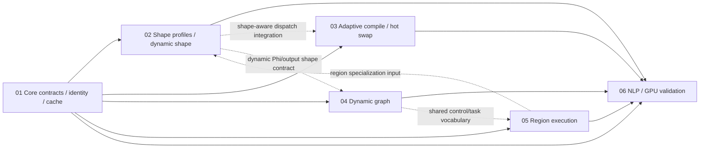

# 编译器基础路线图

> **状态：** 进行中（01 本轨实现已完成，等待 02–06 按 CoreContract v1 集成）
> **权威输入：** [`docs/COMPILER_FOUNDATION_ARCHITECTURE_REVIEW.md`](../../COMPILER_FOUNDATION_ARCHITECTURE_REVIEW.md)  
> **范围：** 为现有 per-unit 编译、multi-entry module、`ExecutablePlan` 与静态 `RuntimeSession` 建立可演进的契约；本文不是当前能力声明。

## 1. 总目标与边界

当前生产主链是：类型完整的 Relay 图经 value graph、按普通 compute `Call` 划分的 `CompilationUnit`、逐 unit lowering/编译，生成 multi-entry `CompiledModule` 与 runtime-neutral `ExecutablePlan`，由 `RuntimeSession` 在单设备、顺序 stream 上执行。

路线图不恢复历史的一体化 Adaptive Runtime，也不让 `RuntimeSession` 依赖 Compiler、Relay、ShapePredictor 或缓存策略。动态选择、编译协调和版本发布属于 session 上方的控制面；session 只执行已经冻结并验证的 plan/module 版本。

所有轨道遵守以下硬原则：

- fail closed：没有已证明适用的版本时等待、编译或明确报错，绝不按“缓存维度更大”猜测可运行。
- identity 分层：value locator、unit semantic key、artifact key、dispatch key、symbol、storage id 不得混用。
- 发布不可变对象：执行中的 executable、module 与 plan variant 必须有引用保活；发布新 generation 不修改旧对象。
- 先 exact、后 bucket、再 polymorphic；`kDynamicDimension = -1` 只保留为 legacy input ABI sentinel。
- 每轨先定义可验证契约和正反例，再扩展功能或性能策略。

## 2. 三个概念必须分开

| 概念 | 要解决的问题 | 最小产物 | 不是什么 |
|---|---|---|---|
| dynamic shape | 同一图模板如何表达、约束、绑定和计算可变逻辑形状 | `DimExpr`、constraint、`ShapeProgram`、exact/bucket/polymorphic applicability | `-1` 哨兵、仅接受动态输入或“大 buffer 可复用” |
| hot swap | 如何安全发布同一已验证 ABI 下的更优 artifact | immutable `VariantRecord`、`KernelSlot` generation、引用保活与发布审计 | 原地替换运行中的函数指针，或 runtime 内部重新编译 |
| dynamic graph | 如何表示和执行控制流、数据依赖变化或动态任务结构 | executable capability、region/task-DAG/control-flow plan contract | dynamic shape 的同义词，也不是仅因 input rank/extent 改变 |

dynamic shape 可以在静态图模板上发生；hot swap 可以优化一个静态 exact profile；dynamic graph 即使所有张量 shape 静态，仍需要独立的控制流、effect、alias 与计划语义。因此三者分轨验收，不能互相冒充完成。

## 3. 能力轨道与固定文档链接

| # | 能力轨道 | 文档 | 当前状态 | 首要交付 |
|---|---|---|---|---|
| 01 | 共同基础：契约、identity、cache | [01 core](01-core-contracts-identity-cache.md) | 阻塞（仅剩跨轨消费） | capability verifier、generated schema、normalized pipeline、key 分离、pinned singleflight cache |
| 02 | shape profile 与 dynamic shape | [02 shape](02-shape-system-and-specialization.md) | 规划中 | `GraphTemplate`、Shape IR、exact profile |
| 03 | 自适应编译与安全 hot swap | [03 adaptive hot swap](03-adaptive-compilation-hot-swap.md) | 规划中 | coordinator、singleflight、slot generation |
| 04 | dynamic graph | [04 dynamic graph](04-dynamic-graph-control-flow.md) | 规划中 | 受限控制流/结构化 region/CFG 契约 |
| 05 | region execution | [05 region execution](05-region-execution-plan-runtime.md) | 规划中 | 可验证 region unit 与 dependency-aware plan |
| 06 | NLP/GPU validation | [06 NLP/GPU validation](06-nlp-gpu-validation.md) | 规划中 | 可变序列与 GPU 端到端验收矩阵 |

六条能力轨道各自维护独立的设计、实施步骤、测试和 Done 条件。README 只维护跨轨依赖、并行边界和集成状态，不复制各轨任务清单。

## 4. 依赖图

实线是集成前必须满足的硬依赖；虚线是可提前协商并以 mock/fake 并行开发的软依赖。06 是端到端验收汇合点，不是各轨功能的替代实现。

## 5. 逐轨依赖、并行工作与集成点

### 01 — 共同基础：契约、identity、cache

- **硬依赖：** 无；它是其余轨道进入生产主链的共同前置。
- **软依赖：** 可从 02 收集 shape-key 字段、从 03 收集 request 生命周期字段，但不等待其实现。
- **可并行工作：** capability verifier、operator/pass schema 单源、`PipelineResolver`、identity 拆分、artifact pin 与 legacy 文档收敛可分别推进。
- **集成点：** 冻结 `CapabilityVerifier`、normalized pipeline fingerprint、key canonical bytes、artifact handle/cache observer；其他轨道仅通过这些接口交互。
- **阻塞关系：** 不完成 semantic key 与 pin 语义，02/03/05 不能把产物写入共享 cache；不完成 verifier，04/06 不能把“IR 可构造”宣称为可执行。

### 02 — shape profile 与 dynamic shape

- **硬依赖：** 01 的 capability gate、unit/artifact/dispatch key 分离、统一 pipeline fingerprint。
- **软依赖：** 05 的 region boundary 与 04 的 shape-eval task；二者可先用 per-call unit 和顺序 task fake。
- **可并行工作：** Shape IR/constraint、template preparation、exact profile、frontend symbol 保留、shape differential fixtures 可拆开进行。
- **集成点：** 输出 `GraphTemplate`、bound `ShapeProfile`、shape applicability 与 logical/physical/valid-extent contract；03/05/06 消费这些不可变结果。
- **阻塞关系：** 未有 exact profile 前，bucket/polymorphic 和 shape-aware hot swap 均不得作为正确性路径；03 仍可独立完成当前 static exact ABI 的热替换。动态 output 不得越过 `ShapeProgram` 进入 allocation。

### 03 — 自适应编译与安全 hot swap

- **硬依赖：** 01 的 canonical artifact identity、pin、failure record，以及当前 static exact `KernelSignature`/Plan ABI；不依赖完整 Shape 系统即可先闭环。
- **软依赖：** 02 的 profile/dispatch applicability 与 06 的真实热度指标；前者用于 shape-aware routing，后者可先由确定性 synthetic request stream 代替。
- **可并行工作：** coordinator 状态机、singleflight、预算/背压、slot generation、publish validation、profiling 字段可用 fake artifact 和 static exact profile 编写。
- **集成点：** 以完整 artifact+dispatch key 接收请求，向 02/05 提供 immutable selected generation，向 session 提供冻结 `PlanVariant`。
- **阻塞关系：** 只要 ABI、layout、capacity 或 workspace 不完全兼容，就只能切换 plan variant，不能在同一 slot hot swap；02 未完成时只允许 exact dispatch。

### 04 — dynamic graph

- **硬依赖：** 01 的 executable capability verifier、effect/alias contract、pass scope/pipeline resolver。
- **软依赖：** 02 的 shape-eval task 和 05 的 task-DAG；可先定义受限控制流节点的 mock plan。
- **可并行工作：** 可执行 dialect 定义、控制流 capability、branch/loop task contract、错误诊断与 interpreter/reference fixture。
- **集成点：** 向 05 提供 task/control-flow 的依赖和 effect 语义；向 06 提供动态执行图的限定模型集。
- **阻塞关系：** 在 verifier、effect/alias 和任务依赖未冻结前，不把 `If`、`Let` 或函数值导入现有静态 plan 主链。

### 05 — region execution

- **硬依赖：** 01 的 unit semantic key、symbol 分离、pipeline phase/invariant；04 的控制流 region 仅在其 task contract 稳定后接入。
- **软依赖：** 02 的 specialization 信息；可先仅支持静态 exact region，保留 per-call 回退。
- **可并行工作：** region boundary verifier、保守 fusion policy、library region、task-DAG plan validation、dependency-aware liveness。
- **集成点：** `CompilationUnit` 从当前 per-call policy 演进为 region，仍输出显式 live-in/live-out、ABI 与可追踪 identity；02/03 按 region 消费 key/profile。
- **阻塞关系：** 不以 fusion 数量代替正确性；region 不满足 effect、alias、ABI 或依赖验证时必须回退 per-call。

### 06 — NLP/GPU validation

- **硬依赖：** 至少 01 的 capability/identity；dynamic sequence 验收还依赖 02；热替换指标依赖 03；控制流/region 用例分别依赖 04/05。
- **软依赖：** 具体 op/backend 扩展可独立立项，但必须向本轨提供明确 support matrix 与测试证据。
- **可并行工作：** fixture、reference oracle、NLP shape case、GPU target matrix、profile schema、失败用例可先于功能实现准备。
- **集成点：** 汇总 frontend、template/profile、artifact/cache、plan/session、CPU/GPU 数值和性能证据；不向核心轨道注入 NLP op 名特判。
- **阻塞关系：** unknown/symbolic dim 被静默填 `1`、fuzzy bucket、或 target/ABI fingerprint 不匹配时，验收必须失败而不是降级通过。

## 6. 集成里程碑与状态

| 里程碑 | 进入条件 | 集成产物 | 状态 |
|---|---|---|---|
| M0：事实收敛 | 本路线图与现有架构审查一致 | capability matrix、legacy/current/target 文档标记 | 已完成（Core handoff） |
| M1：核心冻结 | 01 的最小接口和 key/cache 语义审查通过 | CoreContract v1、deterministic fakes、artifact pin/singleflight | 阻塞（待 02–06 分支消费确认） |
| M2：exact shape | 02 能从模板绑定静态 exact profile | `GraphTemplate` + exact `PlanVariant` | 未开始 |
| M3：受控自适应 | 03 可合并同 key 请求并安全发布 generation | coordinator + slot + failure/backpressure | 未开始 |
| M4：可扩展执行 | 04/05 的 task/region 计划可验证且保留回退 | dynamic task vocabulary、region plan | 未开始 |
| M5：真实模型验收 | 06 取得数值、生命周期、编译成本和性能证据 | NLP/GPU validation report | 未开始 |

M1 之前，各轨内部可以独立实现纯 IR、状态机、executor 或 fixture，但跨轨集成只允许使用版本化 mock/fake，不能以私有临时类型建立依赖。M2、M3、M4 可在 M1 的 core contract 上并行推进；只有 shape-aware hot swap、动态 Shape Phi/输出等交叉能力需要等待对应轨道的集成门禁。M2 建立的 exact path 始终是后续优化的可回退 oracle。

## 7. 共同交付与状态维护规则

每个轨道文档必须维护：目标/非目标、现状证据、冻结接口、依赖与并行项、步骤、测试矩阵、Done 条件、风险和状态。状态只能使用“规划中、进行中、阻塞、已完成、已归档”，并附证据链接；没有 feature gate 或测试证据时不得标“已完成”。

跨轨 PR 必须注明消费的接口版本、key/ABI/pipeline fingerprint 变化、是否影响 mock/fake，以及回退路径。任何轨道都不得扩展 `RuntimeSession` 的职责来绕过控制面，也不得将 object address、graph-local value id 或 backend symbol 作为跨图 artifact identity。

本文未实现接口，未运行构建或测试。
